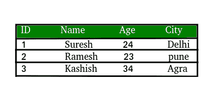
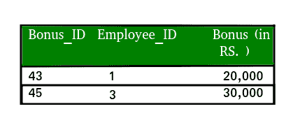
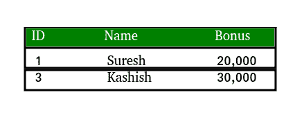
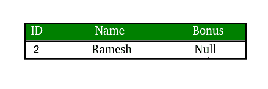

# SQL | Intersect &除外条款

> 原文:[https://www.geeksforgeeks.org/sql-intersect-except-clause/](https://www.geeksforgeeks.org/sql-intersect-except-clause/)

1. **INTERSECT 子句:**
顾名思义，INTERSECT 子句用于提供两个 select 语句的交集结果。这意味着结果包含两个 SELECT 语句共有的所有行。

**语法:**

```
SELECT column-1, column-2 …… 
FROM table 1
WHERE…..

INTERSECT

SELECT column-1, column-2 …… 
FROM table 2
WHERE…..
```

示例:

表 1 包含员工详情

表 2 包含获得奖金的员工详情


**查询:**

```
SELECT ID, Name, Bonus 
FROM
table1 
LEFT JOIN
table2
ON table1.ID = table2.Employee_ID

INTERSECT

SELECT ID, Name, Bonus 
FROM
table1 
RIGHT JOIN
table2
ON table1.ID = table2.Employee_ID;

```

**结果:**


2。 **EXCEPT 子句:**
这与 INTERSECT 子句完全相反。在这种情况下，结果包含除两个 SELECT 语句的公共行之外的所有行。

**语法:**

```
SELECT column-1, column-2 …… 
FROM table 1
WHERE…..

EXCEPT

SELECT column-1, column-2 …… 
FROM table 2
WHERE…..

```

示例:

包含员工详细信息的表 1


表 2 包含获得奖金的员工详情


**查询:**

```
SELECT ID, Name, Bonus 
FROM
table1 
LEFT JOIN
table2
ON table1.ID = table2.Employee_ID

EXCEPT

SELECT ID, Name, Bonus 
FROM
table1 
RIGHT JOIN
table2
ON table1.ID = table2.Employee_ID;

```

**结果:**
