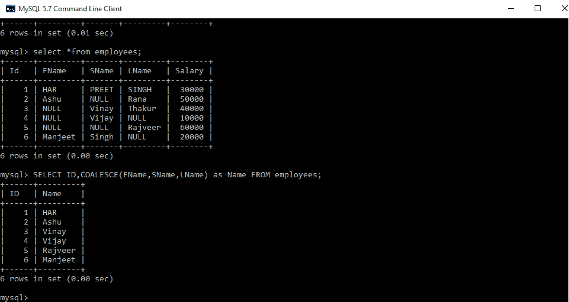
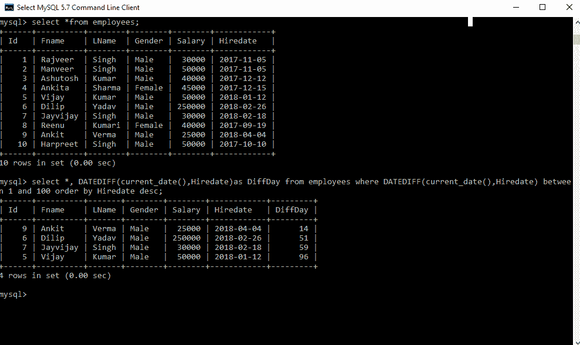

# SQL 面试问题|第一套

> 原文:[https://www . geesforgeks . org/SQL-面试-问题-集合-1/](https://www.geeksforgeeks.org/sql-interview-questions-set-1/)

**Que-1:** 闭锁与死结的区别。

*   **阻塞:**
    阻塞发生时，事务试图获取另一个事务已经锁定的资源上的不兼容锁。被阻止的事务保持被阻止，直到被阻止的事务释放锁。
*   **死锁:**
    当两个或多个事务锁定了一个资源，并且每个事务请求锁定另一个事务已经锁定的资源时，就会发生死锁。这里的两个事务都不能更向前，因为每个事务都在等待另一个事务释放锁。

**Que-2:** 从表中删除重复数据，只有第一个数据保持不变。

**经理–**

<center>

| 身份 | 名字 | 薪水 |
| one | 哈布雷 | Twenty thousand |
| Two | 拉维河 | thirty thousand |
| three | 维奈 | ten thousand |
| four | 拉维河 | thirty thousand |
| five | 哈布雷 | Twenty thousand |
| six | 维奈 | ten thousand |
| seven | 拉杰夫 | forty thousand |
| eight | 维奈 | ten thousand |
| nine | 拉维河 | thirty thousand |
| Ten | 桑杰（男子名） | Fifty thousand |

**查询–**

```sql
DELETE M1 
From managers M1, managers M2 
Where M2.Name = M1.Name AND M1.Id>M2.Id; 
```

**输出–**

<center>

| 身份 | 名字 | 薪水 |
| one | 哈布雷 | Twenty thousand |
| Two | 拉维河 | thirty thousand |
| three | 维奈 | ten thousand |
| seven | 拉杰夫 | forty thousand | Ten | 桑杰（男子名） | Fifty thousand |

</center>

**Que-3:** 查找员工姓名。

在表中给出名字、姓氏和姓氏的地方查找员工姓名。缺少一些名字，如名字、姓氏，可能是姓氏。在这里，我们将使用聚结()函数，该函数将首先返回非空值。

**员工–**

<center>

| 身份证明 | 姓氏 | 名称 | LName | 薪水 |
| --- | --- | --- | --- | --- |
| one | 海港咨询雷达 | 漂亮的 | 辛格 | thirty thousand |
| Two | 阿苏 | 空 | 中国林蛙 | Fifty thousand |
| three | 空 | 维奈 | 塔库尔 | forty thousand |
| four | 空 | 维奈 | 空 | ten thousand |
| five | 空 | 空 | 拉贾维尔 | Sixty thousand |
| six | 曼吉耶 | 辛格 | 空 | Sixty thousand |

</center>

**查询–**

```sql
SELECT ID, COALESCE(FName, SName, LName) as Name 
FROM employees; 
```

**输出–**



**Que-4:** 查找最近 n 个月录用的员工。

查找在过去 n 个月内被雇用的员工。这里我们通过使用 TIMESTAMPDIFF() mysql 函数来获得期望的输出。

**员工–**

<center>

| 身份证明 | 姓氏 | LName | 性别 | 薪水 | 你在说什么 |
| --- | --- | --- | --- | --- | --- |
| one | 拉贾维尔 | 辛格 | 男性的 | thirty thousand | 2017/11/05 |
| Two | 曼维尔 | 辛格 | 男性的 | Fifty thousand | 2017/11/05 |
| three | 阿舒特什 | 库马尔 | 男性的 | forty thousand | 2017/12/12 |
| four | 安塔 | 夏尔马 | 女性的 | Forty-five thousand | 2017/12/15 |
| five | 维杰 | 库马尔 | 男性的 | Fifty thousand | 2018/01/12 |
| six | 迪利普 | 亚达夫 | 男性的 | Twenty-five thousand | 2018/02/26 |
| seven | Jayvijay | 辛格 | 男性的 | thirty thousand | 2018/02/18 |
| eight | 里努 | 活女神 | 女性的 | forty thousand | 2017/09/19 |
| nine | 鸭子！鸭子 | 维尔马 | 男性的 | Twenty-five thousand | 2018/04/04 |
| Ten | 哈布雷 | 辛格 | 男性的 | Fifty thousand | 2017/10/10 |

</center>

**查询–**

```sql
Select *, TIMESTAMPDIFF (month, Hiredate, current_date()) as DiffMonth 
From employees
Where TIMESTAMPDIFF (month, Hiredate, current_date()) 
Between 1 and 5 Order by Hiredate desc; 
```

**注意–**在查询 1 和 5 中，表示 1 到 n 个月，显示过去 1 到 5 个月雇佣的员工。在这个查询中，DiffMonth 是我们理解的一个额外的列，它显示了第 n 个月。

**输出–**


**Que-5:** 查找最近 n 天录用的员工。

查找在过去 n 天内被雇用的员工。在这里，我们通过使用 DATEDIFF() mysql 函数获得期望的输出。

<center>
**Employees –**

| 身份证明 | 姓氏 | LName | 性别 | 薪水 | 你在说什么 |
| --- | --- | --- | --- | --- | --- |
| one | 拉贾维尔 | 辛格 | 男性的 | thirty thousand | 2017/11/05 |
| Two | 曼维尔 | 辛格 | 男性的 | Fifty thousand | 2017/11/05 |
| three | 阿舒特什 | 库马尔 | 男性的 | forty thousand | 2017/12/12 |
| four | 安塔 | 夏尔马 | 女性的 | Forty-five thousand | 2017/12/15 |
| five | 维杰 | 库马尔 | 男性的 | Fifty thousand | 2018/01/12 |
| six | 迪利普 | 亚达夫 | 男性的 | Twenty-five thousand | 2018/02/26 |
| seven | Jayvijay | 辛格 | 男性的 | thirty thousand | 2018/02/18 |
| eight | 里努 | 活女神 | 女性的 | forty thousand | 2017/09/19 |
| nine | 鸭子！鸭子 | 维尔马 | 男性的 | Twenty-five thousand | 2018/04/04 |
| Ten | 哈布雷 | 辛格 | 男性的 | Fifty thousand | 2017/10/10 |

</center>

**查询–**

```sql
Select *, DATEDIFF (current_date(), Hiredate) as DiffDay 
From employees
Where DATEDIFF (current_date(), Hiredate) between 1 and 100 order by Hiredate desc; 
```

**注意–**在查询 1 和 100 中，表示 1 到 n 天，显示最近 1 到 100 天雇佣的员工。在这个查询中，DiffDay 是我们理解的一个额外的列，它显示了第 n 天。

**输出–**



**Que-6:** 查找最近 n 年雇佣的员工。

查找在过去 n 年中被雇用的员工。这里我们通过使用 TIMESTAMPDIFF() mysql 函数来获得期望的输出。

**员工–**

<center>

| 身份证明 | 姓氏 | LName | 性别 | 薪水 | 你在说什么 |
| --- | --- | --- | --- | --- | --- |
| one | 拉贾维尔 | 辛格 | 男性的 | thirty thousand | 2010/11/05 |
| Two | 曼维尔 | 辛格 | 男性的 | Fifty thousand | 2017/11/05 |
| three | 阿舒特什 | 库马尔 | 男性的 | forty thousand | 2015/12/12 |
| four | 安塔 | 夏尔马 | 女性的 | Forty-five thousand | 2016/12/15 |
| five | 维杰 | 库马尔 | 男性的 | Fifty thousand | 2017/01/12 |
| six | 迪利普 | 亚达夫 | 男性的 | Twenty-five thousand | 2011/02/26 |
| seven | Jayvijay | 辛格 | 男性的 | thirty thousand | 2012/02/18 |
| eight | 里努 | 活女神 | 女性的 | forty thousand | 2013/09/19 |
| nine | 鸭子！鸭子 | 维尔马 | 男性的 | Twenty-five thousand | 2017/04/04 |
| Ten | 哈布雷 | 辛格 | 男性的 | Fifty thousand | 2017/10/10 |

</center>

**查询–**

```sql
Select *, TIMESTAMPDIFF (year, Hiredate, current_date()) as DiffYear 
From employees
Where TIMESTAMPDIFF (year, Hiredate, current_date()) between 1 and 4 order by Hiredate desc; 
```

**注意–**在查询 1 和 4 中，表示 1 到 n 年，显示过去 1 到 4 年雇佣的员工。在这个查询中，DiffYear 是我们理解的一个额外的列，它显示了第 n 年。

**输出–**


**Que-7:** 选择所有以给定字母开头的名称。

在这里，我们通过使用三个不同的查询来获得期望的输出。

**员工–**

<center>

| 身份证明 | 姓氏 | LName | 性别 | 薪水 | 你在说什么 |
| --- | --- | --- | --- | --- | --- |
| one | 拉贾维尔 | 辛格 | 男性的 | thirty thousand | 2010/11/05 |
| Two | 曼维尔 | 辛格 | 男性的 | Fifty thousand | 2017/11/05 |
| three | 阿舒特什 | 库马尔 | 男性的 | forty thousand | 2015/12/12 |
| four | 安塔 | 夏尔马 | 女性的 | Forty-five thousand | 2016/12/15 |
| five | 维杰 | 库马尔 | 男性的 | Fifty thousand | 2017/01/12 |
| six | 迪利普 | 亚达夫 | 男性的 | Twenty-five thousand | 2011/02/26 |
| seven | Jayvijay | 辛格 | 男性的 | thirty thousand | 2012/02/18 |
| eight | 里努 | 活女神 | 女性的 | forty thousand | 2013/09/19 |
| nine | 鸭子！鸭子 | 维尔马 | 男性的 | Twenty-five thousand | 2017/04/04 |
| Ten | 哈布雷 | 辛格 | 男性的 | Fifty thousand | 2017/10/10 |

</center>

**查询–**

```sql
Select *
From employees 
Where Fname like 'A%';

Select *
From employees 
Where left(FName, 1)='A';

Select *
From employees 
Where substring(FName, 1, 1)='A'; 
```

**注意–**这里每个查询都会给出相同的输出，并且员工的姓名列表以字母 a 开头

请参考–[SQL 面试问题|第 2 集](https://www.geeksforgeeks.org/sql-interview-questions-set-2/)

</center>