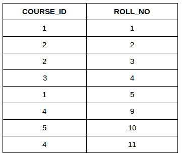
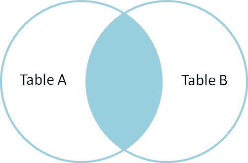
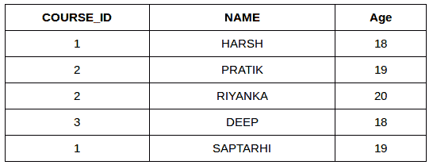
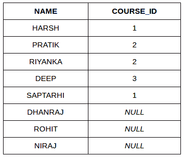
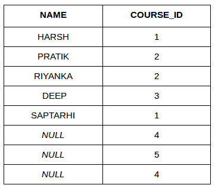
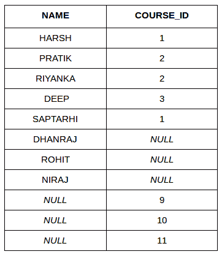

# SQL |联接(内部、左侧、右侧和完全联接)

> 原文:[https://www . geeksforgeeks . org/SQL-join-set-1-inner-left-right-and-full-joins/](https://www.geeksforgeeks.org/sql-join-set-1-inner-left-right-and-full-joins/)

SQL Join 语句用于根据两个或多个表之间的公共字段组合它们的数据或行。不同类型的连接有:

*   内部连接
*   左连接
*   右连接
*   完全连接

考虑下面的两个表格:

**学生**

[](https://media.geeksforgeeks.org/wp-content/cdn-uploads/table1-3.png)

**学生课程**

[](https://media.geeksforgeeks.org/wp-content/uploads/table5.png)

最简单的连接是内部连接。

1.  **INNER JOIN:** The INNER JOIN keyword selects all rows from both the tables as long as the condition satisfies. This keyword will create the result-set by combining all rows from both the tables where the condition satisfies i.e value of the common field will be same.
    **Syntax**:

    ```sql
    SELECT table1.column1,table1.column2,table2.column1,....
    FROM table1 
    INNER JOIN table2
    ON table1.matching_column = table2.matching_column;

    table1: First table.
    table2: Second table
    matching_column: Column common to both the tables.

    ```

    **注**:我们也可以写 JOIN 代替 INNER JOIN。JOIN 与 INNER JOIN 相同。

    

    **示例查询(内部连接)**

    *   This query will show the names and age of students enrolled in different courses.

        ```sql
        SELECT StudentCourse.COURSE_ID, Student.NAME, Student.AGE FROM Student
        INNER JOIN StudentCourse
        ON Student.ROLL_NO = StudentCourse.ROLL_NO;

        ```

        **输出** :
        [](https://media.geeksforgeeks.org/wp-content/uploads/table22.png)

2.  **LEFT JOIN**: This join returns all the rows of the table on the left side of the join and matching rows for the table on the right side of join. The rows for which there is no matching row on right side, the result-set will contain *null*. LEFT JOIN is also known as LEFT OUTER JOIN.**Syntax:**

    ```sql
    SELECT table1.column1,table1.column2,table2.column1,....
    FROM table1 
    LEFT JOIN table2
    ON table1.matching_column = table2.matching_column;

    table1: First table.
    table2: Second table
    matching_column: Column common to both the tables.

    ```

    **注**:我们也可以用 LEFT OUTER JOIN 代替 LEFT JOIN，两者相同。
    [](https://i.stack.imgur.com/VkAT5.png)

    **示例查询(左连接)**:

    ```sql
    SELECT Student.NAME,StudentCourse.COURSE_ID 
    FROM Student
    LEFT JOIN StudentCourse 
    ON StudentCourse.ROLL_NO = Student.ROLL_NO;

    ```

    **输出** :
    [](https://media.geeksforgeeks.org/wp-content/uploads/table31.png)

3.  **RIGHT JOIN**: RIGHT JOIN is similar to LEFT JOIN. This join returns all the rows of the table on the right side of the join and matching rows for the table on the left side of join. The rows for which there is no matching row on left side, the result-set will contain *null*. RIGHT JOIN is also known as RIGHT OUTER JOIN.**Syntax:**

    ```sql
    SELECT table1.column1,table1.column2,table2.column1,....
    FROM table1 
    RIGHT JOIN table2
    ON table1.matching_column = table2.matching_column;

    table1: First table.
    table2: Second table
    matching_column: Column common to both the tables.

    ```

    **注**:我们也可以用 RIGHT OUTER JOIN 代替 RIGHT JOIN，两者相同。
    T3】

    **示例查询(右连接)**:

    ```sql
    SELECT Student.NAME,StudentCourse.COURSE_ID 
    FROM Student
    RIGHT JOIN StudentCourse 
    ON StudentCourse.ROLL_NO = Student.ROLL_NO;

    ```

    **输出:**
    [](https://media.geeksforgeeks.org/wp-content/uploads/table6.png)

4.  **FULL JOIN:** FULL JOIN creates the result-set by combining result of both LEFT JOIN and RIGHT JOIN. The result-set will contain all the rows from both the tables. The rows for which there is no matching, the result-set will contain *NULL* values.**Syntax:**

    ```sql
    SELECT table1.column1,table1.column2,table2.column1,....
    FROM table1 
    FULL JOIN table2
    ON table1.matching_column = table2.matching_column;

    table1: First table.
    table2: Second table
    matching_column: Column common to both the tables.

    ```

    

    **示例查询(完全连接)**:

    ```sql
    SELECT Student.NAME,StudentCourse.COURSE_ID 
    FROM Student
    FULL JOIN StudentCourse 
    ON StudentCourse.ROLL_NO = Student.ROLL_NO;

    ```

    **输出:**
    [](https://media.geeksforgeeks.org/wp-content/uploads/table7.png)

[左 JOIN(视频)](https://youtu.be/LCbO2U3jzU0)
[右 JOIN(视频)](https://youtu.be/JOAe-yua6Jw)
[全 JOIN(视频)](https://youtu.be/WmqAKSBupsE)
[SQL | JOIN(笛卡尔 JOIN，Self Join)](https://www.geeksforgeeks.org/sql-join-cartesian-join-self-join/)

本文由 [**哈什·阿加瓦尔**](https://www.facebook.com/harsh.agarwal.16752) 供稿。如果你喜欢 GeeksforGeeks 并想投稿，你也可以使用[contribute.geeksforgeeks.org](http://www.contribute.geeksforgeeks.org)写一篇文章或者把你的文章邮寄到 contribute@geeksforgeeks.org。看到你的文章出现在极客博客主页上，帮助其他极客。

如果你发现任何不正确的地方，或者你想分享更多关于上面讨论的话题的信息，请写评论。