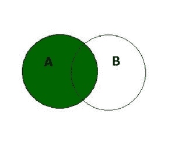

# SQL 左连接

> 原文:[https://www.geeksforgeeks.org/sql-left-join/](https://www.geeksforgeeks.org/sql-left-join/)

SQL 中的 LEFT JOIN 关键字返回所有**匹配的记录(或行)**和出现在**左表中但不在右表中的记录(或行)。**这意味着，如果某一行出现在左表中但不在右表中，结果将包括该行，但在右表的每一列中有一个空值。如果右表中的记录不在左表中，它将不会包含在结果中。



**左连接**

**左连接的语法是:**

```sql
SELECT column_name(s) 
FROM tableA 
LEFT JOIN tableB ON tableA.column_name = tableB.column_name;
```

**SQL 左连接示例:**

在本例中，我们将考虑两个表，雇员表包含在特定部门工作的雇员的详细信息，部门表包含部门的详细信息

<u>员工表</u>

<figure class="table">**【EMP _ name】 30**

| **【EMP _ no】** | 【34，000】 | 【D1】 |
| 【E4】 | 【尼廷赛尼】 | 【34】 |

</figure>

<u>系表</u>

<figure class="table">**【dept _ name】**

| **【部门 _ 编号】** |

</figure>

为了对这两个表执行左连接，我们将使用以下 SQL 查询:

```sql
select emp_no ,emp_name , age, salary ,dept_name, location 
from employee 
left join department on employee.dept_no=department.dept_no;
```

我们将得到的输出如下:-

<figure class="table">T57T60】Amrita SinghalT62】28T64】25，000T66】HRT68】海得拉巴 T70T72】E4T74】尼廷赛尼 T76】34

| **电磁脉冲 _ 号** | **EMP _ name** | **Age** | **Salary** | T21】部门名称 | T25] position |
| E1 | Washinghar [IT | 德里 | E2 |

</figure>

因为左连接给出了匹配的行和出现在左表中但不在右表中的行。在本例中，我们看到不在特定部门工作的员工，即没有部门值为[空]的员工，在左连接后包含部门名称和位置的[空]值。