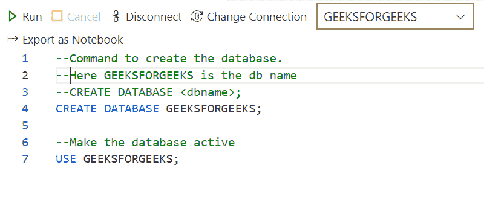
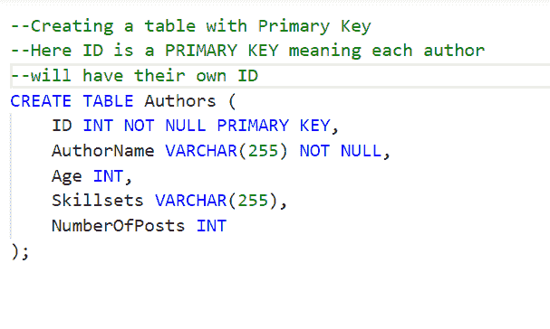
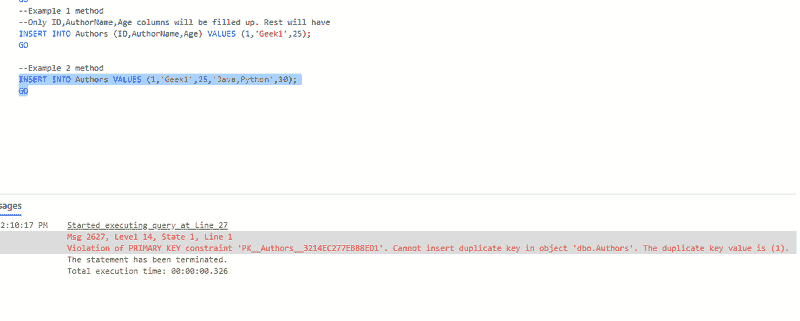
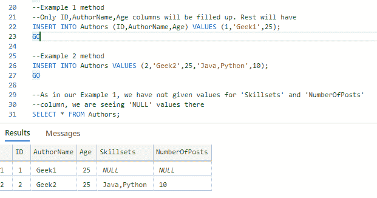
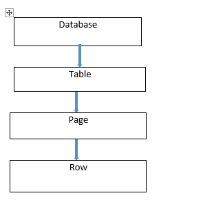
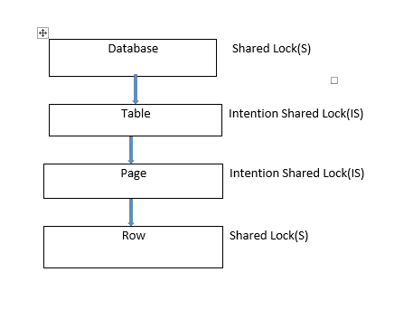
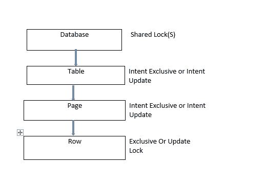
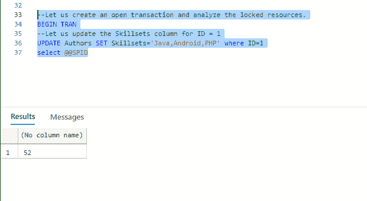
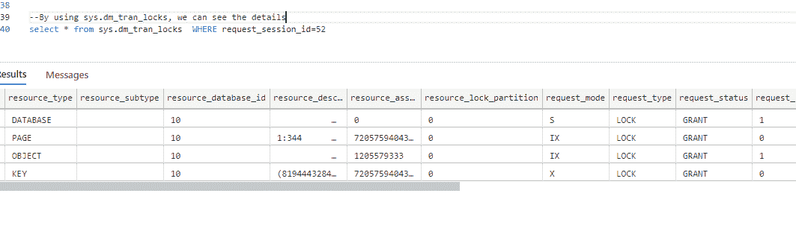
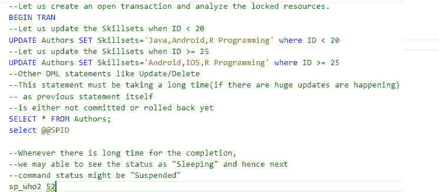

# SQL-锁表

> 原文:[https://www.geeksforgeeks.org/sql-lock-table/](https://www.geeksforgeeks.org/sql-lock-table/)

SQL Server 是一个通用的数据库，它是许多软件行业中使用最多的关系数据库。在本文中，让我们通过一些实际的例子来了解一下 SQL Server 中的 SQL 锁表。因为它满足原子性、一致性、隔离性和持久性的要求，所以它被称为关系数据库。为了维护 ACID 机制，在 SQL Server 中，会维护一个锁。

通过使用 Azure Data Studio，让我们从创建数据库、创建表、锁等开始，了解锁机制的概念。Azure Data Studio 适用于 Windows 10、Mac 和 Linux 环境。可以从这里[开始安装。](https://docs.microsoft.com/en-us/sql/azure-data-studio/download-azure-data-studio?view=sql-server-ver15)

### **数据库创建:**

命令来创建数据库。这里的 GEEKSFORGEEKS 是数据库的名字。

```
--CREATE DATABASE <dbname>;
```

### 创建数据库极客:

使数据库处于活动状态

```
USE GEEKSFORGEEKS;
```



一旦数据库处于活动状态，将在顶部显示数据库名称

### **将表添加到数据库:**

使用主键创建表。这里 ID 是一个主键，意味着每个作者都有自己的 ID

```
CREATE TABLE Authors (
   ID INT NOT NULL PRIMARY KEY,
   <other column name1> <datatype> <null/not null>,
   ..........
);
```

如果明确指定“非空”，则该列应该有值。如果未指定，则默认为“空”。



“作者”命名表是在“GEEKSFORGEEKS”数据库下创建的

### **在表格中插入行:**

可能会出现这样的情况:我们可以向表中添加所有列或少量列值。原因是默认情况下，某些列可能需要空值。

**例 1 :**

```
INSERT INTO <table_name> (column1, column2, column3, ...)  VALUES (value1, value2, value3, ...);
```

这里我们考虑到了上述的列，因此上面的查询只插入了它们的必需值。

**例 2 :**

```
INSERT INTO <table_name> VALUES (value1, value2, value3, ...);
```

这里我们不指定任何列意味着，所有列的所有值都需要插入。



```
Violation of PRIMARY KEY constraint 'PK__Authors__3214EC277EBB8ED1'. 
Cannot insert duplicate key in object 'dbo.Authors'. The duplicate key value is (1).
```

上面截图中出现的上述错误说明“ID”列是唯一的，不应该有重复的值

现在，让我们纠正这一点，并使用以下命令查询该表:

```
SELECT * FROM <tablename>
```



清除应用示例 1 和示例 2 方法的输出

可以观察到，第 1 行在“技能集”和“人数”列中有“空”值。原因是因为我们没有为这些列指定值，所以它采用了默认的空值。

*   **SQL 锁:**

SQL Server 是一个关系数据库，数据一致性是一个重要的机制，可以通过 SQL Locks 来实现。当事务开始时，在 SQL Server 中建立锁，当事务结束时，释放锁..有不同类型的锁。

*   **共享(S)锁:**当需要读取对象时，会出现这种类型的锁，但这并没有坏处。
*   **独占(X)锁:**防止插入/更新/删除等其他事务。，因此不能对锁定的对象进行任何修改。
*   **更新(U)锁:**或多或少类似于排他锁，但在这里操作可以被视为“读阶段”和“写阶段”。尤其是在读取阶段，会阻止其他事务。
*   **意图锁:**当 SQL Server 对一行拥有共享(S)锁或独占(X)锁时，则意图锁在表上。
*   **常规意图锁:**意图独占(IX)、意图共享(IS)和意图更新(IU)。
*   **转换锁:**共享意图独占(SIX)，共享意图更新(SIU)，更新意图独占(UIX)。

锁层次结构从数据库开始，然后是表，然后是行。



数据库级的共享锁非常重要，因为它可以防止删除数据库或恢复正在使用的数据库的数据库备份。

发出“选择”语句时锁定事件。



在 DML 语句执行期间，即插入/更新/删除期间。



通过我们的例子，让我们看看锁定机制。

```
--Let us create an open transaction and analyze the locked resource.
BEGIN TRAN
Let us update the Skillsets column for ID = 1
UPDATE Authors SET Skillsets='Java,Android,PHP' where ID=1
select @@SPID
```



```
select * from sys.dm_tran_locks  WHERE request_session_id=<our session id. here it is 52>
```



让我们在表中插入更多的记录(大约 100 条记录),然后使用一个事务，让我们更新一些列，同时并行应用 select 查询

```
--Let us create an open transaction and analyze the locked resources.
BEGIN TRAN
--Let us update the Skillsets when ID < 20
UPDATE Authors SET Skillsets='Java,Android,R Programming' where ID < 20  
--Let us update the Skillsets when ID >= 25
UPDATE Authors SET Skillsets='Android,IOS,R Programming' where ID >= 25  
--Other DML statements like Update/Delete. This statement must be taking a long time
--(if there are huge updates are happening) as previous statement itself
--is either not committed or rolled back yet
SELECT * FROM Authors;
select @@SPID
```



实际上，当前面的命令事务尚未完成(如果有大量记录，至少有 100 条记录)并且每一行都在更新时，并且在完成之前，如果我们继续执行另一组命令，如“select”

那么状态可能是“等待”(正在执行的查询)和“暂停”(暂停的查询)

**如何克服目前为止的跑步过程？**

```
KILL <spid> -> Kill the session
```

(或)在事务内部，每次查询后，应用

```
COMMIT -> TO COMMIT THE CHANGES
ROLLBACK -> TO ROLLBACK THE CHANGES
```

通过执行这个过程，我们要么执行提交操作，要么回滚操作(取决于需求，必须执行)

但是除非我们知道整个过程是否需要，否则我们不能提交或回滚事务。

**替代方式:**

通过使用 NOLOCK 和 SELECT QUERY，我们可以克服

```
SELECT * FROM Authors WITH (NOLOCK);
```

对于 SELECT 语句状态，请使用 sp_who2 命令。查询运行时不需要等待 UPDATE 事务成功完成并释放表上的锁定，

```
SELECT * FROM Authors WITH (READUNCOMMITTED);
--This way also we can do
```

**结论:**

SQL 锁对于任何关系数据库管理系统都非常重要。SQL Server 以上述方式处理它们。