# SQL–逻辑运算符

> 原文:[https://www.geeksforgeeks.org/sql-logical-operators/](https://www.geeksforgeeks.org/sql-logical-operators/)

SQL 逻辑运算符用于测试条件的真实性。像[比较](https://www.geeksforgeeks.org/sql-operators/)运算符这样的逻辑运算符返回的布尔值为**真**、**假**、或未知。

下面给出了 SQL 中可用的逻辑运算符列表。

<figure class="table">

| **Operator** | **means** |
| [**和**T3】](https://www.geeksforgeeks.org/sql-and-and-or-operators/) | TRUE if both Boolean expressions are TRUE. |
| [**在**](https://www.geeksforgeeks.org/sql-between-in-operator/) | True if the operand is equal to one of the expression lists. |
| [**不是**](https://www.geeksforgeeks.org/sql-not-operator/) | Inverts the value of any other Boolean operator. |
| [**或**T3】](https://www.geeksforgeeks.org/sql-and-and-or-operators/) | If any Boolean expression is true, it is true. |
| [**LIKE**](https://www.geeksforgeeks.org/sql-like/) | TRUE if the operand matches a pattern. |
| [](https://www.geeksforgeeks.org/sql-between-in-operator/) | True if the operand is in a range. |
| [**ALL**](https://www.geeksforgeeks.org/sql-all-and-any/) | TRUE if a set of comparisons are all TRUE. |
| [**任意**](https://www.geeksforgeeks.org/sql-all-and-any/) | TRUE if any one of a set of comparisons is TRUE. |
| [**存在**](https://www.geeksforgeeks.org/sql-exists/) | TRUE if the subquery contains any rows. |
| [**有些**](https://www.geeksforgeeks.org/sql-some/) | TRUE if some comparisons in a set of comparisons are TRUE. |

</figure>

在下面的例子中，我们将看到这个逻辑运算符是如何工作的。

**步骤 1:** 创建数据库

为了创建数据库，我们需要使用 create 运算符。

**查询:**

```
CREATE DATABASE xstream_db;
```


**步骤 2:** 创建员工表

在这一步中，我们将在 xstream_db 数据库中创建雇员表。

**查询:**

```
CREATE TABLE employee (emp_id INT, emp_name VARCHAR(255), 
                                  emp_city VARCHAR(255),
                                  emp_country VARCHAR(255),
                                  PRIMARY KEY (emp_id));
```

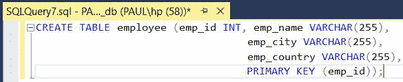

为了在数据库中插入数据，我们需要使用 insert 操作符。

**查询:**

```
INSERT INTO employee VALUES (101, 'Utkarsh Tripathi', 'Varanasi', 'India'),
                            (102, 'Abhinav Singh', 'Varanasi', 'India'), 
                            (103, 'Utkarsh Raghuvanshi', 'Varanasi', 'India'),
                            (104, 'Utkarsh Singh', 'Allahabad', 'India'),
                            (105, 'Sudhanshu Yadav', 'Allahabad', 'India'),
                            (106, 'Ashutosh Kumar', 'Patna', 'India');
```

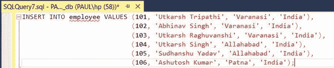

**输出:**

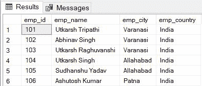

下面给出的是逻辑运算符的一个例子。

### **和运算符**

**查询:**

```
SELECT * FROM employee WHERE emp_city = 'Allahabad' AND emp_country = 'India';
```


**输出:**

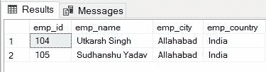

### **输入操作符**

**查询:**

```
SELECT * FROM employee WHERE emp_city IN ('Allahabad', 'Patna');
```


**输出:**

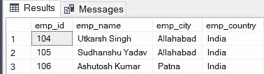

### **非操作员**

**查询:**

```
SELECT * FROM employee WHERE emp_city NOT LIKE 'A%';
```


**输出:**

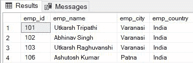

### **或运算符**

**查询:**

```
SELECT * FROM employee WHERE emp_city = 'Varanasi' OR emp_country = 'India';
```


**输出:**

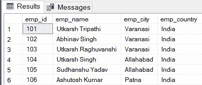

### **同操作员**

**查询:**

```
SELECT * FROM employee WHERE emp_city LIKE 'P%';
```


**输出:**

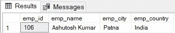

### **操作员之间**

**查询:**

```
SELECT * FROM employee WHERE emp_id BETWEEN 101 AND 104;
```


**输出:**

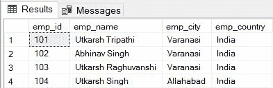

### **所有操作员**

**查询:**

```
SELECT * FROM employee WHERE emp_id = ALL 
                (SELECT emp_id FROM employee WHERE emp_city = 'Varanasi');
```


**输出:**


### **任何操作员**

**查询:**

```
SELECT * FROM employee WHERE emp_id = ANY
                (SELECT emp_id FROM employee WHERE emp_city = 'Varanasi');
```


**输出:**

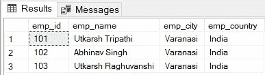

### **存在操作员**

**查询:**

```
SELECT emp_name FROM employee WHERE EXISTS
                (SELECT emp_id FROM employee WHERE emp_city = 'Patna');
```


**输出:**

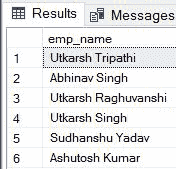

### **某些操作员**

**查询:**

```
SELECT * FROM employee WHERE emp_id < SOME 
                (SELECT emp_id FROM employee WHERE emp_city = 'Patna');
```


**输出:**

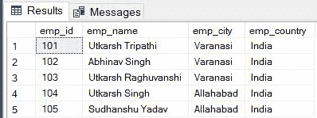