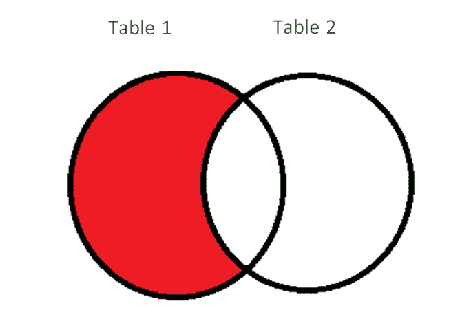
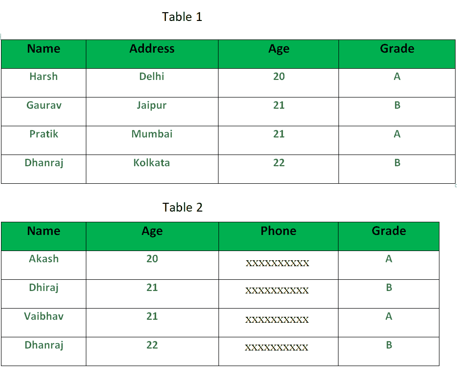
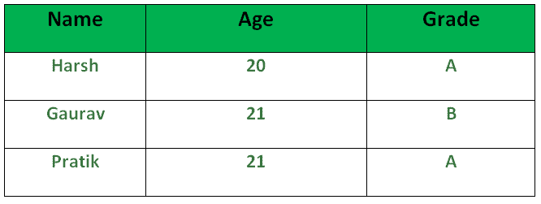

# SQL |减运算符

> 原文:[https://www.geeksforgeeks.org/sql-minus-operator/](https://www.geeksforgeeks.org/sql-minus-operator/)

SQL 中的减运算符与两个 SELECT 语句一起使用。减运算符用于从第二个 SELECT 查询获得的结果集中减去第一个 SELECT 查询获得的结果集。简而言之，我们可以说减运算符将只返回仅在第一个 SELECT 查询中唯一的那些行，而不返回第一个和第二个 SELECT 查询共有的那些行。

**图示** :
[](https://media.geeksforgeeks.org/wp-content/uploads/SQL_Minus_Operator_1.png) 
如上图所示，减运算符将只返回表 1 结果集中存在而表 2 结果集中不存在的行。

**基本语法**:

```sql
SELECT column1 , column2 , ... columnN
FROM table_name
WHERE condition
MINUS
SELECT column1 , column2 , ... columnN
FROM table_name
WHERE condition;

columnN: column1, column2.. are the name of columns of the table.
 Important Points:
```

*   在上述查询中，WHERE 子句是可选的。
*   两个 SELECT 语句中的列数必须相同。
*   两个 SELECT 语句对应列的数据类型必须相同。

**样表**:

表 1

[](https://media.geeksforgeeks.org/wp-content/cdn-uploads/SQL_Minus_Operator_2.png)

**查询**:

```sql
SELECT NAME, AGE , GRADE
FROM Table1
MINUS 
SELECT NAME, AGE, GRADE 
FROM Table2

```

输出:
上面的查询将只返回那些在‘表 1’中唯一的行。我们可以清楚地看到，两个表中最后一行的“名称”、“年龄”和“等级”字段中的值是相同的。因此，输出将是表 1 中的前三行。获得的输出如下所示:
[](https://media.geeksforgeeks.org/wp-content/uploads/SQL_Minus_Operator_3.png)

**注**:不是所有数据库都支持减运算符。Oracle 数据库支持，但不支持 SQL server 或 PostgreSQL。

本文由 [**Harsh Agarwal**](https://www.facebook.com/harsh.agarwal.16752) 供稿。如果你喜欢 GeeksforGeeks 并想投稿，你也可以用[contribute.geeksforgeeks.org](http://www.contribute.geeksforgeeks.org)写一篇文章或者把你的文章邮寄到 contribute@geeksforgeeks.org。看到你的文章出现在极客博客主页上，帮助其他极客。

如果你发现任何不正确的地方，或者你想分享更多关于上面讨论的话题的信息，请写评论。