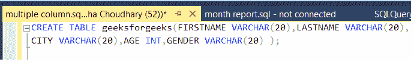
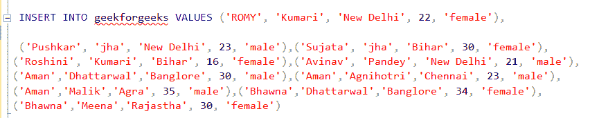
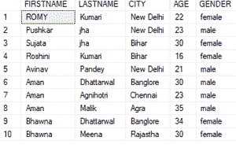
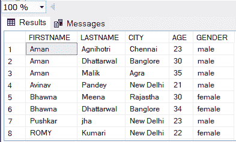
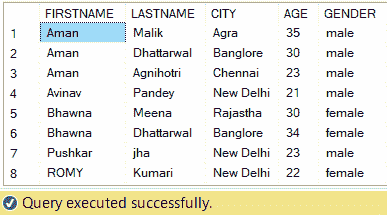

# SQL–多列排序

> 原文:[https://www.geeksforgeeks.org/sql-multiple-column-ordering/](https://www.geeksforgeeks.org/sql-multiple-column-ordering/)

**SQL** 代表结构化查询语言。它用于与数据库通信。有一些标准的 SQl 命令，如“select”、“delete”、“alter”等。对于 SQL 中的列排序，我们使用“ORDER BY”关键字。

### 订购人:

它用于按升序或降序对结果集进行排序。默认情况下，它按升序对记录进行排序。要按降序对记录进行排序，请使用 DESC 关键字。

**语法:**

```sql
SELECT * FROM table_name ORDER BY column_name;
```

对于多列顺序，请添加要首先对记录进行排序的列的名称。首先输入的列将首先被排序，同样。

### **步骤 1:创建数据库**

使用下面的 SQL 语句创建一个名为 geeks 的数据库:

**查询:**

```sql
CREATE DATABASE geeks;
```

### **步骤 2:使用数据库**

使用下面的 SQL 语句将数据库上下文切换到极客:

**查询:**

```sql
USE geeks;
```

### **第三步:表格定义**

我们的极客数据库中有以下演示表。

**查询:**

```sql
 CREATE TABLE geeksforgeeks(
 FIRSTNAME VARCHAR(20), LASTNAME VARCHAR(20), 
 CITY VARCHAR(20), AGE INT, GENDER VARCHAR(20));
```



### **第四步:将数据**插入**表格**

```sql
INSERT INTO geeksforgeeks VALUES
('ROMY', 'Kumari', 'New Delhi', 22, 'female'),
('Pushkar', 'jha', 'New Delhi', 23, 'male'),
('Sujata', 'jha', 'Bihar', 30, 'female'),
('Roshini', 'Kumari', 'Bihar', 16, 'female'),
('Avinav', 'Pandey', 'New Delhi', 21, 'male'),
('Aman','Dhattarwal','Banglore', 30, 'male'),
('Aman','Agnihotri','Chennai', 23, 'male'),
('Aman','Malik','Agra', 35, 'male'),
('Bhawna','Dhattarwal','Banglore', 34, 'female'),
('Bhawna','Meena','Rajastha', 30, 'female')
```



### 第五步:查看表格的内容

**查询:**

```sql
SELECT * FROM geeksforgeeks;
```

**输出:**



让我们举一个例子，根据名字和年龄对表格内容进行排序。

**查询:**

```sql
 SELECT * FROM geeksforgeeks ORDER BY FIRSTNAME, AGE;
```

**输出:**



现在，如果我们想按名字(升序)、姓氏(降序)、年龄(降序)排序，那么查询是:

**查询:**

```sql
 SELECT * FROM geeksforgeeks ORDER BY FIRSTNAME, LASTNAME DESC, AGE DESC ;
```

**输出:**

