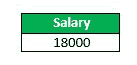
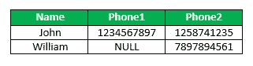
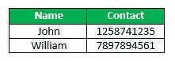
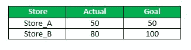

# SQL |空函数

> 原文:[https://www.geeksforgeeks.org/sql-null-functions/](https://www.geeksforgeeks.org/sql-null-functions/)

以下是在 SQL 中定义的空函数:

1.  **ISNULL(): **The ISNULL function have different uses in SQL Server and MySQL. In SQL Server, ISNULL() function is used to replace NULL values.
    **Syntax:**

    ```sql
    SELECT column(s), ISNULL(column_name, value_to_replace)
    FROM table_name;
    ```

    示例:
    考虑下面的员工表，

    

    **查询:**查找所有员工的薪资之和，如果任意员工的薪资不可用(或为空值)，则使用薪资为 10000。

    ```sql
    SELECT SUM(ISNULL(Salary, 10000) AS Salary
    FROM Employee;
    ```

    输出:

    

    在 MySQL 中，ISNULL()函数用于测试表达式是否为空。如果表达式为空，则返回真，否则返回假。
    **语法:**

    ```sql
    SELECT column(s)
    FROM table_name
    WHERE ISNULL(column_name);
    ```

    示例:
    考虑下面的员工表，

    

    **查询:**取表中所有薪资可用的员工姓名(非空)。

    ```sql
    SELECT Name
    FROM Employee
    WHERE ISNULL(Salary);
    ```

    输出:

    

2.  **IFNULL(): **This function is available in MySQL, and not in SQL Server or Oracle. This function take two arguments. If the first argument is not NULL, the function returns the first argument. Otherwise, the second argument is returned. This function is commonly used to replace NULL value with another value.
    **Syntax:**

    ```sql
    SELECT column(s), IFNULL(column_name, value_to_replace)
    FROM table_name;
    ```

    示例:
    考虑下面的员工表，

    

    **查询:**查找所有员工的薪资之和，如果任意员工的薪资不可用(或为空值)，则使用薪资为 10000。

    ```sql
    SELECT SUM(IFNULL(Salary, 10000) AS Salary
    FROM Employee;
    ```

    输出:

    

3.  **COALESCE(): **COALESCE function in SQL returns the first non-NULL expression among its arguments. If all the expressions evaluate to null, then the COALESCE function will return null.
    Syntax:

    ```sql
    SELECT column(s), CAOLESCE(expression_1,....,expression_n)
    FROM table_name;
    ```

    示例:
    考虑下面的 Contact_info 表，

    

    **查询:**取每个员工的姓名、联系电话。

    ```sql
    SELECT Name, COALESCE(Phone1, Phone2) AS Contact
    FROM Contact_info;
    ```

    输出:

    

4.  **NULLIF(): **The NULLIF function takes two argument. If the two arguments are equal, then NULL is returned. Otherwise the first argument is returned.
    Syntax:

    ```sql
    SELECT column(s), NULLIF(expression1, expression2)
    FROM table_name;
    ```

    示例:
    考虑下面的销售表，

    

    ```sql
    SELECT Store, NULLIF(Actual, Goal)
    FROM Sales;
    ```

    输出:

    

本文由 **[Anuj Chauhan](https://www.facebook.com/anuj0503)** 供稿。如果你喜欢 GeeksforGeeks 并想投稿，你也可以使用[contribute.geeksforgeeks.org](http://www.contribute.geeksforgeeks.org)写一篇文章或者把你的文章邮寄到 contribute@geeksforgeeks.org。看到你的文章出现在极客博客主页上，帮助其他极客。

如果你发现任何不正确的地方，或者你想分享更多关于上面讨论的话题的信息，请写评论。