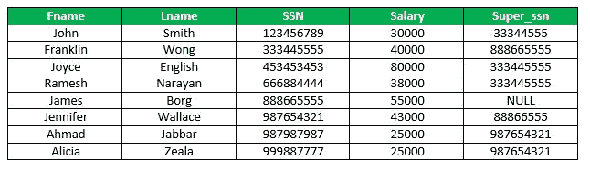
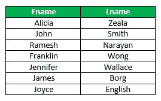
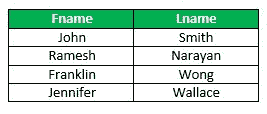
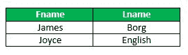

# SQL | OFFSET-FETCH 子句

> 原文:[https://www.geeksforgeeks.org/sql-offset-fetch-clause/](https://www.geeksforgeeks.org/sql-offset-fetch-clause/)

OFFSET 和 FETCH 子句与 SELECT 和 ORDER BY 子句一起使用，以提供检索一系列记录的方法。

**偏移**

OFFSET 参数用于标识从结果集中返回行的起始点。基本上，它排除了第一组记录。
**注:**

*   偏移量只能与 ORDER BY 子句一起使用。它不能单独使用。
*   偏移值必须大于或等于零。不能为负数，否则返回错误。

语法:

```
SELECT column_name(s)
FROM table_name
WHERE condition
ORDER BY column_name
OFFSET rows_to_skip ROWS;
```

示例:
考虑下面的员工表，



*   打印除最低工资员工以外的所有员工的姓名。

```
SELECT Fname, Lname
FROM Employee
ORDER BY Salary
OFFSET 1 ROWS;
```

*   输出:



**FETCH**

FETCH 参数用于返回一组行数。FETCH 不能单独使用，它是和 OFFSET 一起使用的。
语法:

```
SELECT column_name(s)
FROM table_name
ORDER BY column_name
OFFSET rows_to_skip
FETCH NEXT number_of_rows ROWS ONLY;
```

示例:

*   根据“工资”排序时，打印员工表中从第 3 到第 6 个元组的 Fname、Lname。

```
SELECT Fname, Lname
FROM Employee
ORDER BY Salary
OFFSET 2 ROWS
FETCH NEXT 4 ROWS ONLY;
```

*   输出:



*   按薪资排序时，打印员工表的后 2 个元组。

```
SELECT Fname, Lname
FROM Employee
ORDER BY Salary
OFFSET (SELECT COUNT(*) FROM EMPLOYEE) - 2 ROWS
FETCH NEXT 2 ROWS;
```

*   输出:



**要点:**

1.  对于 FETCH，OFFSET 子句是必需的。你永远不能使用，订单由…提取。
2.  TOP 不能与 OFFSET 和 FETCH 组合使用。
3.  OFFSET/FETCH 行计数表达式只能是任何将返回整数值的算术、常量或参数表达式。
4.  ORDER BY 必须与 OFFSET 和 FETCH 子句一起使用。
5.  偏移值必须大于或等于零。不能为负数，否则返回错误。

本文由 **Anuj Chauhan** 供稿。如果你喜欢 GeeksforGeeks 并想投稿，你也可以使用[write.geeksforgeeks.org](http://www.write.geeksforgeeks.org)写一篇文章或者把你的文章邮寄到 review-team@geeksforgeeks.org。看到你的文章出现在极客博客主页上，帮助其他极客。

如果你发现任何不正确的地方，或者你想分享更多关于上面讨论的话题的信息，请写评论。