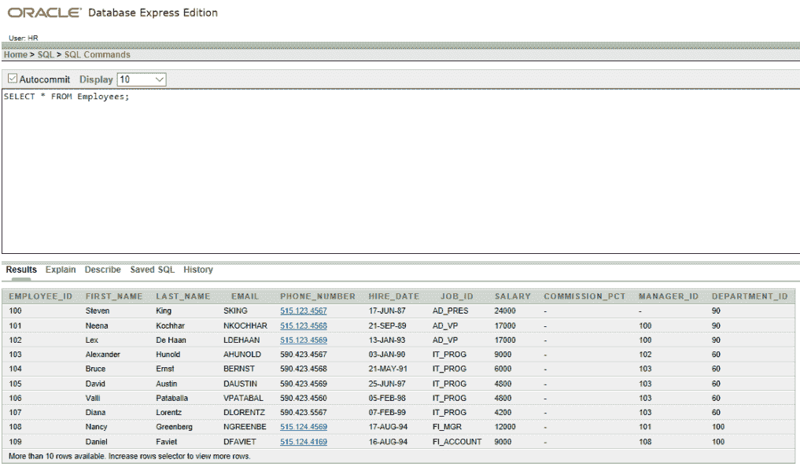
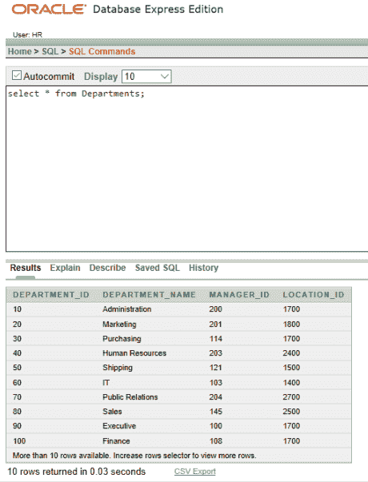
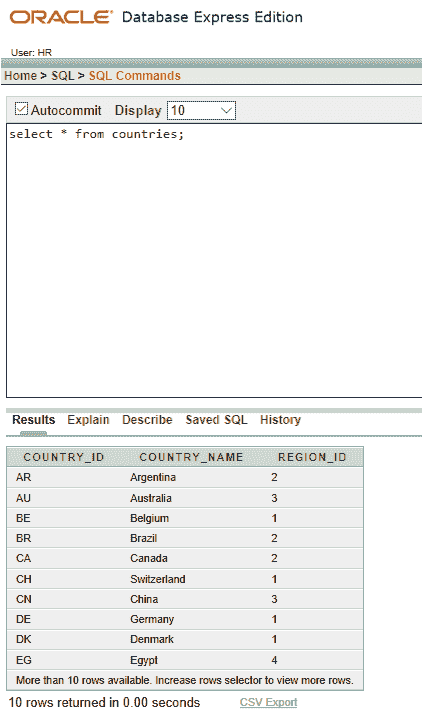
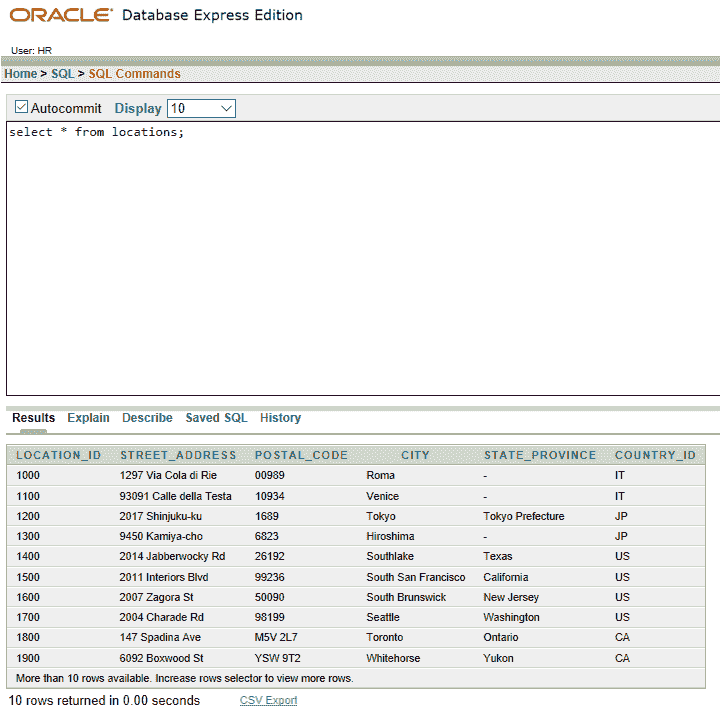

# SQL |开条款

> 原文:[https://www.geeksforgeeks.org/sql-on-clause/](https://www.geeksforgeeks.org/sql-on-clause/)

自然连接的连接条件基本上是所有同名列的 [EQUIJOIN](https://www.geeksforgeeks.org/extended-operators-in-relational-algebra/) 。要指定任意条件或指定要连接的列，请使用 ON 子句。

1.  连接条件与其他搜索条件是分开的。
2.  ON 子句使代码易于理解。
3.  ON 子句可用于连接不同名称的列。
4.  我们使用 ON 子句来指定连接条件。这让我们可以在 [WHERE](https://www.geeksforgeeks.org/sql-where-clause/) 子句中指定独立于任何搜索或过滤条件的连接条件。

**示例:**

 ***我们将在以下基表上应用下面提到的命令:*** 



雇员表



部门表

**QUERY 1:** 写 SQL 查询找到员工的工作地点。还要给出他们各自的员工 id、姓氏和部门 id？

```sql

Input :SELECT e.employee_id, e.last_name, e.department_id,
d.department_id, d.location_id
FROM employees e JOIN departments d
ON (e.department_id = d.department_id);
Output : 

```

**说明:**所示示例使用 on 子句连接了 EMPLOYEES 和 DEPARTMENTS
表中的 DEPARTMENT_ID 列，从而显示了所需的数据。

***我们将在以下基表上应用下面提到的命令:***



国家表



位置表

**QUERY 2:** 写 SQL 查询找到 location_id、street_address、postal_code 以及它们各自的国家名称？

```sql

Input : SELECT l.location_id, l.street_address, l.postal_code, c.country_name
FROM locations l JOIN countries c
ON (l.country_id = c.country_id);
Output : 

```

**解释:**所示示例使用 on 子句将 LOCATIONS 和 COUNTRY
表中的 COUNTRY_ID 列连接起来，从而显示了所需的详细信息。