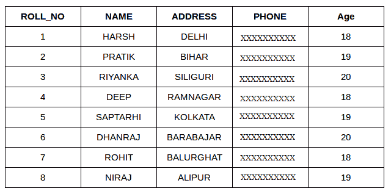
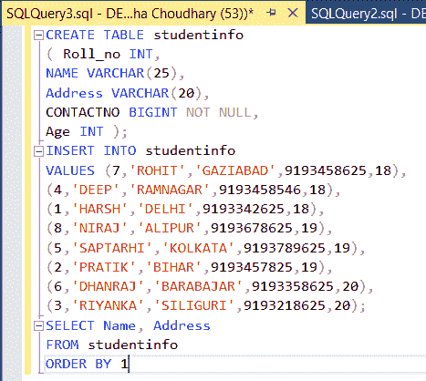
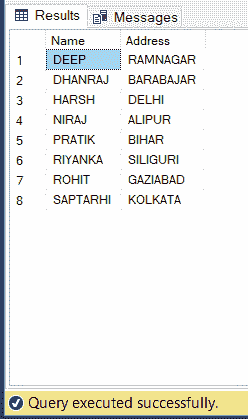

# SQL–订单依据

> 原文:[https://www.geeksforgeeks.org/sql-order-by/](https://www.geeksforgeeks.org/sql-order-by/)

SQL 中的 ORDER BY 语句用于根据一列或多列对提取的数据进行升序或降序排序。

*   默认情况下，ORDER BY 按升序对数据进行排序。
*   我们可以使用关键字 DESC 对数据进行降序排序，使用关键字 ASC 对数据进行升序排序。

### **按一列排序:**

要按升序或降序排序，我们可以分别使用关键字 ASC 或 DESC。

**语法:**

```
SELECT * FROM table_name ORDER BY column_name ASC|DESC
//Where 
table_name: name of the table.
column_name: name of the column according to which the data is needed to be arranged.
ASC: to sort the data in ascending order.
DESC: to sort the data in descending order.
| : use either ASC or DESC to sort in ascending or descending order//
```

### **按多列排序:**

要按升序或降序排序，我们可以分别使用关键字 ASC 或 DESC。若要根据多列进行排序，请使用(，)运算符分隔列名。

**语法:**

```
SELECT * FROM table_name ORDER BY column1 ASC|DESC , column2 ASC|DESC
```



现在考虑上面的数据库表，找到不同查询的结果。

### **按单列排序**:

在本例中，我们将从表 Student 中获取所有数据，并根据 ROLL_NO 列按降序对结果进行排序。

**查询:**

```
SELECT * FROM Student ORDER BY ROLL_NO DESC;
```

**输出:**

<figure class="table">【xxxxxxx】

|  | 【卷号】 | **Name** |  |  |
| --- | --- | --- | --- | --- |
|  |
| --- |
| 【萨普塔里】 | 【加尔各答】 |  |
| --- | --- | --- |

</figure>

在上面的例子中，如果我们想按升序排序，我们必须使用 ASC 来代替 DESC。

### **按多列排序**:

在本例中，我们将从学生表中获取所有数据，然后首先根据年龄列按升序对结果进行排序。然后按照
**列降序查询:**

```
SELECT * FROM Student ORDER BY Age ASC , ROLL_NO DESC;
```

**输出:**

<figure class="table">【NIR aj】【xxxxxxx】

|  | 【卷号】 | **Name** |  | 【18】 |
| --- | --- | --- | --- | --- |
| 【8】 | "紫红色" |  |
| --- | --- | --- |

</figure>

在上面的输出中，我们可以看到，首先结果按照年龄升序排序。有多行具有相同的年龄。现在，根据 ROLL_NO 对这个结果集进行进一步的排序将按照 ROLL_NO 对具有相同年龄的行进行降序排序。

**注:**

ASC 是 ORDER BY 子句的默认值。因此，如果我们在 ORDER BY 子句中的列名之后没有指定任何内容，默认情况下，输出将按升序排序。

再举一个例子，下面的查询会给出和上面类似的输出:
**查询:**

```
SELECT * FROM Student ORDER BY Age , ROLL_NO DESC;
```

**输出:**

<figure class="table">【NIR aj】【xxxxxxx】

|  | 【卷号】 | **Name** |  | 【18】 |
| --- | --- | --- | --- | --- |
| 【8】 | "紫红色" |  |
| --- | --- | --- |

</figure>

### **按列号排序(代替名称):**

一个整数，标识 [SELECT 语句](#rrefsqlj41360) 底层查询中选择项的列号。列数必须大于 0 且不大于结果表中的列数。换句话说，如果我们想按列排序，则必须在 SELECT 列表中指定该列。

该规则使用列号而不是列名检查引用选择列表列的 ORDER BY 子句。ORDER BY 子句中的列号会降低 SQL 语句的可读性。此外，当列是通过名称而不是数字来引用时，更改选择列表中列的顺序对 ORDER BY 没有影响。

**语法:**

```
Order by Column_Number asc/desc
```

这里我们举一个例子，根据第 1 列即 Roll_Number 对数据库表进行排序。 对此的一个查询将是:

**查询:**

```
CREATE TABLE studentinfo
( Roll_no INT,
NAME VARCHAR(25),
Address VARCHAR(20),
CONTACTNO BIGINT NOT NULL,
Age INT ); 
INSERT INTO studentinfo
VALUES (7,'ROHIT','GAZIABAD',9193458625,18),
(4,'DEEP','RAMNAGAR',9193458546,18),
(1,'HARSH','DELHI',9193342625,18),
(8,'NIRAJ','ALIPUR',9193678625,19),
(5,'SAPTARHI','KOLKATA',9193789625,19),
(2,'PRATIK','BIHAR',9193457825,19),
(6,'DHANRAJ','BARABAJAR',9193358625,20),
(3,'RIYANKA','SILIGURI',9193218625,20);
SELECT Name, Address
FROM studentinfo
ORDER BY 1
```



**输出:**

