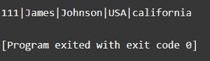
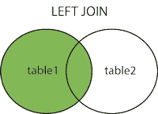
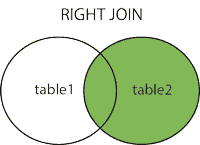
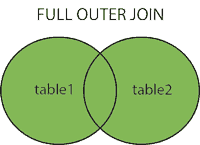

# SQL 外部连接

> 原文:[https://www.geeksforgeeks.org/sql-outer-join/](https://www.geeksforgeeks.org/sql-outer-join/)

在[关系数据库管理系统](https://www.geeksforgeeks.org/rdbms-full-form/)中，我们遵循规范化的原则，允许我们将大表最小化为小表。通过在连接中使用 select 语句，我们可以检索回大表。外部联接有以下三种类型。

1.  左外连接
2.  右外连接
3.  完全外部连接

**创建数据库:**运行以下命令创建数据库。

```
Create database testdb;
```

**使用数据库:**运行以下命令使用数据库。

```
use testdb;
```

**向数据库添加表:**运行以下命令向数据库添加表。

```
CREATE TABLE Students (
   StudentID int,
   LastName varchar(255),
   FirstName varchar(255),
   Address varchar(255),
   City varchar(255)
);
```

**将行插入数据库:**

```
INSERT INTO students (
StudentID,
LastName,
FirstName,
Address,
City
)
VALUES
(
111, 
'James',
 'Johnson',
 'USA',
 california
);
```

**数据库输出:**

键入以下命令获取输出。

```
SELECT  * FROM students;
```



**外部连接类型:**

1.**左外连接**:左连接操作返回左表的所有记录和右表的匹配记录。在右表中找不到匹配的元素，在这种情况下表示为空。



**语法:**

```
SELECT column_name(s)
FROM table1
LEFT JOIN Table2 
ON Table1.Column_Name=table2.column_name;
```

**2。右外连接:**右连接操作返回右表的所有记录和左表的匹配记录。在左表中找不到匹配的元素，在这种情况下表示为空。



**语法:**

```
SELECT column_name(s)
FROM table1
RIGHT JOIN table2
ON table1.column_name = table2.column_name;
```

**3。完全外部联接:**当左表记录或右表记录匹配时，完全外部联接关键字返回所有记录。



```
Syntax:
SELECT column_name
FROM table1
FULL OUTER JOIN table2
ON table1.columnName = table2.columnName
WHERE condition;
```

**示例:**

创建第一个示例表学生。

```
CREATE TABLE students (
 id INTEGER,
 name TEXT NOT NULL,
 gender TEXT NOT NULL
);
-- insert some values
INSERT INTO students VALUES (1, 'Ryan', 'M');
INSERT INTO students VALUES (2, 'Joanna', 'F');
INSERT INTO students Values (3, 'Moana', 'F');
```

创建第二个样表学院。

```
CREATE TABLE college (
 id INTEGER,
 classTeacher TEXT NOT NULL,
 Strength TEXT NOT NULL
);
-- insert some values
INSERT INTO college VALUES (1, 'Alpha', '50');
INSERT INTO college VALUES (2, 'Romeo', '60');
INSERT INTO college Values (3, 'Charlie', '55');
```

对以上两个表执行外部连接。

选择学院。班级老师，学生。id

来自大学

完全外部加入学院

按学院、班级、教师排序；

上面的代码将对学生和学院表执行完全外部连接，并将返回与学院 id 和学生 id 匹配的输出。输出将是大学表中的班级教师和学生表中的 id。桌子将由班主任从大学桌子上订购。

<figure class="table">T16【罗密欧T21T28

| class teacher/head teacher | 身份 |
| alpha | one |
| Two |
| Charlie | three |

</figure>