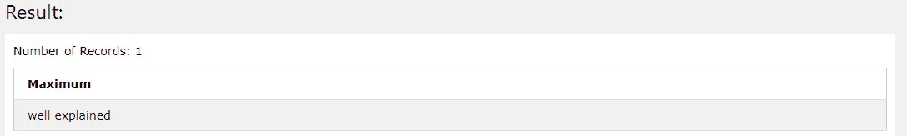

# 查找行中最大值的 SQL 查询

> 原文:[https://www . geeksforgeeks . org/SQL-查询查找最大行数值/](https://www.geeksforgeeks.org/sql-query-for-finding-maximum-values-in-rows/)

**SQL** 代表 [**结构化查询语言**](https://www.geeksforgeeks.org/sql-tutorial/) ，用于创建、维护和检索关系数据库中的数据。[关系数据库管理系统(RDBMS)](https://www.geeksforgeeks.org/rdbms-full-form/) 像 MySQL、MS Access、Oracle 和 SQL Server 一样，使用 SQL 作为它们的标准数据库语言。在这里，我们将看到用于查找行中最大值的 SQL 查询。让我们通过创建一个名为“CSEportal”的数据库来理解它。

**创建数据库:**

```sql
Syntax : 
CREATE DATABASE <DatabaseName>;
Example :
CREATE DATABASE CSEportal;
Output :
Query returned successfully in 3 secs 817 msec.
```

**使用数据库:**

```sql
Syntax :
USE <DatabaseName>;
Example :
USE CSEportal;
```

使用上面的命令，我们已经成功地创建了名为“CSEportal”的数据库，现在我们需要在这个数据库中创建一个名为“GeeksforGeeks”的表(关系)。

**创建表格:**

```sql
Syntax :
CREATE TABLE TableName (field1 dataType1 , field2 dataType2...fieldN dataTypeN);
Example : 
CREATE TABLE GeeksforGeeks(
sno int, 
Description VARCHAR(40), 
courses VARCHAR(40));
```

这将创建一个空表，因此让我们用一些记录填充我们的表，使用 INSERT INTO 命令对表执行实际操作。

**在表中插入记录:**

```sql
Syntax :
INSERT INTO tablename (field1,field2,...fieldN) VALUES (value1,value2...valueN);
Example :
INSERT INTO GeeksforGeeks(sno,Description,Courses) VALUES(1,'Cse Portal','DBMS');
```

同样，我们可以使用这个 INSERT INTO 命令来填充我们的表。要查看创建的表，我们可以运行如下所示的 SELECT 命令:

```sql
SELECT * from GeeksforGeeks;
```

**输出:**


我们的“极客”表

现在我们可以继续编写我们的 SQL 查询来查找所有行中的最大值，这可以使用 SQL 中的 ***MAX(字段)*** 函数来完成。让我们尝试检索字段“描述”的最大值，如下所示:

```sql
Select max(Description) as Maximum from GeeksforGeeks;
```

这里我们使用了“ ***”作为*** ”关键字来更改结果字段的名称，如下图所示:

**输出:**



在这里，我们将“*很好地解释为“*”作为输出，因为它是表中所有行的最大值。让我们尝试将此应用于包含一些数值的字段，以获得更清晰的概念。

```sql
 Select max(sno) from GeeksforGeeks;
```

**输出:**


显然，4 是表中所有行的最大值，因此我们的输出是 4。另外，这里我们没有使用‘as’关键字，所以在结果字段中，我们得到了‘*max(SnO)‘*作为它的名称。这是一个可选步骤，可以用与上面所示相同的方式完成。我们还可以使用如下所示的单个查询从所有行中检索多个字段的最大值:

```sql
Query:
Select max(sno),max(description) from GeeksforGeeks;

Output:
max(sno)    max(description)

4            well explained
```

因此，在这里，我们只使用一个查询检索了两个字段的最大值(从所有行中)。