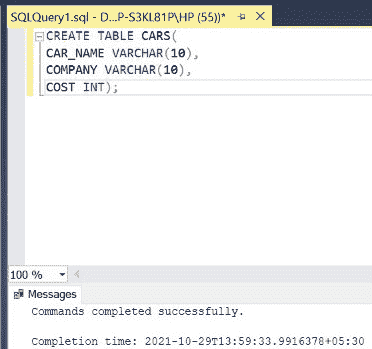

# 同列多值匹配的 SQL 查询

> 原文:[https://www . geesforgeks . org/SQL-查询匹配-同列多值/](https://www.geeksforgeeks.org/sql-query-for-matching-multiple-values-in-the-same-column/)

在 SQL 中，为了匹配同一列中的多个值，我们需要在查询中使用一些特殊的词。下面，使用 **IN** 、 **LIKE** 和**比较运算符(> =)** 演示了 3 种方法来实现这一点。在本文中，我们将使用微软的 SQL Server 作为我们的数据库。

**步骤 1:** 创建数据库。为此，使用下面的命令创建一个名为 GeeksForGeeks 的数据库。

**查询:**

```
CREATE DATABASE GeeksForGeeks
```

*输出:*


**步骤 2:** 使用 GeeksForGeeks 数据库。为此，请使用以下命令。

**查询:**

```
USE GeeksForGeeks
```

*输出:*


**步骤 3:** 在数据库 GeeksForGeeks 中创建一个 CARS 表。该表有 3 列，即 CAR_NAME、COMPANY 和 COST，包含各种汽车的名称、公司和成本。

**查询:**

```
CREATE TABLE CARS(
CAR_NAME VARCHAR(10),
COMPANY VARCHAR(10),
COST INT);
```

*输出:*



**第四步:**描述 CARS 表的结构。

**查询:**

```
EXEC SP_COLUMNS CARS;
```

*输出:*


**第 5 步:**在 CARS 表中插入 5 行。

**查询:**

```
INSERT INTO CARS VALUES('INNOVA','TOYOTA',10000);
INSERT INTO CARS VALUES('CAMRY','TOYOTA',20000);
INSERT INTO CARS VALUES('CIAZ','HONDA',30000);
INSERT INTO CARS VALUES('POLO','VOLKSWAGEN',50000);
INSERT INTO CARS VALUES('BENZ','MERCEDES',100000);
```

*输出:*


**第 6 步:**显示 CARS 表的所有行。

**查询:**

```
SELECT * FROM CARS;
```

*输出:*


**第七步:**检索属于丰田和本田公司的所有汽车的详细信息。

*注意*–在中使用**匹配多个值，即**丰田**和**本田**在同一列，即**公司**。**

**语法:**

```
SELECT * FROM TABLE_NAME WHERE COLUMN_NAME IN (MATCHING_VALUE1,MATCHING_VALUE2);
```

**查询:**

```
SELECT * FROM CARS WHERE COMPANY IN ('TOYOTA','HONDA');
```

*输出:*


**第八步:**检索名称以字母 c 开头的所有汽车的详细信息

*注意*–使用 **LIKE** 匹配多个值，即**凯美瑞**和 **CIAZ** 在同一列，即 **CAR_NAME** 。

**语法:**

```
SELECT * FROM TABLE_NAME WHERE COLUMN_NAME LIKE 'STARTING_LETTER%';
```

**查询:**

```
SELECT * FROM CARS WHERE CAR_NAME LIKE 'C%';
```

*输出:*


**第九步:**检索所有成本大于等于 30000 的车的详细信息。

*注*–使用**比较运算符> =** 匹配多个值，即 **30000** 、 **50000** 和 **100000** 在同一列，即 **COST** 。

**语法:**

```
SELECT * FROM TABLE_NAME WHERE COLUMN_NAME >=VALUE;
```

**查询:**

```
SELECT * FROM CARS WHERE COST>=30000;
```

*输出:*

