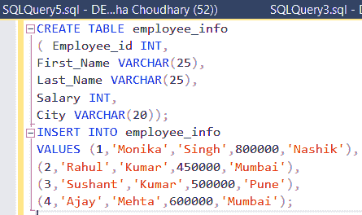
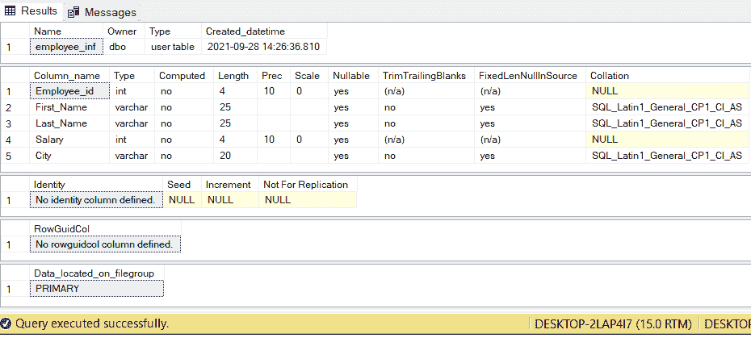
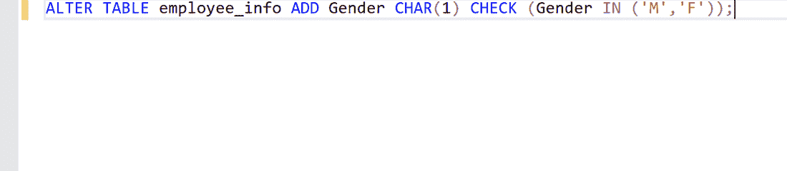
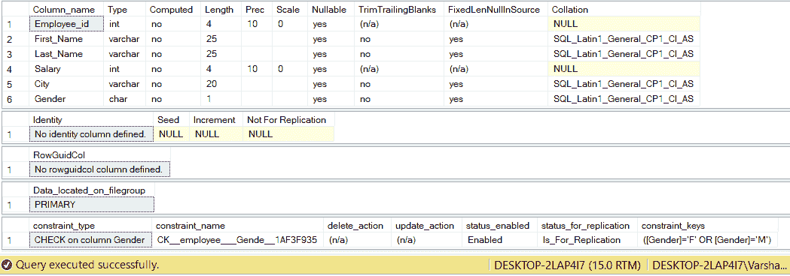
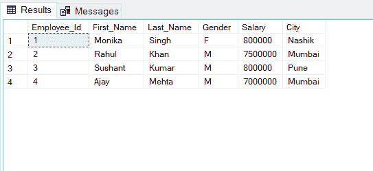

# 在 SQL 中的现有列后添加新列的 SQL 查询

> 原文:[https://www . geesforgeks . org/sql-查询-在 SQL 中的现有列后添加新列/](https://www.geeksforgeeks.org/sql-query-to-add-a-new-column-after-an-existing-column-in-sql/)

S 结构化 Q uery L 语言或 SQL 是一种标准的数据库语言，用于创建、维护和检索关系数据库中的数据，如 MySQL、Oracle、SQL Server、 Postgres 等。在 Microsoft SQL Server 中，我们可以改变列的顺序，并且可以使用 ALTER 命令添加一个新列。[ALTER](https://www.geeksforgeeks.org/sql-alter-add-drop-modify/)TABLE 用于添加、删除/删除或修改现有表格中的列。它还用于在现有表上添加和删除各种约束。

**步骤 1:** 创建数据库

让我们创建一个数据库*员工。*

**查询:**

```sql
CREATE DATABASE employee;
```

**步骤 2:** 创建表格

现在创建一个表*员工信息。*

**查询:**

```sql
CREATE TABLE employee_info
( Employee_id INT,
First_Name VARCHAR(25),
Last_Name VARCHAR(25),
Salary INT,
City VARCHAR(20)); 

INSERT INTO employee_info
VALUES (1,'Monika','Singh',800000,'Nashik'),
(2,'Rahul','Kumar',450000,'Mumbai'),
(3,'Sushant','Kumar',500000,'Pune'),
(4,'Ajay','Mehta',600000,'Mumbai');
```



**步骤 3:** 要查看数据库模式，我们使用以下查询。

**查询:**

```sql
EXEC sp_help 'dbo.employee_info';
```

**输出:**



现在，让我们在表格中添加一个新列*性别*。然后我们使用 ALTER table 命令。

**第四步:**改表。

```sql
ALTER TABLE employee_info ADD Gender CHAR(1) CHECK (Gender IN ('M','F'));
```



**输出:**



现在，在*城市*之后，即最后一个成功添加新列。

再举一个使用查询的例子，如果我们想要*姓氏后的*性别*列，*那么我们可以编写如下所示的查询。

**查询:**

```sql
SELECT Employee_Id,First_Name,Last_Name,Gender,Salary,City FROM employee_info;
```

**输出:**

