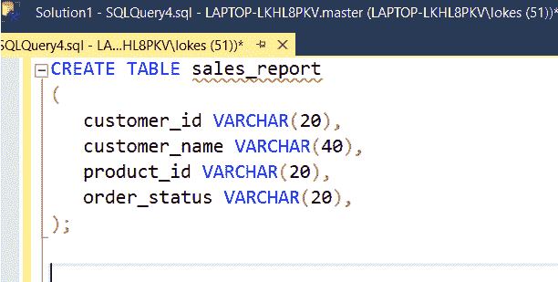
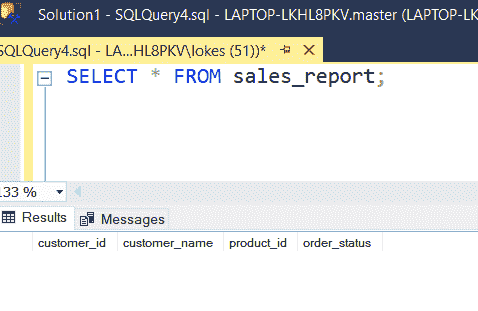
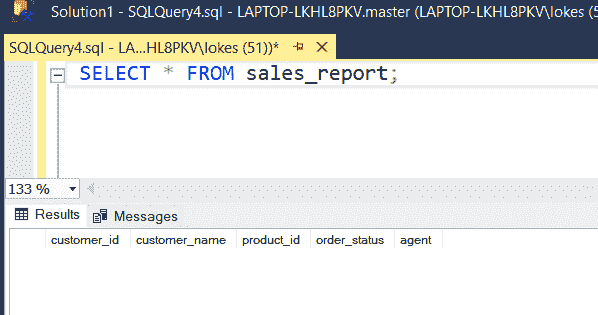
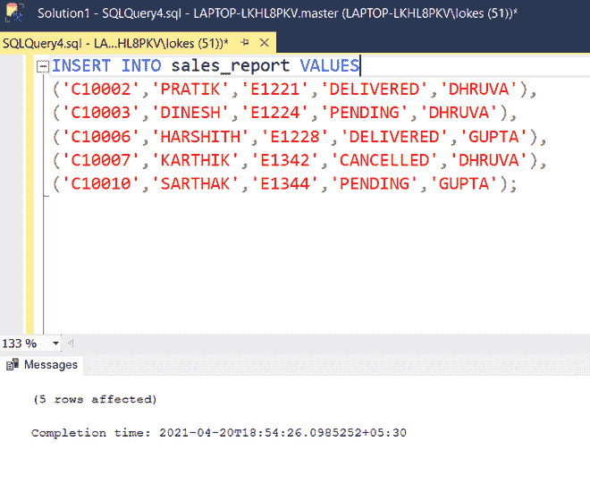
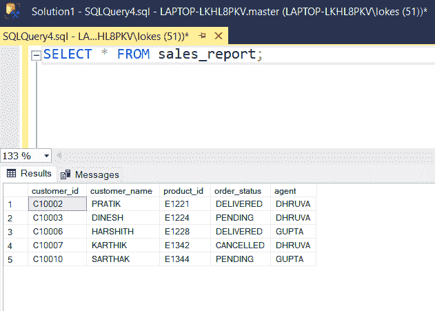

# 在数据库中添加代理参数的 SQL 查询

> 原文:[https://www . geesforgeks . org/SQL-查询-添加代理-数据库中的参数/](https://www.geeksforgeeks.org/sql-query-to-add-an-agent-parameter-in-a-database/)

在本文中，我们将逐步详细了解如何在使用微软 SQL Server 中的 **ALTER 命令**创建表后添加额外的或新的参数:

**步骤 1:** 使用以下 SQL 查询创建数据库销售:

```sql
CREATE DATABASE sales;
```

**第 2 步:**使用数据库销售通过使用以下 SQL 查询:

```sql
USE sales;
```

**步骤 3:** 使用以下 SQL 查询创建一个包含 4 列的表 sales_report:

```sql
CREATE TABLE sales_report
(
  customer_id VARCHAR(20),
  customer_name VARCHAR(40),
  product_id VARCHAR(20),
  order_status VARCHAR(20),
);
```



**步骤 4:** 使用以下查询查看表中的列:

```sql
SELECT * FROM sales_report;
```



**步骤 5:** 添加额外参数代理:

在微软的 SQL Server 中，使用 ALTER 命令添加一个额外的参数，通过在表中添加一个额外的列来改变表。

**语法:**

> ALTER TABLE 表名
> 
> 添加参数数据类型；

因此，现在使用 ALTER 命令，我们将在表中添加一个名为 agent 的新列(即 sales_report)

```sql
ALTER TABLE sales_report
ADD agent VARCHAR(40);
```

查看更改后添加的列代理:

```sql
SELECT * FROM sales_report;
```



代理列已添加到表中

**第 6 步:**使用以下 SQL 查询向 sales_report 表中插入行:

```sql
INSERT INTO sales_report VALUES
('C10002','PRATIK','E1221','DELIVERED','DHRUVA'),
('C10003','DINESH','E1224','PENDING','DHRUVA'),
('C10006','HARSHITH','E1228','DELIVERED','GUPTA'),
('C10007','KARTHIK','E1342','CANCELLED','DHRUVA'),
('C10010','SARTHAK','E1344','PENDING','GUPTA');
```



**步骤 7:** 查看插入的数据

```sql
SELECT * FROM sales_report;
```

