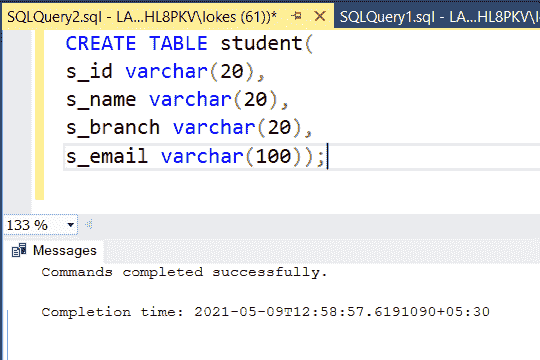

# 仅使用一个查询添加电子邮件验证的 SQL 查询

> 原文:[https://www . geesforgeks . org/SQL-查询-添加-电子邮件-验证-仅使用一个查询/](https://www.geeksforgeeks.org/sql-query-to-add-email-validation-using-only-one-query/)

在本文中，让我们看看如何使用 MSSQL [](https://www.geeksforgeeks.org/sql-tutorial/)作为数据库服务器来检查学生数据库中邮件的有效性。例如，如果电子邮件是像 abcdedfABCDEF…0123456@gmail.com 这是一个电子邮件的有效形式，如果它不是这样，那么这被称为无效。那么，现在我们就一步步详细讨论这个概念:

**步骤 1:** 使用如下 SQL 查询创建数据库学院。

```sql
CREATE DATABASE college;
```

**步骤 2:** 使用数据库学生使用如下 SQL 查询如下。

```sql
USE college;
```

**步骤 3:** 使用如下 SQL 查询创建一个包含 4 列的学生表。

```sql
CREATE TABLE student
(
    s_id varchar(20),
    s_name varchar(20),
    s_branch varchar(20),
    s_email varchar(100)
);
```



**步骤 4:** 使用如下 SQL 查询查看数据库中表的描述。

```sql
EXEC sp_columns student;
```


**步骤 5:** 使用如下 SQL 查询将行插入 student_details 表。

```sql
INSERT INTO student VALUES
('19102001','JOHNSON','E.C.E','john432@gmail.com'),
('19102002','VIVEK','E.C.E','VIVEK2252gmail.com'),
('19102003','DINESH','E.C.E','dineshg@gmail.com'),
('19102004','HARSHA','E.C.E','hARsha302@gmail.com'),
('19102005','DAVID','E.C.E','david2000@gmail.com'),
('19102006','NAVIN','E.C.E','navin00'),
('19102007','VINAY','E.C.E','Vinay24mail.com');
```


**步骤 6:** 使用如下 SQL 查询查看插入行后的表 student_details。

```sql
SELECT * FROM student;
```


**查询:**现在我们查询显示所有有效邮件的学生详细信息。因此，电子邮件验证是通过使用模式匹配来完成的，模式匹配可以通过使用 **MSSQL** 中的 **LIKE** 操作符来完成。它在数据中检查数据库设计者设置的固定模式，并显示与固定模式匹配的数据。

**语法:**

```sql
SELECT * FROM table_name
WHERE attribute LIKE 'pattern';
```

```sql
SELECT * FROM student
WHERE s_email LIKE '%@gmail.com';
```


表格中仅显示拥有有效电子邮件的学生。