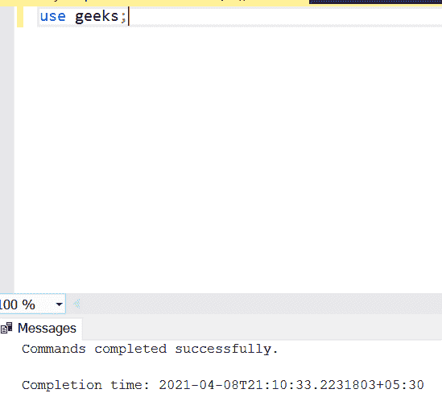

# 使用 ALTER 命令添加外键约束的 SQL 查询

> 原文:[https://www . geesforgeks . org/SQL-query-add-foreign-key-constraints-using-alter-command/](https://www.geeksforgeeks.org/sql-query-to-add-foreign-key-constraints-using-alter-command/)

在本文中，我们将研究如何在 SQL 中使用 ALTER 命令添加外键约束。对于本文，我们将使用**微软 SQL Server** 作为我们的数据库。

但是在我们开始之前，让我们看一下下面的术语:

*   **主键:**用于唯一标识表中的记录。它主要用于关系数据库。主服务器必须是唯一的。
*   **外键:**用于将表链接在一起。这也称为引用。它用于引用另一个表的主键。

### 创建数据库:

我们可以使用以下命令创建数据库:

```
Syntax: CREATE DATABASE DATABASE_NAME;
```

让我们创建一个如下所示的*极客*数据库:

```
CREATE DATABASE geeks;
```


### 使用数据库:

使用以下命令使用*极客*数据库:

```
use geeks;
```



### 将表添加到数据库:-

要将表添加到数据库中，我们使用以下命令:

```
Syntax:- CREATE TABLE table_name (Attribute_name datatype...);
```

因此，让我们在*极客*数据库中创建一个*极客*表，如下所示:

```
CREATE TABLE geeks(id int , name varchar(20));
```


此表添加成功。

### 向表中插入值:

要将记录插入表中，我们可以使用下面的命令:

```
Syntax: INSERT INTO table_name(column1,
                column2,
                column 3,.....)
                 VALUES( value1,
                value2,
                value3,.....);
```

所以让我们在*极客*表中添加一些记录:

```
 INSERT INTO geeks(id,name) VALUES (1,"teja");
```


### 在表中创建主键元素:

要在表中有外键，我们必须有主键。要创建主服务器，我们使用以下命令:

```
Syntax: CREATE TABLE table_name (Attribute_name  datatype PRIMARY_KEY);
```

现在让我们创建一个主键:

```
CREATE TABLE emp (id int NOT NULL PRIMARY KEY,name varchar(20))
```


现在要添加外键，我们必须通过以下方式创建一个新表:

```
CREATE TABLE  student(
id int ,
name varchar(20),
Emp_id int REFERENCES emp(id));
```


### 更改表并添加外键:

因此，如果您已经创建了学生表，并且现在希望添加外键，则可以使用下面的命令进行更改:

```
ALTER TABLE dbo.student 
add  constraint Fk_empid foreign key(emp_id)
references dbo.emp(id);
```


至此，我们已经成功实现了我们的目标。