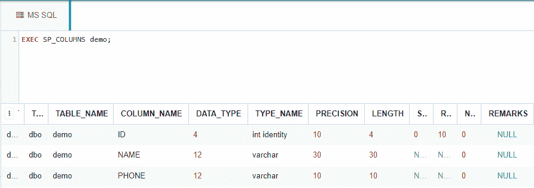
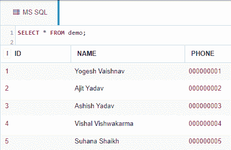
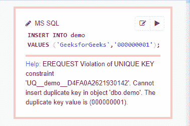

# 使用 ALTER 命令添加唯一键约束的 SQL 查询

> 原文:[https://www . geesforgeks . org/SQL-query-add-unique-key-constraints-using-alter-command/](https://www.geeksforgeeks.org/sql-query-to-add-unique-key-constraints-using-alter-command/)

在这里，我们将看到如何在使用 ALTER 子句的 SQL 查询的帮助下，向 MS SQL Server 数据库的列添加唯一键约束。

出于演示目的，我们将在名为“极客”的数据库中创建一个*演示*表。

**创建数据库:**

使用下面的 SQL 语句创建一个名为*极客*的数据库:

```sql
CREATE DATABASE geeks;
```

**使用数据库:**

使用下面的 SQL 语句将数据库上下文切换到*极客*:

```sql
USE geeks;
```

**表定义:**

我们的*极客*数据库中有以下*演示*表。

```sql
CREATE TABLE demo(
  ID INT IDENTITY(1,1) PRIMARY KEY, --IDENTITY(1,1) is same as AUTO_INCREMENT in MySQL.
                                      --Starts from 1 and increases by 1 with each inserted row.
  NAME VARCHAR(30) NOT NULL,
  PHONE VARCHAR(10) NOT NULL
);
```

您可以使用下面的语句来查询创建的表的描述:

```sql
EXEC SP_COLUMNS demo;
```



**向表中添加数据:**

使用以下语句将数据添加到演示表中:

```sql
INSERT INTO demo --no need to mention columns explicitly as we are inserting into all columns and ID gets 
                 --automatically incremented.
VALUES
('Yogesh Vaishnav', '000000001'),
('Ajit Yadav', '000000002'),
('Ashish Yadav', '000000003'),
('Vishal Vishwakarma', '000000004'),
('Suhana Shaikh', '000000005');
```

要验证表格的内容，请使用以下语句:

```sql
SELECT * FROM demo;
```



现在让我们给列*电话添加一个**唯一键**约束，因为电话号码应该是唯一的。*

**注意:**一个数据库表中可以有多个**唯一键**列，但只有一个**主键**列。

将唯一键约束添加到单列和多列的语法如下:

> **语法:**
> 
> –向列添加唯一键约束。
> 
> 更改表格<table_name></table_name>
> 
> 添加唯一(<column_name>)；</column_name>
> 
> –向多个列添加唯一键约束
> 
> 更改表格<table_name></table_name>
> 
> 添加约束<identifier_name>唯一(<column_name1>、<column_name2>、…)；</column_name2></column_name1></identifier_name>

**示例:**

```sql
ALTER TABLE demo
ADD UNIQUE (PHONE);

--Let's insert a row into the table.

INSERT INTO demo
VALUES ('GeeksforGeeks','000000001'); --error
```

由于字符串‘000000001’已经存在于*电话*列中，该列现在具有唯一的键约束，因此在执行上述查询时会导致错误。



因此，我们可以说唯一键约束已经成功应用。