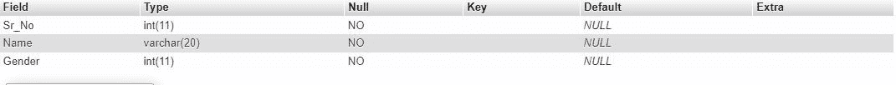
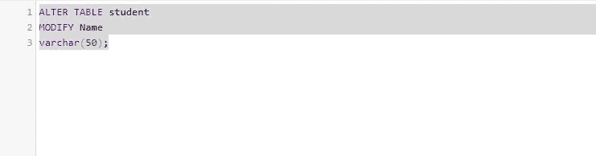
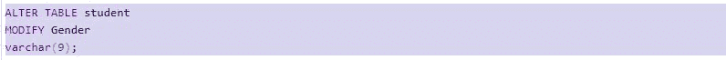
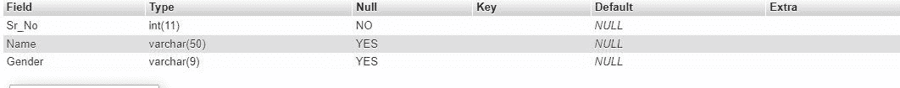

# 在 MySQL 中改变列大小的 SQL 查询

> 原文:[https://www . geesforgeks . org/SQL-query-to-alter-column-size-in-MySQL/](https://www.geeksforgeeks.org/sql-query-to-alter-column-size-in-mysql/)

有时您可能需要在 MySQL 中更改列大小或字段长度。在本文中，我们将了解如何在 MySQL 中更改列大小。您可以使用这些命令来增加或减少 MySQL 中的列大小。

**SQL ALTER TABLE 语句:**

> ALTER TABLE 语句用于添加、删除或修改现有表中的列。

**语法:**

```
ALTER TABLE table_name
MODIFY column_name
varchar(new_length);
```

**示例:**

让我们用 table_name 创建一个表；“学生”

```
-- create a table
CREATE TABLE students (Sr_No integer,Name varchar(20), Gender integer);
```

**description**用来形容某物。因为在数据库中我们有表，所以我们使用 DESCHERE 或 DESC(两者都是相同的)命令来描述表的结构。

**语法:**

```
DESCRIBE student;
 OR
DESC student;
```

对上表使用此命令(在 Xampp 中)；

**输出:**



现在使用 Alter 命令更改列的大小

```
ALTER TABLE student
MODIFY Name
varchar(50);
```



要查看表格结构，请使用描述命令:

```
DESCRIBE student;
```

**输出:**


列大小从 20 更改为 50。

**用于减小“性别”栏的尺寸**

```
ALTER TABLE student
MODIFY Gender
varchar(9);
```



要查看表格结构，请使用描述命令:

```
DESCRIBE student;
```

**输出:**



列大小从 11 更改为 9。