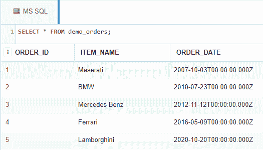

# 计算两个特定日期之间总周数的 SQL 查询

> 原文:[https://www . geesforgeks . org/SQL-查询-计算-两个特定日期之间的总周数/](https://www.geeksforgeeks.org/sql-query-to-calculate-total-number-of-weeks-between-two-specific-dates/)

这里我们将看到，如何借助使用 DATEDIFF()函数的 SQL 查询来计算两个给定日期之间的周数。

为了演示，我们将在名为“*极客*的数据库中创建一个 *demo_orders* 表。

### **创建数据库:**

使用下面的 SQL 语句创建一个名为*极客*的数据库:

```
CREATE DATABASE geeks;
```

### **使用数据库:**

使用下面的 SQL 语句将数据库上下文切换到极客:

```
USE geeks;
```

### 表格定义:

我们的*极客*数据库中有以下演示表。

```
CREATE TABLE demo_orders(
ORDER_ID INT IDENTITY(1,1) PRIMARY KEY,
ITEM_NAME VARCHAR(30) NOT NULL,
ORDER_DATE DATE NOT NULL
);
```

您可以使用下面的语句来查询创建的表的描述:

```
EXEC SP_COLUMNS demo_orders;
```


### **向表中添加数据:**

使用以下语句将数据添加到*演示订单*表中:

```
INSERT INTO demo_orders --no need to mention columns explicitly as we are inserting
                        --into all columns and ID gets
                          --automatically incremented.
VALUES
('Maserati', '2007-10-03'),
('BMW', '2010-07-23'),
('Mercedes Benz', '2012-11-12'),
('Ferrari', '2016-05-09'),
('Lamborghini', '2020-10-20');
```

要验证表格的内容，请使用以下语句:

```
SELECT * FROM demo_orders;
```



现在让我们使用 DATEDIFF()函数在表格中找到“玛莎拉蒂”和“法拉利”订单日期之间的周数。

下面是 DATEDIFF()函数的语法，用于查找两个给定日期之间的周数。

```
Syntax: DATEDIFF(week or ww or wk, <start_date>, <end_date>);
```

**例**:

```
DECLARE 
@start VARCHAR(10) = (
  SELECT order_date FROM demo_orders
  WHERE item_name = 'Maserati'),
@end VARCHAR(10) = (
  SELECT order_date FROM demo_orders
  WHERE item_name = 'Ferrari')

--@start variable holds the start date(i.e date of Maserati being purchased).

--@end variable holds the end date (i.e date of Ferrari being purchased).

SELECT DATEDIFF(ww, @start, @end) AS number_of_weeks;
```

**输出:**

