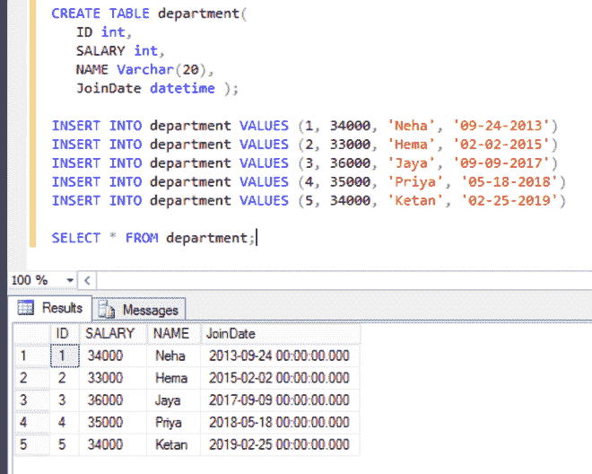
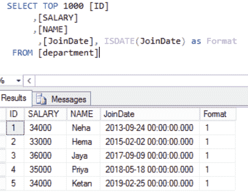

# 检查给定日期格式的 SQL 查询

> 原文:[https://www . geesforgeks . org/SQL-查询到检查给定日期格式/](https://www.geeksforgeeks.org/sql-query-to-check-given-format-of-a-date/)

在这里，我们将看到如何找到 SQL Query 来检查传递给查询的日期是否是给定格式的日期。在本文中，我们将使用微软的 SQL Server 作为我们的数据库。

在这里，我们将首先创建一个名为“极客”的数据库，然后在该数据库中创建一个表“部门”。之后，我们将对该表执行查询。

**创建数据库:**

```sql
CREATE DATABASE geeks;
```

**使用数据库:**

```sql
USE geeks;
```

**表定义:**

我们的*极客*数据库中有一个名为部门的下表。

```sql
CREATE TABLE department
(
    ID int,
    SALARY int,
    NAME Varchar(20),
    JoinDate datetime 
);
```

**加值到表中:**

```sql
INSERT INTO department VALUES (1, 34000, 'Neha', '09-24-2013')
INSERT INTO department VALUES (2, 33000, 'Hema', '02-02-2015')
INSERT INTO department VALUES (3, 36000, 'Jaya', '09-09-2017')
INSERT INTO department VALUES (4, 35000, 'Priya', '05-18-2018')
INSERT INTO department VALUES (5, 34000, 'Ketan', '02-25-2019')
```

要验证表的内容，请使用以下 SQL 查询:

```sql
SELECT * FROM department;
```



**检查传递给查询的日期是否是给定格式的日期:**

SQL 有 [IsDate()](https://www.geeksforgeeks.org/isdate-function-in-sql-server/) 函数，用于检查传递的值是否为指定格式的日期，当指定值为日期时返回 1(真)，否则返回 0(假)。

**语法:**

> 选择日期作为“格式”；
> 
> **或**
> 
> 从表名中选择*作为“格式”；

**示例:**

```sql
SELECT TOP 1000 [ID]
     ,[SALARY]
     ,[NAME]
     ,[JoinDate], ISDATE(JoinDate) as Format 
 FROM [department]
```

