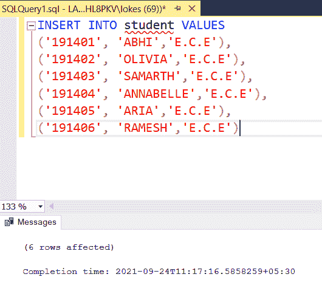

# 检查名字是否以元音开头和结尾的 SQL 查询

> 原文:[https://www . geesforgeks . org/SQL-query-to-check-如果名字以元音开头和结尾/](https://www.geeksforgeeks.org/sql-query-to-check-if-a-name-begins-and-ends-with-a-vowel/)

在本文中，我们将看到一个 SQL 查询来检查一个名称是否以元音开头和结尾，我们将借助一个示例来实现为了更好地理解，首先，我们将创建一个数据库名称的数据库将 GeeksforGeeks。在数据库中，我们将创建一个名为“学生”的表。

这里我们使用两种不同的方法。

**语法:**

```
FOR LEFT():
LEFT ( expression, no_of_chars needed to the left)

FOR RIGHT():
RIGHT ( expression, no_of_chars needed to the right)
```

在本文中，让我们看看如何检查一个名字是否以元音开头和结尾，并使用 MSSQL 作为服务器来显示它们。

### **步骤 1:创建数据库**

使用如下 SQL 查询创建数据库极客。

**查询:**

```
CREATE DATABASE GeeksforGeeks;
```


### **第二步:使用数据库**

使用数据库 GeeksforGeeks 使用如下的 SQL 查询。

**查询:**

```
USE GeeksforGeeks;
```


### **第三步:创建表格**

使用以下 SQL 查询创建一个包含 3 列的学生表，如下所示。

**查询:**

```
CREATE TABLE student(
stu_id VARCHAR(8),
stu_name VARCHAR(30),
stu_branch VARCHAR(30)
)
```


### **第四步:验证数据库**

使用以下 SQL 查询查看表的描述，如下所示。

**查询:**

```
EXEC sp_columns student 
```


### **第五步:将数据插入表格**

使用以下 SQL 查询将行插入学生表，如下所示。

**查询:**

```
INSERT INTO student VALUES
('191401', 'ABHI','E.C.E'),
('191402', 'OLIVIA','E.C.E'),
('191403', 'SAMARTH','E.C.E'),
('191404', 'ANNABELLE','E.C.E'),
('191405', 'ARIA','E.C.E'),
('191406', 'RAMESH','E.C.E')
```



### **第六步:验证插入的数据**

使用以下 SQL 查询插入行后查看学生表，如下所示。

**查询:**

```
SELECT * FROM student 
```


**第 7 步:**使用字符串函数和 IN 运算符进行查询，检查姓名是否以元音开头和结尾

#### **方法 1:**

为了检查一个名字是否以元音结尾，我们使用字符串函数来选择第一个和最后一个字符，并检查它们是否与查询条件中使用的元音匹配。我们在 SQL 中使用字符串的 LEFT()和 RIGHT()函数来检查第一个和最后一个字符。

**查询:**

```
SELECT stu_name
FROM student 
WHERE LEFT(stu_name , 1) IN ('a','e','i','o','u')
AND RIGHT(stu_name,1) IN  ('a','e','i','o','u')
```

**输出:**


**方法二:**

使用正则表达式和 LIKE 运算符检查第一个和最后一个字符是否是元音。使用 REGEX 查询名字是否以元音开头和结尾

**查询:**

```
SELECT stu_name 
FROM student 
WHERE stu_name LIKE '[aeiouAEIOU]%[aeiouAEIOU]'
```

这里%用于任何字符的多次出现，而[]用于括号中给定字符集的任何一次出现。

**输出:**

