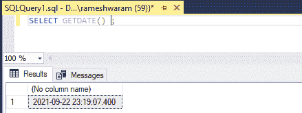
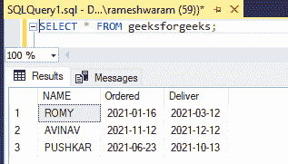
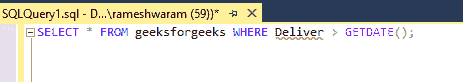
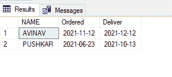
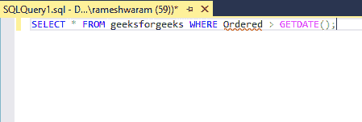
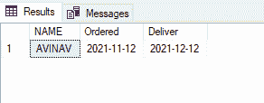

# SQL 查询，检查 SQL 中的日期是否大于今天

> 原文:[https://www . geesforgeks . org/sql-查询检查日期是否大于 SQL 中的今天/](https://www.geeksforgeeks.org/sql-query-to-check-if-date-is-greater-than-today-in-sql/)

在本文中，我们将看到 SQL 查询，通过使用 [**GETDATE()**](https://www.geeksforgeeks.org/getdate-function-in-sql-server/) 函数将日期与今天的日期进行比较来检查日期是否大于今天的日期。SQL Server 中的这个函数用于以 **'YYYY-MM-DD hh:mm:** **ss 返回数据库系统的当前日期和时间。****mmm’**图案。

**特征:**

*   该功能用于查找数据库系统的当前日期和时间。
*   该功能属于日期功能。
*   这个函数不接受任何参数。
*   该函数返回输出'以' T0]YYYY-MM-DD hh:MM:**ss 表示。** **嗯**格式。

要检查当前日期，我们只需使用 GETDATE()函数。

**查询:**

```
SELECT GETDATE();        
```

**输出:**



现在，举个例子来检查日期是否大于今天的日期。为此，我们遵循以下步骤:

**步骤 1:** 创建数据库

我们可以使用以下命令创建一个名为 geeks 的数据库。

**查询:**

```
CREATE DATABASE geeks;
```

**步骤 2:** 使用数据库

使用下面的 SQL 语句将数据库上下文切换到极客:

**查询:**

```
USE geeks;
```

**步骤 3:** 表格定义

我们的极客数据库中有以下极客。

**查询:**

```
CREATE TABLE geeksforgeeks(
NAME VARCHAR(20),
Ordered DATE,
Deliver DATE);
```

**步骤 4:** 将数据插入表格

**查询:**

```
INSERT  INTO geeksforgeeks VALUES
 ('ROMY', '2021-01-16', '2021-03-12'),
('AVINAV', '2021-11-12', '2021-12-12'),
 ('PUSHKAR', '2021-06-23', '2021-10-13');
```

**步骤 5:** 对于视图，表格数据

要查看表格的内容，请运行以下命令

**查询:**

```
SELECT * FROM geeksforgeeks;
```

**输出:**



**步骤 6:** 检查日期是否大于今天

*   为此，我们将从表中检查哪一行的值大于今天的日期。

**查询:**

```
SELECT * FROM geeksforgeeks WHERE Deliver > GETDATE();
```



**输出:**



日期为 2021-12-12 和 2021-10-13 的返回值大于 2021-09-22(今天的日期)

*   检查订购日期晚于今天的日期。

**查询:**

```
SELECT * FROM geeksforgeeks WHERE Ordered > GETDATE();
```



**输出:**

