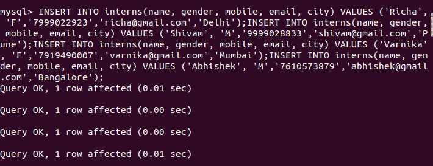
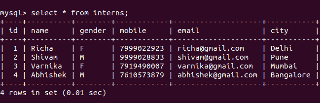

# 用于检查或查找主键列的列名的 SQL 查询

> 原文:[https://www . geesforgeks . org/SQL-query-to-check-or-find-the-column-name-primary-key-column/](https://www.geeksforgeeks.org/sql-query-to-check-or-find-the-column-name-which-is-primary-key-column/)

[结构化查询语言](ustom software development geeksforgeeks)或 SQL，由命令组成，使用户能够创建数据库和表结构，执行各种类型的数据操作和数据管理，并查询数据库以提取有用的信息。我们将从创建数据库“geeksforgeeks”开始，然后在该数据库中创建一个“实习生”表。之后，我们将在表上执行查询。

**创建数据库:**

```sql
CREATE DATABASE geeksforgeeks;
```

**使用上面创建的数据库:**

```sql
USE geeksforgeeks;
```

**创建表格:**

```sql
CREATE TABLE interns(
    id SERIAL PRIMARY KEY, 
    name VARCHAR(30),
     gender VARCHAR(1), 
    mobile BIGINT, 
    email VARCHAR(35), 
    city VARCHAR(25));
```

**查看上面创建的表的描述:**

```sql
DESC interns;
```


**将数据插入表中:**

```sql
INSERT INTO interns(name, gender, mobile, email, city) VALUES ('Richa', 'F', '7999022923', 'richa@gmail.com', 'Delhi');
INSERT INTO interns(name, gender, mobile, email, city) VALUES ('Shivam', 'M', '9999028833', 'shivam@gmail.com', 'Pune');
INSERT INTO interns(name, gender, mobile, email, city) VALUES ('Varnika', 'F', '7919490007', 'varnika@gmail.com', 'Mumbai');
INSERT INTO interns(name, gender, mobile, email, city) VALUES ('Abhishek', 'M', '7610573879', 'abhishek@gmail.com', 'Bangalore');
```



**查看插入数据:**

```sql
SELECT * FROM interns;
```



我们已经完成了创建数据库、创建表和向表中插入数据。现在，我们必须找出创建的表的主键，该主键应该是“id”。

**查找任意表的主键:**

> 从中选择列名
> 
> 信息模式。表 _ 约束
> 
> 加入信息模式。密钥 _ 列 _ 用法
> 
> 约束名
> 
> 其中 K.TABLE_NAME= **“您的-TABLE-NAME”**
> 
> 和 K.TABLE_SCHEMA= **“您的数据库名称”**
> 
> 约束类型=“主键”限制 1；

**示例:**

```sql
SELECT K.COLUMN_NAME FROM  
INFORMATION_SCHEMA.TABLE_CONSTRAINTS T
JOIN INFORMATION_SCHEMA.KEY_COLUMN_USAGE K
ON K.CONSTRAINT_NAME=T.CONSTRAINT_NAME  
WHERE K.TABLE_NAME='interns'
AND K.TABLE_SCHEMA='geeksforgeeks'  
AND T.CONSTRAINT_TYPE='PRIMARY KEY' LIMIT 1;
```


这里，我们将 COLUMN_NAME 作为“id”，即“实习生”表的 PRIMARY KEY。

**说明:**

信息模式。TABLE_CONSTRAINTS 是一个表，它包含了迄今为止在任何数据库中创建的所有表的信息。我们需要这个表来验证约束类型。您可以通过运行下面的查询来查看表格提供的信息。

```sql
SELECT * FROM INFORMATION_SCHEMA.TABLE_CONSTRAINTS;
```

此外，我们还有 INFORMATION_SCHEMA。描述哪些键列有约束的键列使用表。我们需要这个表来获得列名。您可以通过运行下面的查询来查看表格提供的信息。

```sql
SELECT * FROM INFORMATION_SCHEMA.KEY_COLUMN_USAGE;
```

因此，我们在约束名上连接了这两个表。我们选择了那些记录中的 K.COLUMN_NAME，其中 K.TABLE_NAME = '实习生'和 K.TABLE_SCHEMA = 'geeksforgeeks '和 T . CONSTRAINT _ TYPE = '主键'。