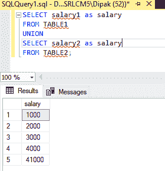

# 合并两个没有公共列的表的 SQL 查询

> 原文:[https://www . geeksforgeeks . org/SQL-查询-合并两个没有公共列的表/](https://www.geeksforgeeks.org/sql-query-to-combine-two-tables-without-a-common-column/)

在学习过程中的大多数查询中，我们通常使用来连接那些在它们之间具有一些公共列或关系的表。但是当涉及到现实生活中的问题时，这样最容易的情况很少出现。像连接两个没有公共列的表这样的复杂任务是常见的。

让我们首先看一下我们将在本例中加入的表格:

**创建数据库:**

使用下面的 SQL 语句创建一个名为*极客*的数据库:

```
CREATE DATABASE GFG;
```

**使用数据库:**

使用下面的 SQL 语句将数据库上下文切换到极客:

```
USE GFG;
```

**添加表格:**

现在，我们创建了两个名为表 1 和表 2 的表

```
CREATE TABLE table1
(
    Name1 VARCHAR(20),
    ID1 INT PRIMARY KEY,
    Salary1 INT
);

CREATE TABLE table2
(
    Name2 VARCHAR(20),
    ID2 INT PRIMARY KEY,
    Salary2 INT
);
```

现在，向表中添加数据

```
INSERT INTO table1
ValUES
('Harish',1,1000),
('Rakesh',2,2000),
('Mukesh',3,3000),
('Suresh',4,4000),
('Ramesh',5,4000);

INSERT INTO table2
VALUES
('Astitva',1,4000),
('Maharaj',2,41000);
```

要验证表格的内容，请使用以下语句:

对于表 1:

```
SELECT * FROM table1;
```

对于表 2:

```
SELECT * FROM table2;
```


现在我们可以看到，在上面的两个表中，没有两列是相同的。现在要将它们合并成一个表，我们有 3 种不同的方法。

**方法 1(交叉连接):**正如您可能听说过的几个连接，如内部连接、外部连接，以同样的方式，交叉连接是存在的，它用于形成没有或有公共列的表的笛卡尔乘积。因为这些连接不检查任何列，只是检查两个表的乘积，所以这些连接不适合任何查询，因为这些连接会导致数据重复。此外，还会出现不一致。但是因为我们对知道方法感兴趣，所以我们正在讨论它。

为了进行交叉连接，我们只需要在 FROM 子句中指定表的名称。不，需要 WHERE 子句。

```
SELECT * FROM table1, table2;
```


5*2=10

**方法 2 (UNION 方法):**这个方法不同于上面的方法，因为它不仅仅是一个连接。它的主要目的是通过逐行方法组合表。它只是将两个表的**唯一**行数相加，并根据方法中指定的第一个表命名列。

```
SELECT *
FROM TABLE1
UNION
SELECT *
FROM TABLE2;
```

这将返回在 TABLE1 的列名下组合在一起的所有行(唯一的)。


我们还可以在这个方法中查询单个列或重命名列，如下所示:

```
SELECT salary1 as salary
FROM TABLE1
UNION
SELECT salary2 as salary
FROM TABLE2;
```



因此，我们能够在这两个表中选择所有可能的工资，并提供给不同的客户。此方法返回唯一的数据。

**方法 3(UNION ALL):**UNION 和 UNION ALL 方法之间的唯一区别是，前一个方法允许非重复(唯一)行，但后一个方法也通过组合重复行来产生所有可能的行。

```
SELECT salary1 as salary
FROM TABLE1
UNION all
SELECT salary2 as salary
FROM TABLE2;
```


因此，我们可以看到三种不同的方法来组合表和非公共列。这些方法根据需要在不同的条件下使用。