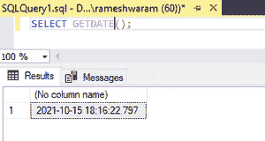
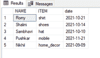
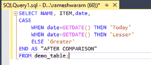
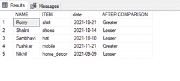

# 将结果与今天的日期进行比较的 SQL 查询

> 原文:[https://www . geesforgeks . org/SQL-查询结果与今天日期的比较/](https://www.geeksforgeeks.org/sql-query-to-compare-results-with-todays-date/)

在本文中，我们将看到 SQL Query 通过使用 SQL 的 [GETDATE()函数](https://www.geeksforgeeks.org/getdate-function-in-sql-server/)将数据与今天的日期进行比较，从而将结果与今天的日期进行比较。

为了比较日期，我们可以使用 [CASE()函数](https://www.geeksforgeeks.org/sql-case-statement/)

**GETDATE()** 功能:该功能用于返回数据库系统当前的日期和时间。

**特征:**

*   它返回系统的当前日期和时间。
*   它属于日期函数。
*   它不接受任何参数。
*   它以–'**YYYY-MM-DD hh:MM:ss 格式返回输出。嗯**'

**查询:**

检查当前日期

```
SELECT GETDATE();
```

**输出:**



**CASE()** :此语句包含一个或多个条件及其对应的结果。它类似于 IF_ELSE 语句，一旦满足某个条件，它就停止读取并返回相应的结果。

如果不满足任何条件，它将返回 ELSE 语句中的值。如果 ELSE 语句不存在，则返回空值。

**语法:**

```
 CASE
    WHEN condition1 THEN result1
    WHEN condition2 THEN result2
    WHEN conditionN THEN resultN
    ELSE result
END;
```

现在，举一个例子来比较今天的结果。

遵循以下步骤:

**步骤 1:** 创建数据库

我们可以使用以下命令创建一个名为 geeks 的数据库。

**查询:**

```
CREATE DATABASE geeks;
```

**步骤 2:** 使用数据库

使用下面的 SQL 语句将数据库上下文切换到极客:

```
USE geeks;
```

**第三步**:表格定义

我们的极客数据库中有以下演示表。

**查询:**

```
CREATE TABLE demo_table(
NAME VARCHAR(20),
ITEM varchar(20),
date DATE);
```

**步骤 4:** 将数据插入表格

**查询:**

```
INSERT INTO demo_table VALUES('Romy','shirt','2021-10-21'),
('Shalini', 'shoes', '2021-10-14'),
('Sambhavi','hat','2021-10-10'),
('Pushkar','mobile','2021-11-21'),
('Nikhil','home_decor','2021-09-09');
```

**第五步:**查看表格内容

**查询:**

```
SELECT * from demo_table;
```

**输出:**



**步骤 6:** 将结果与今天的日期进行比较

为此，我们将返回一个名为“比较后”的列，该列在将今天的日期与“交付”列中的值进行比较后返回一个值。比较后列包含以下字符串:

*   小于-如果日期小于今天的日期
*   大于-如果日期大于今天的日期
*   今天-如果日期与今天的日期相同。

**语法:**

```
SELECT column_name,
CASE  
       WHEN condition1 THEN result1
       WHEN condition2 THEN  result2
       ELSE result3  
END 
FROM table_name;
```

**查询:**

```
SELECT NAME, ITEM,date,
CASE  
    WHEN date=GETDATE() THEN 'Today'
    WHEN date<GETDATE() THEN 'Lesser'
    ELSE 'Greater'  
END AS "AFTER COMPARISON"
FROM demo_table;
```

**输出:**

 