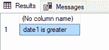

# 比较两个日期的 SQL 查询

> 原文:[https://www . geesforgeks . org/SQL-查询比较两个日期/](https://www.geeksforgeeks.org/sql-query-to-compare-two-dates/)

在 SQL 中，日期对于新手来说很复杂，因为在使用数据库的时，表中的日期格式必须与输入的日期匹配才能插入。在各种场景中，不使用日期，而是使用日期时间(时间也与日期相关)。这里我们将看到，SQL Query 对两个日期进行比较。这可以使用等于(=)、小于(<)和大于(>)运算符轻松完成。在 SQL 中，日期值具有[日期数据类型](https://www.geeksforgeeks.org/sql-date-functions/)，它接受“yyyy-mm-dd”格式的日期。为了比较两个日期，我们将声明两个日期，并使用 [**IF-ELSE** 语句进行比较。](https://www.geeksforgeeks.org/sql-conditional-expressions/)

**语法:**

> 布尔表达式
> 
> { sql _ 语句|语句 _ 块}
> 
> [ ELSE
> 
> { sql _ 语句|语句 _ 块} ]

我们可以通过在变量名前使用关键字[**【DECLARE】**](https://www.geeksforgeeks.org/table-variable-in-sql-server/)来轻松地声明变量。默认情况下，局部变量以@开头。

**语法:**

```sql
DECLARE @variable_name datatype;
```

**给变量赋值:**我们可以使用 Set 关键字给变量赋值。

**语法:**

```sql
SET @variable_name;
```

现在我们用不同的例子来演示日期之间的比较。

**查询 1:**

```sql
DECLARE @date1 DATE, @date2 DATE;                               
SET @date1='2021-01-01';
SET @date2='2021-02-02';                                       
IF @date1=@date2                                                
SELECT 'equal date'
ELSE
IF @date1<@date2 SELECT 'date2 is greater'              
ELSE SELECT 'date1 is greater';                         
```


**输出:**


**查询 2:**

```sql
DECLARE @date1 DATE, @date2 VARCHAR(20);
SET @date1='2021-01-01';
SET @date2='2021-01-01';
IF @date1=@date2
SELECT 'equal date'
ELSE
IF @date1<@date2 SELECT 'date2 is greater'
ELSE SELECT 'date1 is greater';
```


**输出:**


**查询 3:**

```sql
DECLARE @date1 DATE, @date2 VARCHAR(20);
SET @date1='2022-01-01';
SET @date2='2021-01-01';
IF @date1=@date2
SELECT 'equal date'
ELSE
IF @date1<@date2 SELECT 'date2 is greater'
ELSE SELECT 'date1 is greater';
```


**输出:**

