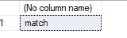
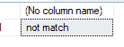

# 比较两个字符串的 SQL 查询

> 原文:[https://www . geesforgeks . org/SQL-查询比较两个字符串/](https://www.geeksforgeeks.org/sql-query-to-compare-two-strings/)

SQL 代表结构化查询语言。它用于与数据库通信。有一些标准的 SQL 命令，如“选择”、“删除”、“更改”等。要在 SQL Server 中比较两个字符串，没有直接的方法。在本文中，我们将学习如何在 MS SQL 服务器中比较两个字符串，并提供一些示例。

字符串函数是将字符串值作为输入的函数，与返回值的数据类型无关。在 SQL Server 中，有许多内置的字符串函数可供开发人员使用。

我们可以使用 **IF-ELSE** 语句来比较字符串。

**语法:**

> 布尔表达式
> 
> { sql _ 语句|语句 _ 块}
> 
> [ ELSE
> 
> { sql _ 语句|语句 _ 块} ]

### **声明变量:**

我们可以通过在变量名前使用关键字 declare 来轻松地声明变量。默认情况下，局部变量以@开头。

**语法:**

> DECLARE @variable_name 数据类型；

### **给变量设置值:**

我们可以使用 SET 关键字为变量赋值。

**语法:**

> SET @ variable _ name

**例 1:**

**查询:**

```sql
DECLARE @Name1 VARCHAR(30), @Name2 VARCHAR(20);
Set @Name1='geeks';
Set @Name2='geeks';
If @Name1=@Name2 Select 'match' else Select 'not match';
```

**输出:**



上面的示例显示了字符串比较，并将结果作为“匹配”返回，因为两个字符串是相同的。

**例 2:**

**查询:**

```sql
DECLARE @Name1 VARCHAR(30), @Name2 VARCHAR(20);
Set @Name1='geeks';
Set @Name2='geeksforgeeks';
If @Name1=@Name2 Select 'match' else Select 'not match';
```

**输出:**



上面的示例显示了字符串比较，并将结果作为“不匹配”返回，因为两个字符串不相同。