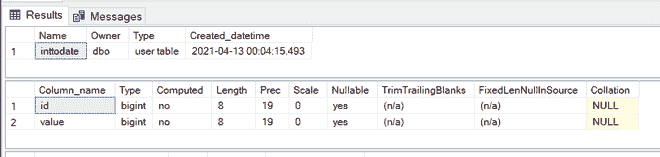
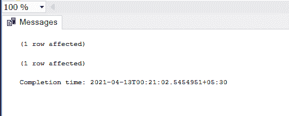
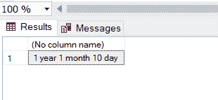
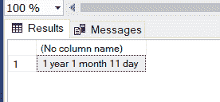

# 将整数转换为年月日的 SQL 查询

> 原文:[https://www . geesforgeks . org/SQL-查询-转换-整数-年-月-日/](https://www.geeksforgeeks.org/sql-query-to-convert-an-integer-to-year-month-and-days/)

通过这篇文章，我们将了解如何将整数值转换为年、月、日。本文的前提是您的计算机上应该有一个 [MSSQL](https://www.microsoft.com/en-in/sql-server/sql-server-downloads) 服务器。

#### 什么是查询？

查询是为执行特定任务而编写的一条或一组语句，如检索数据、将数据保存到数据库。

让我们首先创建一个数据库来执行这个任务–

#### 第一步:

```
CREATE DATABASE GFG
```

**步骤 2:** 使用数据库

```
USE GFG
```

**第 3 步:**创建一个名为**的表格，并输入**-

```
CREATE TABLE inttodate (id bigint,
                        value bigint);
```

**第 4 步:**描述该表–



已创建表架构

**步骤 5:** 在表格中插入一些值–

```
INSERT INTO [dbo].[inttodate]
           ([id]
           ,[value])
     VALUES
           (1
           ,35110011)

INSERT INTO [dbo].[inttodate]
           ([id]
           ,[value])
     VALUES
           (2
           ,35220011)
```



插入表中的数据

**步骤 6:** 现在运行查询，检查插入数据的年、月、日转换是什么–

在这里，我们将使用 dateadd 函数创建一个变量，然后我们将这些值分成年、月和日期。

```
DECLARE @variable_date DATETIME = DATEADD(SECOND, (SELECT [value]
FROM [dbo].[inttodate] WHERE [id] = '1'), 0)

SELECT CAST(DATEPART(YEAR, @variable_date) - 1900 AS VARCHAR(10)) 
+ ' year ' + CAST(DATEPART(MONTH, @variable_date) - 1 AS VARCHAR(2)) + ' month '
+ CAST(DATEPART(DD, @variable_date) - 1 AS VARCHAR(2)) + ' day '
```



使用 id =1 时的输出

**步骤 7:** 当 id = 2 时，用不同的数据进行检查–

```
DECLARE @variable_date DATETIME = DATEADD(SECOND, (SELECT [value]
FROM [dbo].[inttodate] WHERE [id] = '2'), 0)

SELECT CAST(DATEPART(YEAR, @variable_date) - 1900 AS VARCHAR(10)) + ' year ' 
+ CAST(DATEPART(MONTH, @variable_date) - 1 AS VARCHAR(2)) + ' month '
+ CAST(DATEPART(DD, @variable_date) - 1 AS VARCHAR(2)) + ' day '
```



使用 id = 2 时的输出

所以我们得到了想要的输出。