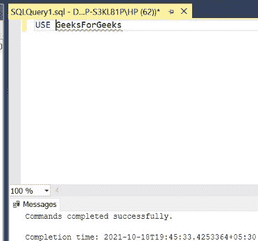

# 将日期字段转换为世界协调时的 SQL 查询

> 原文:[https://www . geesforgeks . org/SQL-查询-转换-日期-字段-utc/](https://www.geeksforgeeks.org/sql-query-to-convert-date-field-to-utc/)

在 SQL 中，日期对于新手来说很复杂，因为在使用数据库的时，表中的日期格式必须与输入的日期匹配才能插入。在各种场景中，使用[【Datetime】](https://www.geeksforgeeks.org/sql-date-functions/)(时间也涉及日期)代替日期。在本文中，我们将讨论如何在 SQL 中将日期字段转换为 UTC。在本文中，我们将使用微软的 SQL Server 作为我们的数据库。

**步骤 1:** 创建数据库。为此，使用下面的命令创建一个名为 GeeksForGeeks 的数据库

**查询:**

```sql
CREATE DATABASE GeeksForGeeks
```

**输出:**


**步骤 2:** 使用 GeeksForGeeks 数据库。为此，请使用以下命令

**查询:**

```sql
 USE GeeksForGeeks
```

**输出:**



**步骤 3:** 在数据库 GeeksForGeeks 中创建一个演示表

**查询:**

```sql
 CREATE TABLE Demofordatetime(
 demonumber int);
```

**输出:**


**第 4 步:**使用 GETDATE()命令编写一个命令，以默认格式显示当前日期和时间。我们稍后会将其转换为世界协调时，即协调世界时。

**查询:**

```sql
 SELECT GETDATE() AS CurrentTime
```

CurrentTime 是这里的变量。

**输出:**


**步骤 5:** 使用[getutcdata()命令，编写一个类似的命令，在 UTC 字段中显示当前日期和时间。](https://www.geeksforgeeks.org/getutcdate-function-in-sql-server/)

**查询:**

```sql
 SELECT GETUTCDATE() AS UTCTime
```

UTCTime 是这里的变量。

**输出:**


**步骤 6:** 现在同时编写和运行两个命令，根据本地时区和世界协调时查看当前日期和时间的值。

**注–**IST(印度标准时间)和世界协调时(UTC)的时差如下:

IST–世界协调时= 5:30 小时，即 IST 领先世界协调时 5 小时 30 分钟。

**查询:**

```sql
 SELECT GETDATE() AS CurrentTime
 SELECT GETUTCDATE() AS UTCTime
```

**输出:**

