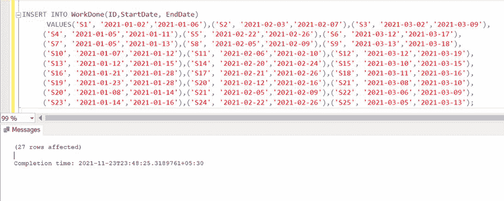

# 将日期范围转换为每日记录的 SQL 查询

> 原文:[https://www . geesforgeks . org/SQL-查询-转换-日期-范围-每天-记录/](https://www.geeksforgeeks.org/sql-query-to-convert-date-range-to-per-day-records/)

在本文中，我们将了解如何将日期范围转换为每日记录，但在此之前，我们需要清楚地知道它对我们有什么帮助。

假设，我们有一个数据库，我们希望在其中存储特定班级学生的所有项目详细信息记录。在这里我们可以看到一个学生完成他/她的项目花了多长时间，但是它被保存在一个日期范围表单中。例如，学生 1 从 2021-11-20 开始做这个项目，并在 2021-11-24 完成。那么，她花了多长时间才完成？5 天，简单。然而，当我们处理数百万个数据时，计算似乎并不那么简单。这就是为什么我们想把它从日期范围转换成每天的记录。因为我们可以轻松地在单独的行上应用聚合函数，这将使我们的分析更加简单。

这里我们将使用**“理货表”**或**“数字表”**。

**数字表/理货表:**一个数字表被称为 SQL Server 的“瑞士军刀”。它可以代替循环使用更快的基于集合的操作，扩展数据集，插入测试数据，以及许多其他事情。它将有一列，从 0 或 1 到您可能需要的最高数字的连续数字。

**语法:**

```
--create a table CREATE TABLE Sample(SampleId  int  not null) 
DECLARE @NoOfRows int SET @NoOfRows = 1000000  
--We can add as many rows as you want  ;
WITH  P0 AS (SELECT 1 AS C UNION ALL SELECT 1),
--2 rows  P1 AS (SELECT 1 AS C FROM Pass0 AS A, P0 AS B),
--4 rows  P2 AS (SELECT 1 AS C FROM Pass1 AS A, P1 AS B),
--16 rows  P3 AS (SELECT 1 AS C FROM Pass2 AS A, P2 AS B),
--256 rows  P4 AS (SELECT 1 AS C FROM Pass3 AS A, P3 AS B),
--65536 rows  P5 AS (SELECT 1 AS C FROM Pass4 AS A, P4 AS B),
--4,294,967,296 rows Tally AS (SELECT row_number()
 over(ORDER BY C) AS Number FROM P5) 
INSERT Sample (SampleId) SELECT Number 
 FROM Tally  WHERE Number <= @NoOfRows   
```

**注:**以下语法是由 T-SQL 大师**伊奇克本干**发明的

由于我们使用的是带有子句的 [**，因此可以将其转换为**](https://www.geeksforgeeks.org/sql-with-clause/#:~:text=The%20SQL%20WITH%20clause%20was,within%20the%20main%20SQL%20query.) **[**【插入】**](https://www.geeksforgeeks.org/sql-insert-statement/) 和 [**选择**](https://www.geeksforgeeks.org/sql-select-query/) 。最后一行，**WHERE**Number<= @ NoOfRows 可以轻松调整，我们可以放任何范围。**

现在，让我们看看如何使用 SQL 查询将日期范围转换为每天记录。

**步骤 1:** 创建一个数据库并使用它

使用以下命令创建并使用数据库。

**查询:**

```
CREATE DATABASE GFG_Demo; USE GFG_Demo;  
```

**输出:**


**步骤 2:** 表格定义

我们在数据库中有以下工作完成表。

**查询:**

```
CREATE TABLE WorkDone (ID VARCHAR(10) 
NOT NULL , StartDate DATE NOT NULL , 
EndDate DATE NOT NULL);   
```

**输出:**


**第 3 步:**插入数值

以下命令用于将值插入表中。

**查询:**

```
INSERT INTO WorkDone(ID,StartDate,EndDate)
VALUES('S1', '2021-01-02','2021-01-06'),
('S2', '2021-02-03','2021-02-07'),
('S3', '2021-03-02','2021-03-09'),   
('S4', '2021-01-05','2021-01-11'),
('S5', '2021-02-22','2021-02-26'),
('S6', '2021-03-12','2021-03-17'), 
('S7', '2021-01-05','2021-01-13'),
('S8', '2021-02-05','2021-02-09'),
('S9', '2021-03-13','2021-03-18'), 
('S10', '2021-01-07','2021-01-12'),
('S11', '2021-02-06','2021-02-10'),
('S12', '2021-03-12','2021-03-19'), 
('S13', '2021-01-12','2021-01-15'),
('S14', '2021-02-20','2021-02-24'),
('S15', '2021-03-10','2021-03-15'),
('S16', '2021-01-21','2021-01-28'),
('S17', '2021-02-21','2021-02-26'),
('S18', '2021-03-11','2021-03-16'), 
('S19', '2021-01-23','2021-01-28'),
('S20', '2021-02-12','2021-02-16'),
('S21', '2021-03-08','2021-03-10'),
('S20', '2021-01-08','2021-01-14'),
('S21', '2021-02-05','2021-02-09'),
('S22', '2021-03-06','2021-03-09'), 
('S23', '2021-01-14','2021-01-16'),
('S24', '2021-02-22','2021-02-26'),
('S25', '2021-03-05','2021-03-13');   
```

**输出:**



**第五步:**查看表格数据

**查询:**

```
SELECT * FROM WorkDone; 
```

**输出:**


**第 6 步:**扩大日期范围

**查询:**

```
WITH S00(N) AS (SELECT 1 UNION ALL SELECT 1), 
S02(N) AS (SELECT 1 FROM S00 a, S00 b) , 
S04(N) AS (SELECT 1 FROM S02 a, S02 b) ,
S08(N) AS (SELECT 1 FROM S04 a, S04 b) , 
S16(N) AS (SELECT 1 FROM S08 a, S08 b) ,
S32(N) AS (SELECT 1 FROM S16 a, S16 b) ,
CteTally(N) AS (SELECT ROW_NUMBER() 
OVER (ORDER BY (SELECT NULL)) FROM S32) ,
DateRange AS (SELECT SeparatedDate = 
DATEADD(DAY,N - 1,'2021-01-01') 
FROM CteTally    WHERE N <= 365 ) 
SELECT * FROM WorkDone w JOIN DateRange 
d ON d.SeparatedDate >= w.[StartDate] 
AND d.SeparatedDate <= w.[EndDate];   
```

在这里，在第一个 [CTE](https://www.geeksforgeeks.org/cte-in-sql/#:~:text=CTE%20was%20introduced%20in%20SQL,of%20the%20view's%20SELECT%20query.) S00 中，两行连接在一起，这就是为什么它给我们 2 行。第二个 CTE S02 与自身交叉连接，结果是 4 行。对其余的行也继续同样的过程，得到 16，256，65536，…行，最后一行将产生 2^32 行。

**注意:** 2^32 是一个整数在 SQL Server 中能容纳的最高数字。

*   窗口功能 **ROW_NUMBER** 用于为每一行分配一个数字。
*   现在，我们在 **OVER** 子句中的的[**ORDER BY**](https://www.geeksforgeeks.org/sql-order-by/)中使用的子查询怎么样？它用于欺骗服务器不对数据集进行排序。对这么多行进行排序可能会严重降低查询的性能。该查询用于为每一行分配一个唯一的序列号，从数字 1 开始。
*   请记住，它用于生成数字，而不是日期。这就是为什么我们使用**DATADD**函数将数字转换成日期。这将生成 2021 年的所有日期。
*   为了探索我们的样本数据，我们必须使用范围连接将计数表连接到工作完成表。

**输出:**


在这里，我们看到它被成功地扩展了。但是，它们没有按正确的顺序排列，我们可以通过在查询的最后添加 order by 函数来轻松地按正确的顺序排列它们。正如我们之前提到的，理货表是很广泛的。我们可以设定我们想要的极限，它不会对性能产生太大影响。