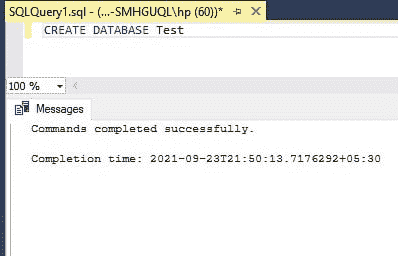

# 将日期转换为日期时间的 SQL 查询

> 原文:[https://www . geesforgeks . org/SQL-查询-转换-日期-日期时间/](https://www.geeksforgeeks.org/sql-query-to-convert-date-to-datetime/)

在本文中，我们将了解如何将 Date 转换为 Datetime。我们可以通过两种方式将日期转换为日期时间。

*   使用 [CONVERT()函数](https://www.geeksforgeeks.org/how-to-convert-a-value-of-one-type-to-another-type-in-sql-server/) : Convert 的意思是改变某物的形式或价值。SQL 服务器中的 CONVERT()函数用于将一种类型的值转换为另一种类型。 Convert()函数用于将任何类型的值转换为另一种数据类型。
*   使用 [CAST()函数](https://www.geeksforgeeks.org/casting-value-or-an-expression-from-one-data-type-to-another-in-sql-server/) : SQL Server 使用 CAST()函数将一个值或表达式从一种数据类型转换为另一种数据类型。Cast()函数也用于同样的目的，转换任何值的数据类型。

为了执行任何查询，我们必须创建一个数据库。所以，让我们先创建一个数据库。

**步骤 1:** 创建数据库

**查询:**

```
CREATE DATABASE Test;
```

**输出:**



**步骤 2:** 将日期转换为日期时间

**方法 1:** 使用 CONVERT()函数

在本例中，我们将日期 01-01-2021 转换为 Datetime。日期的形式为“年-月-日”。

**查询:**

```
SELECT CONVERT(datetime, '2021-01-01');
```

**输出:**


**方法 2:** 使用 CAST()函数

在本例中，我们将日期 01-01-2021 转换为 Datetime，如下所示。日期的形式为“年-月-日”。

**查询:**

```
SELECT CAST('2021-01-01' AS datetime);
```

**输出:**

