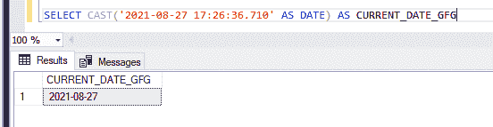

# 将日期时间转换为日期的 SQL 查询

> 原文:[https://www . geesforgeks . org/SQL-查询到转换到日期时间到日期时间/](https://www.geeksforgeeks.org/sql-query-to-convert-datetime-to-date/)

在 MS SQL Server 中，日期对于新手来说很复杂，因为在使用数据库时，表中日期的格式必须与输入的日期相匹配才能插入。在各种场景中，使用日期时间(时间也与日期相关)代替日期。在本文中，我们将学习如何使用三个不同的函数将日期时间转换为日期。

*   [CAST( )](https://www.geeksforgeeks.org/casting-value-or-an-expression-from-one-data-type-to-another-in-sql-server/)
*   [CONVERT( )](https://www.geeksforgeeks.org/how-to-convert-a-value-of-one-type-to-another-type-in-sql-server/)
*   TRY_CONVERT()
*   [使用子字符串](https://www.geeksforgeeks.org/substring-function-in-sql-server/)

本文数据的目的是在 SQL Server 中将日期时间转换为日期，如 YYYY-MM-DD HH:MM: SS 转换为 YYYY-MM-DD。

### **方法一:使用石膏**

这是一个用于将一种类型转换为另一种类型的函数，所以这里我们将使用转换日期时间。

**语法:**

```
CAST( dateToConvert AS DATE)
```

**例 1:**

**查询:**

```
SELECT CAST(GETDATE() AS DATE) AS CURRENT_DATE
```

**输出:**


**GETDATE():** 此函数返回当前日期时间像(2021-08-27 17:26:36.710)

**例 2；**

**查询:**

```
SELECT CAST('2021-08-27 17:26:36.710' AS DATE) AS CURRENT_DATE_GFG
```

**输出:**



### **方法二:使用转换**

这是一个用于将一种类型转换为另一种类型的函数，所以在这里我们将使用它来将日期时间转换为日期。

**语法:**

```
CONVERT(DATE, dateToConvert)
```

**例 1:**

**查询:**

```
SELECT CONVERT(DATE, GETDATE()) AS CURRENT_DATE_GFG
```

**输出:**


**例 2:**

**查询:**

```
SELECT CONVERT(DATE, '2021-08-27 17:26:36.710' ) AS CURRENT_DATE_GFG
```

**输出:**


### **方法三:Try_Convert**

这是一个用于将一种类型转换为另一种类型的函数，所以这里我们将使用转换日期时间为日期。如果日期无效，则它将为空，而转换会产生错误。

**语法:**

```
TRY_CONVERT(DATE, dateToConvert)
```

选择 TRY_CONVERT(日期，' 2021-08-27 17:26:36.710 ')作为当前 _ 日期 _GFG

**例 1:**

**查询:**

```
SELECT TRY_CONVERT(DATE,GETDATE()) AS CURRENT_DATE_GFG
```

**输出:**


**例 2:**

**查询:**

```
SELECT TRY_CONVERT(DATE,'2021-08-27 17:26:36.710') AS CURRENT_DATE_GFG
```

**输出:**


### **方法 4:使用子串**

这是一个用来获取短字符串或子字符串的函数，所以这里我们使用获取子字符串 0 到 11 的索引。

**语法:**

```
SUBSTRING( dateToConvert ,0,11)
```

**例 1:**

**查询:**

```
SELECT SUBSTRING( '2021-08-27 17:26:36.710' ,0,11) AS CURRENT_DATE_GFG
```

**输出:**


**例 2；**

**查询:**

```
SELECT SUBSTRING( CONVERT(varchar(17), GETDATE(), 23) ,0,11) AS CURRENT_DATE_GFG
```

**输出:**

