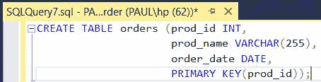
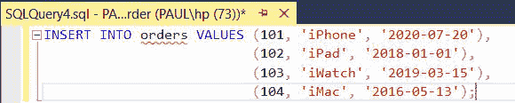
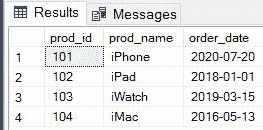
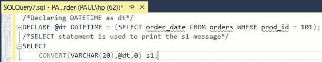
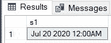
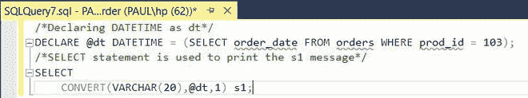
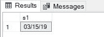
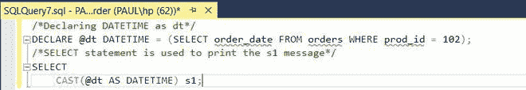
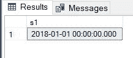

# 将日期时间转换为字符串的 SQL 查询

> 原文:[https://www . geesforgeks . org/SQL-查询到转换-日期时间到字符串/](https://www.geeksforgeeks.org/sql-query-to-convert-datetime-to-string/)

为了将日期时间转换为字符串，我们可以使用 [CONVERT()](https://www.geeksforgeeks.org/sql-conversion-function/) 和 [CAST()](https://www.geeksforgeeks.org/mysql-cast-function/) 函数。这些函数用于将(任何数据类型的)值转换为指定的数据类型。

### **CONVERT()功能**

**语法:**

```
CONVERT(VARCHAR, datetime [,style])
```

*   **VARCHAR**–表示字符串类型。
*   **日期时间**–可以是计算日期的表达式，也可以是要转换为字符串的日期时间值。
*   **样式**–指定日期的格式。它的值是由 SQL Server 预定义的。样式参数是可选的。

### **CAST()功能**

**语法:**

```
CAST(EXPRESSION AS DATATYPE(length))
```

*   **表达式**–表示需要转换的值。
*   **DATATYPE**–它是我们要将表达式转换为的数据类型。
*   **长度**–表示结果数据类型的长度(可选)。

<figure class="table">

| 

**无**

**世纪(YY)**

 | 

**同**

**世纪(YYYY)**

 | 

**标准**

 | 

**格式**

 |
| --- | --- | --- | --- |
| – | 0 或 100 | 日期时间的默认值

和 smalldatetime | 我的 dd yyyyhh:miAM(或 PM) |
| one | One hundred and one | 美国（United States 的缩写） | 1 =毫米/日/年101 =毫米/日/年 |
| Two | One hundred and two | 美国国家标准学会 | 2 = yy.mm.dd102 = yyyy.mm.dd |
| three | One hundred and three | 英国/法国 | 3 =日/月/年103 =日/月/年 |
| four | One hundred and four

 | 德国人 | 4 = dd.mm.yy104 = dd.mm.yyyy |
| five | One hundred and five | 意大利的 | 5 =日-月-年105 =日-月-年 |
| six | One hundred and six | – | 6 = dd mon yy106 = dd mon yyyy |
| seven | One hundred and seven | – | 7 =我的 dd，yy107 =我的 dd，yyyy |
| eight | One hundred and eight | – | hh:mm:ss |

</figure>

在下面的例子中，我们将把日期时间转换成不同格式的字符串。

**步骤 1:** 创建数据库

**查询:**

```
CREATE DATABASE Product_order;
```


图:创建数据库

**步骤 2:** 创建表格

现在，我们需要在数据库中创建一个表。为此，我们将使用 CREATE 语句。

**查询:**

```
CREATE TABLE orders (prod_id INT,
                     prod_name VARCHAR(255),
                     order_date DATE,
                     PRIMARY KEY(prod_id));
```



图:创建订单表

**步骤 3:** 将数据插入表格

在这一步中，我们将在订单表中插入数据。为了插入数据，我们将使用 INSERT 语句。

**查询:**

```
INSERT INTO orders VALUES (101, 'iPhone', '2020-07-20'),
                          (102, 'iPad', '2018-01-01'),
                          (103, 'iWatch', '2019-03-15'),
                          (104, 'iMac', '2016-05-13');
```



图:将数据插入订单表

**步骤 4:** 为了验证表的内容，我们将使用 SELECT 语句。

```
SELECT * FROM orders;
```


图:选择语句查询

**输出:**



图:订单表

**第 5 步:**使用 CONVERT()函数

**查询:**

```
/*Declaring DATETIME as dt*/
DECLARE @dt DATETIME = (SELECT order_date 
FROM orders WHERE prod_id = 101);
/*SELECT statement is used to print the s1 message*/
SELECT 
    CONVERT(VARCHAR(20),@dt,0) s1;
```



图:CONVERT()函数查询

**输出:**



图:输出

**查询:**

在本例中，我们将样式参数更改为 1。同样，您可以使用上表中不同的样式参数值。

```
/*Declaring DATETIME as dt*/
DECLARE @dt DATETIME = (SELECT order_date 
FROM orders WHERE prod_id = 103);
/*SELECT statement is used to print the s1 message*/
SELECT 
CONVERT(VARCHAR(20),@dt,1) s1;
```



图:CONVERT()函数查询

**输出:**



图:输出

**第 6 步:**使用 CAST()功能

**查询:**

```
/*Declaring DATETIME as dt*/
DECLARE @dt DATETIME = (SELECT order_date 
FROM orders WHERE prod_id = 102);
/*SELECT statement is used to print the s1 message*/
SELECT 
    CAST(@dt AS DATETIME) s1;
```



图:CAST()函数查询

**输出:**



图:输出