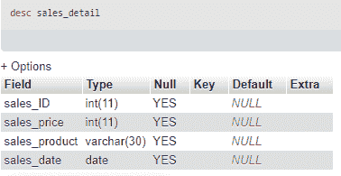
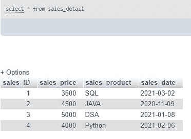
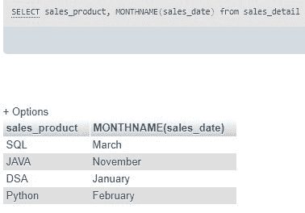
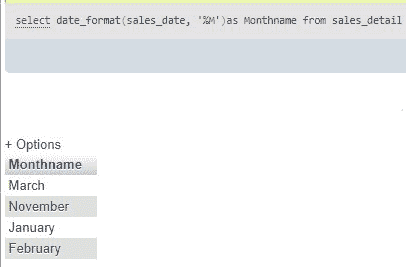

# 将月号转换为月名的 SQL 查询

> 原文:[https://www . geesforgeks . org/SQL-查询-转换-月数-月名/](https://www.geeksforgeeks.org/sql-query-to-convert-month-number-to-month-name/)

SQL 代表**结构查询语言**，在数据库中用来检索数据，更新和修改 MySql、Oracle 等关系数据库中的数据。查询是对数据库数据的一个问题或请求，也就是说，如果我们问某人任何问题，那么这个问题就是查询。类似地，当我们需要数据库中的任何数据时，我们用 SQL 编写查询来获取这些数据。在本文中，我们将讨论如何使用 SQL 将月号转换为月名。

### 正在创建数据库

要创建数据库，我们需要在 SQL 平台中使用一个查询，比如 MySql、Oracle 等。问题是，

```
create database database_name;
```

例如，

```
create database sales;
```

### 使用数据库

为了使用数据库，我们需要在 SQL 门户中使用一个查询，比如 MySql、Oracle 等。问题是，

```
use database_name;
```

### 在数据库中添加表

要在数据库中创建表，我们需要在 SQL 平台中使用一个查询，比如 MySql、Oracle 等。问题是，

```
create table table_name(
column1 type(size),
column2 type(size),
.
.
.
columnN type(size)
);
```

例如，

```
create table sales_detail(
sales_ID INT,
sales_price INT,
sales_product VARCHAR(30),
sales_date DATE
);
```

### 看到桌子了吗

要查看该表使用**‘desc 表 _ 名称’**查询，这里的查询是，

```
desc sales_detail;
```



### 向表中添加值

为了给表增加价值，我们需要在 SQL 平台中使用一个查询，比如 MySql、Oracle 等。问题是，

```
insert into table_name(
value1,
value2,
value3
.
.
.

valueN);
```

例如，这里的查询将是，

```
INSERT INTO `sales_detail` (`sales_ID`, `sales_price`, `sales_product`, `sales_date`)
 VALUES
(1, '3500', 'SQL', '2021-03-02'),
(2, '4500', 'JAVA', '2020-11-09'),
(3, '5000', 'DSA', '2021-01-08'),
(4, '4000', 'Python', '2021-02-06');
```

### 插入后表格中的数据

```
select * from sales_detail;
```



**现在我们要把上表的月号转换成月名。有几种方法可以做到这一点，见下文，**

1.要将月号转换为月名，我们必须使用函数 **MONTHNAME()，**该函数将日期列或日期作为字符串，并返回月号对应的月名。

```
 SELECT sales_product, MONTHNAME(sales_date) from sales_detail;
```

这里，该函数将“sales_date”列作为参数，并返回月份名称。



2.使用 **date_format()** 函数，我们可以将月号转换为月名。该函数以月份和格式说明符为参数，返回格式说明符指定的值。该函数中使用了一些格式说明符，即: **'%M '，' %Y '，' %D '，' %H'** 等。这里我们使用 **'%M'** 将月号转换为月名。

对此的查询，

```
select date_format(sales_date, '%M')as Monthname from sales_detail;
```



这里，该函数以“ **sales_date** 列和说明符**“% M**”为参数，并在 **monthname** 别名列中返回月名作为输出。

这就是我们如何在 SQL 中将月号转换为月名。