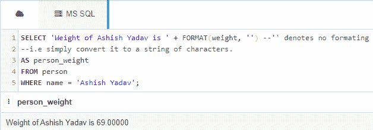

# 将数值转换为非数值的 SQL 查询

> 原文:[https://www . geesforgeks . org/SQL-query-convert-numeric-to-nvarchar/](https://www.geeksforgeeks.org/sql-query-to-convert-numeric-to-nvarchar/)

这里我们将看到，如何使用 CAST()，convert()和 FORMAT()函数将 MS SQL Server 数据库表中的 NUMERIC 数据转换为 NVARCHAR 数据。

我们将在一个名为“极客”的数据库中创建一个*人*表。

### **创建数据库:**

```sql
CREATE DATABASE geeks;
```

### **使用数据库:**

```sql
USE geeks;
```

### **表定义:**

极客数据库中有以下员工表:

```sql
CREATE TABLE person(
id INT IDENTITY(1,1) PRIMARY KEY,
name VARCHAR(30) NOT NULL,
weight NUMERIC(10,5) NOT NULL);
--Here NUMERIC(10,5) says there should be total 10 digits given that 5 digits would be 
--to the right of the decimal point.
```

您可以使用下面的语句来查询创建的表的描述:

```sql
EXEC SP_COLUMNS person;
```


### **向表中添加数据:**

使用以下语句向人员表添加数据:

```sql
INSERT INTO person
VALUES
('Yogesh Vaishnav', 62.5),
('Vishal Vishwakarma', 70),
('Ashish Yadav', 69),
('Ajit Yadav', 71.9);
```

要验证表格的内容，请使用以下语句:

```sql
SELECT * FROM person;
```


现在，让我们使用三种不同的方法将 NUMBERIC 值转换为 NVARCHAR。

*   **使用 CONVERT()功能:**

```sql
Syntax: SELECT CONVERT(<DATA_TYPE>, <VALUE>);
--DATA_TYPE is the type we want to convert to.
--VALUE is the value we want to convert into DATA_TYPE.
```

**示例:**

```sql
SELECT 'Weight of Yogesh Vaishnav is ' + CONVERT(NVARCHAR(20), weight)
AS person_weight
FROM person
WHERE name = 'Yogesh Vaishnav';
```


如您所见，如上所述，小数点右侧总共有 5 位数字。

*   **使用 CAST()功能:**

```sql
Syntax: SELECT CAST(<VALUE> AS <DATA_TYPE>);
--DATA_TYPE is the type we want to convert to.
--VALUE is the value we want to convert into DATA_TYPE
```

**示例:**

```sql
SELECT 'Weight of Ajit Yadav is ' + CAST(weight as NVARCHAR(20))
AS person_weight
FROM person
WHERE name = 'Ajit Yadav';
```


*   **使用 FORMAT()函数:**

虽然 format()函数对于格式化日期时间和不将一种类型转换为另一种类型很有用，但仍然可以用来将(或这里的 FORMAT)浮点值转换为 STR 值。

```sql
Syntax: SELECT FORMAT(<VALUE> , 'actual_format';
--actual_format is the format we want to achieve in a string form.
--VALUE is the value we want to format according to the actual_format.
```

**示例:**

```sql
SELECT 'Weight of Ashish Yadav is ' + FORMAT(weight, '') --'' denotes no formating
--i.e simply convert it to a string of characters.
AS person_weight
FROM person
WHERE name = 'Ashish Yadav';
```

