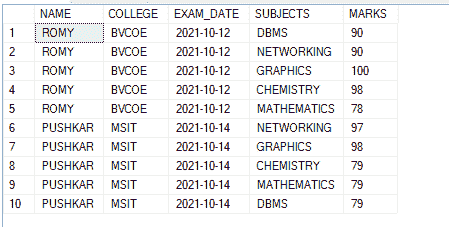
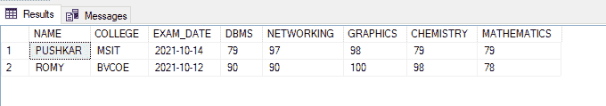

# 在 SQL Server 中将行转换为列的 SQL 查询

> 原文:[https://www . geesforgeks . org/SQL-查询-转换-行-列-in-sql-server/](https://www.geeksforgeeks.org/sql-query-to-convert-rows-to-columns-in-sql-server/)

在本文中，我们将看到如何在 SQL Server 中将行转换为列。在一个表中，许多列的许多条目具有相同的数据，建议将行转换为列。这将有助于缩小表格并使表格更易读。

例如， 假设我们下面给出了一个表:

<figure class="table">T30】0261150T70】91T73T76】MSITT78】08999

| **名称** | **学院** | **辊号** | **主题** | T21 马克 |
| -罗蜜 | BVP | 数据库管理系统 | 制图法 | Ninety-five |
| PUSHKAR | 断续器 | 089888 | 数据库管理系统 |
| PUSHKAR |

</figure>

如果我们将此表的数据存储为:

<figure class="table">就更好了

| **名称** | **学院** | **辊号** | 【T17】数据库管理系统 | T21】网络 | T25】GRAPHICS |
| -罗蜜 | BVP |

</figure>

我们可以使用 SQL 中的[**【PIVOT】**](https://www.geeksforgeeks.org/pivot-and-unpivot-in-sql/)函数将行转换为列。

**语法:**

```sql
SELECT (ColumnNames)  
FROM (TableName)  
PIVOT
(  
  AggregateFunction(ColumnToBeAggregated)
  FOR PivotColumn IN (PivotColumnValues)
) AS (Alias);                                   
 //Alias is a temporary name for a table

```

为了演示的目的，我们将在名为“极客”的数据库中创建一个 demo_table。

**步骤 1:** 创建数据库

使用下面的 SQL 语句创建一个名为 geeks 的数据库。

**查询:**

```sql
CREATE DATABASE geeks;
```

**步骤 2** :使用数据库

使用下面的 SQL 语句将数据库上下文切换到极客。

**查询:**

```sql
USE geeks;
```

**步骤 3:** 表格定义

我们的极客数据库中有以下演示表。

**查询:**

```sql
CREATE TABLE demo_table(
NAME varchar(30),
COLLEGE varchar(30),
EXAM_DATE DATE,
SUBJECTS varchar(30),
MARKS int);
```

**步骤 4:** 将数据插入表格

**查询:**

```sql
INSERT INTO demo_table VALUES ('ROMY', 'BVCOE', 
'12-OCT-2021', 'DBMS', 90),
('ROMY', 'BVCOE', '12-OCT-2021', 'NETWORKING', 90),
('ROMY', 'BVCOE', '12-OCT-2021', 'GRAPHICS', 100),
('ROMY', 'BVCOE', '12-OCT-2021', 'CHEMISTRY', 98),
('ROMY', 'BVCOE', '12-OCT-2021', 'MATHEMATICS', 78),
('PUSHKAR', 'MSIT', '14-OCT-2021', 'NETWORKING' , 97),
('PUSHKAR', 'MSIT', '14-OCT-2021', 'GRAPHICS', 98),
('PUSHKAR', 'MSIT', '14-OCT-2021', 'CHEMISTRY', 79),
('PUSHKAR', 'MSIT', '14-OCT-2021', 'MATHEMATICS', 79),
('PUSHKAR', 'MSIT', '14-OCT-2021', 'DBMS', 79);
```

**第五步:**查看表格内容

使用以下命令查看 demo_table 的内容:

**查询:**

```sql
SELECT * FROM demo_table;
```

**输出:**



**第六步:**使用透视功能将行转换为列。

**查询:**

```sql
SELECT * FROM demo_table  
 PIVOT
(AVG(MARKS) FOR SUBJECTS IN (DBMS,NETWORKING, 
GRAPHICS, CHEMISTRY, MATHEMATICS)) AS PivotTable;
```

我们使用了 AVERAGE 聚合函数，因为一个值的平均值就是该值本身。

**输出:**



我们可以看到行被转换为列。