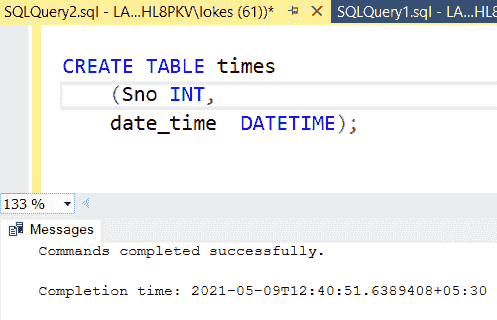
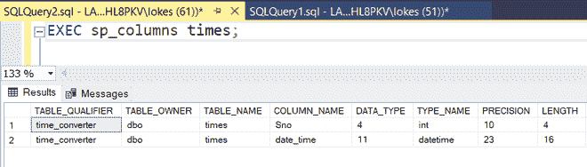
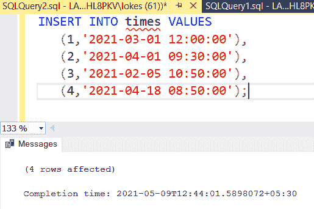
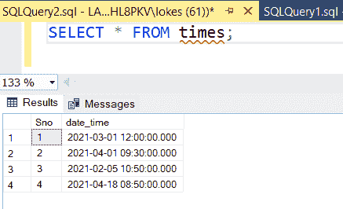
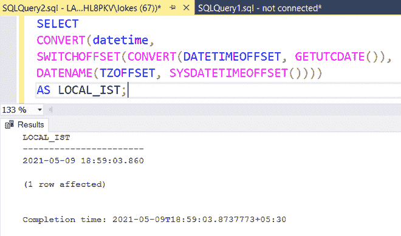
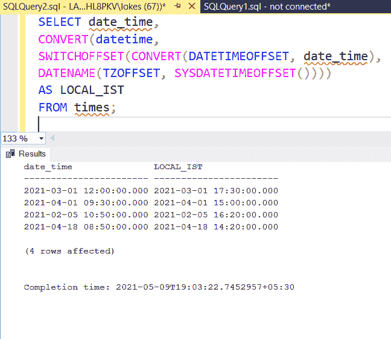
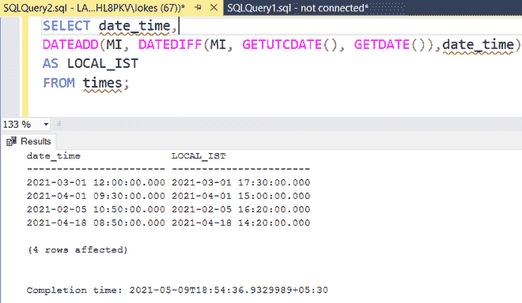

# 将世界协调时转换为当地时区的 SQL 查询

> 原文:[https://www . geesforgeks . org/SQL-query-convert-utc-local-time-zone/](https://www.geeksforgeeks.org/sql-query-to-convert-utc-to-local-time-zone/)

在本文中，我们将介绍如何将数据库中不同时间的世界协调时转换为当地时区。现在，让我们执行一个查询，该查询使用 MSSQL 作为我们的数据库，逐步详细地将 UTC 转换为本地时区。

**步骤 1:** 使用以下 SQL 查询创建数据库 time_converter，如下所示。

```sql
CREATE DATABASE time_converter;
```

**步骤 2:** 使用数据库 time_converter 使用如下 SQL 查询如下。

```sql
USE time_converter;
```

**步骤 3:** 使用以下 SQL 查询创建包含 2 列的表时间，如下所示。

让我们创建一个以索引和**日期时间**作为数据类型的表。

```sql
CREATE TABLE times
(Sno INT,
 date_time DATETIME);
```



**步骤 4:** 使用如下 SQL 查询查看数据库中表的描述。

```sql
EXEC sp_columns times;
```



**步骤 5:** 使用如下 SQL 查询将行插入时间表。

```sql
INSERT INTO times VALUES
(1,'2021-03-01 12:00:00'),
(2,'2021-04-01 09:30:00'),
(3,'2021-02-05 10:50:00'),
(4,'2021-04-18 08:50:00');
```



**步骤 6:** 使用如下 SQL 查询查看插入行后的表时间。

```sql
SELECT * FROM times;
```



**查询 1:** 将当前时间从世界协调时转换为 IST 当地时间(印度标准时间)的查询

**注意:**印度时区比世界协调时提前 5 小时 30 分钟。

**语法:**

```sql
SELECT colum_name,
CONVERT(datetime, 
SWITCHOFFSET(CONVERT(DATETIMEOFFSET, column_name), 
DATENAME(TZOFFSET, SYSDATETIMEOFFSET()))) 
AS general_name
```

```sql
SELECT 
CONVERT(datetime, 
SWITCHOFFSET(CONVERT(DATETIMEOFFSET, GETUTCDATE()), 
DATENAME(TZOFFSET, SYSDATETIMEOFFSET()))) 
AS LOCAL_IST;
```

在这里，GETUTCDATE()函数可以用来获取当前的日期和时间 UTC。使用此查询，世界协调时被转换为 IST 当地时间。



**查询 2:** 查询将时间表中的所有时间从 UTC 转换为 IST 本地时间。

**方法 1:**

在这种方法中，表中的世界协调时时间被转换为当地印度标准时间。要将世界协调时转换为 IST，世界协调时必须加上“+05:30”，输出中也会加上同样的内容。

**语法:**

```sql
SELECT colum_name,
CONVERT(datetime, 
SWITCHOFFSET(CONVERT(DATETIMEOFFSET, column_name), 
DATENAME(TZOFFSET, SYSDATETIMEOFFSET()))) 
AS general_name
FROM table_name;
```

```sql
SELECT date_time,
CONVERT(datetime, 
SWITCHOFFSET(CONVERT(DATETIMEOFFSET, date_time), 
DATENAME(TZOFFSET, SYSDATETIMEOFFSET()))) 
AS LOCAL_IST
FROM times;
```



**方法二:**

在该方法中，当前日期时间( **GETDATE()** )与 UTC(**getutchdate()**)日期时间之间的差值被添加到 date_time 列中的日期。

**语法:**

```sql
SELECT 
column_name,
DATEADD(MI, DATEDIFF(MI, GETUTCDATE(), GETDATE()), date_time) 
AS LOCAL_IST
FROM times;
```

```sql
SELECT date_time,
DATEADD(MI, DATEDIFF(MI, GETUTCDATE(), GETDATE()), date_time) 
AS LOCAL_IST 
FROM times;
```

