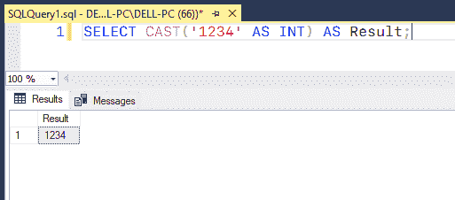
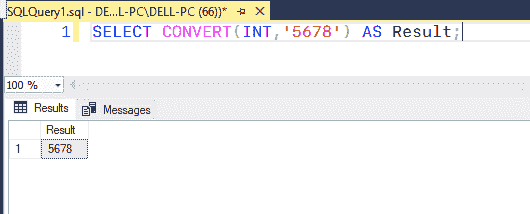
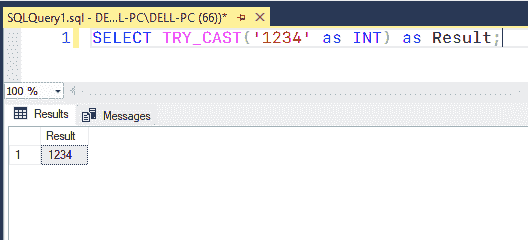
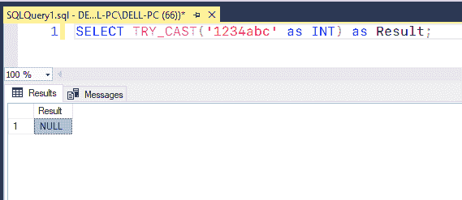
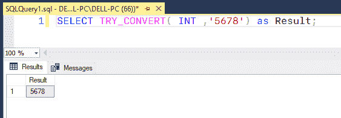
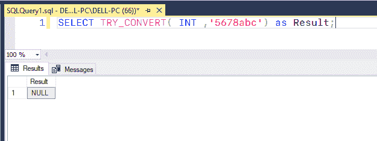

# 将 VARCHAR 转换为 INT 的 SQL 查询

> 原文:[https://www . geesforgeks . org/SQL-query-convert-varchar-to-int/](https://www.geeksforgeeks.org/sql-query-to-convert-varchar-to-int/)

SQL Server 的 CAST()和 CONVERT()方法可用于将 VARCHAR 转换为 INT。我们还将研究将值从一种数据类型转换为另一种数据类型的更高效、更安全的方法。

### CAST()

SQL Server 中的[**【CAST()】**](https://www.geeksforgeeks.org/mysql-cast-function/)函数用于将一个值或表达式从一种数据类型转换为另一种数据类型。

**语法:**

```sql
CAST ( expression AS target_type [ ( length ) ] )
```

参数:

*   **表达式**–将被转换的任何类型的任何值。
*   **目标 _ 类型**–值将被转换为的目标数据类型。例如 INT、BIT、SQL_VARIANT 等。
*   **长度**–可选参数，指定 target_type 的长度，默认长度为 30。

让我们举一个使用 CAST()函数将 VARCHAR 转换为 INT 的例子。

**查询:**

```sql
SELECT CAST('1234' AS INT) AS Result;
```

**输出:**



### 转换()

在 SQL Server 中，[**【CONVERT()】**](https://www.geeksforgeeks.org/ms-sql-server-type-conversion/)函数用于将一种类型的值转换为另一种类型的值。转换任何东西都需要改变它的形状或价值。

**语法:**

```sql
SELECT CONVERT ( target_type ( length ), expression )  
```

参数 **:**

*   **target _ type**–表达式要转换成的数据类型，例如:INT、BIT、SQL_VARIANT 等。
*   **长度**–提供目标类型的长度。长度不是强制性的。默认长度设置为 30。
*   **表达式**–表达式是任何将被转换的东西。

在下面的示例中，CONVERT()函数用于将 VARCHAR 转换为 INT。

**查询:**

```sql
SELECT CONVERT(INT,'5678') AS Result;
```



现在让我们讨论一种更有效的方法，使用 SQL Server 的 TRY_CAST()和 TRY_CONVERT()函数将值从一种数据类型转换为另一种数据类型:

### TRY_CAST()

**TRY_CAST()** 函数试图将输入值转换为给定数据类型的值。如果转换成功，它将返回所提供数据中的值；否则，它返回空值。但是，如果您请求无效的转换，TRY_CAST()方法将返回一个错误。

**语法:**

```sql
TRY_CAST ( expression AS data_type [ ( length ) ] )  
```

使用的参数:

*   **数据类型:**函数将表达式转换为的有效数据类型。
*   **表达式:**要转换的值。

**查询:**

```sql
SELECT TRY_CAST('1234' as INT) as Result;
```



**查询:**

```sql
SELECT TRY_CAST('1234abc' as INT) as Result;
```



### **TRY_CONVERT()**

**TRY_CONVERT()** 方法试图将提供给它的值转换为指定的数据类型。如果转换成功，它将返回值作为给定的数据；否则，它返回空值。如果请求显式禁止的转换，TRY CONVERT()方法将返回一个错误。

**语法:**

```sql
TRY_CONVERT ( data_type[(length)], expression [,style])
```

使用的参数:

*   **数据类型:**函数将表达式转换为的有效数据类型。
*   **表达式:**要转换的值。
*   **style:** 是一个提供的整数，指定函数将如何翻译表达式。

**查询:**

```sql
SELECT TRY_CONVERT( INT ,'5678') as Result;
```



**查询:**

```sql
SELECT TRY_CONVERT( INT ,'56abc') as Result;
```

