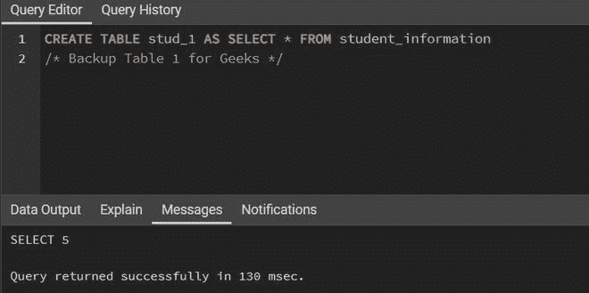
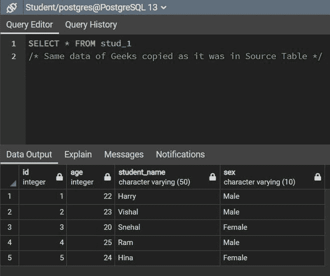
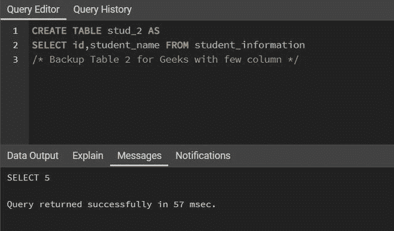
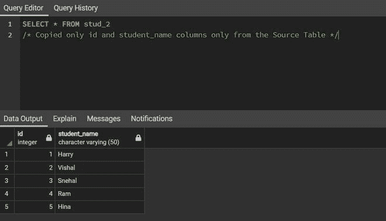
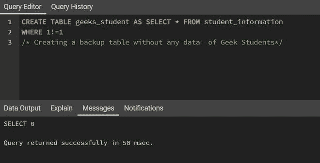
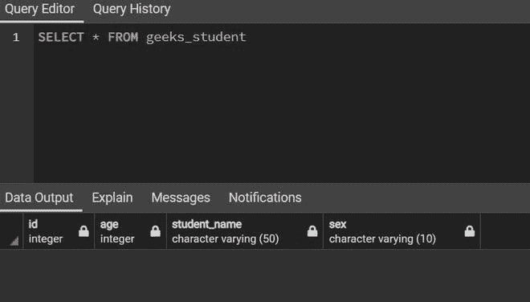
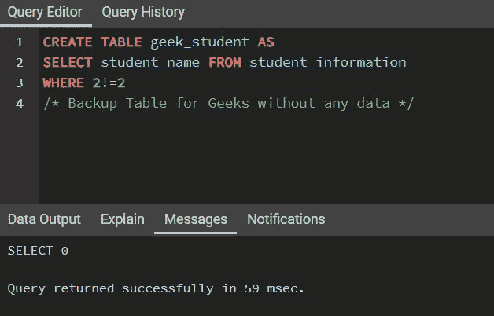
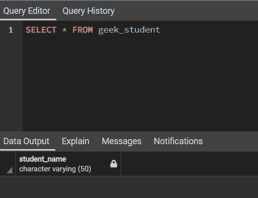

# 复制、复制或备份表的 SQL 查询

> 原文:[https://www . geesforgeks . org/SQL-查询-复制-复制-或-备份-表/](https://www.geeksforgeeks.org/sql-query-to-copy-duplicate-or-backup-table/)

在关系数据库中，我们经常使用这种不同的数据库软件来处理不同的表并执行各种操作，如 MYSQL、Oracle、PostgreSQL 等。有时，在执行这些操作时，我们中的许多人希望保留一个备份表，该表是有益的，可以用作参考，或者在需要时可以重用。同样，很多时候我们需要再次复制同一个表，并创建其自身的副本。

当我们执行各种修改操作时，我们可以使用备份表跟踪数据的变化。因此，在本文中，我们将讨论如何在 SQL 中复制和创建备份表。

**样本输入:**考虑一个由参加我们 DSA 课程的极客数据组成的模式“学生信息”，如下所示:

<figure class="table">T46】20T48【Snehal】T49T52T54T56】25T58【拉姆】T59T62T64T66】24T68【希娜】T69T71

| **Student information** |
| --- |
| 身份证明 | age | Student name | gender |
| --- | --- | --- | --- |
| one | Twenty-two |  | three | woman |
| man |
| woman |

</figure>

```
Syntax:
CREATE TABLE Table_Name AS SELECT * FROM Source_Table_Name;

Table_Name: The name of the backup table.
AS: Aliasing
```

在 MYSQL 中，我们可以使用以下命令来检查备份前后在数据库中创建的表的数量。但是，PostgreSQL 和其他版本的 SQL 不支持此命令。

```
SHOW TABLES;
```

**示例 1:** 我们可以复制备份表中的所有列。



**备份表 1 查询**

**输出:**



**备份表 1 输出**

**例 2:** 不强制复制所有列。我们也可以选几个专栏。

```
Syntax:
CREATE TABLE Table_Name AS SELECT col_1, col_2, ... FROM Source_Table_Name;

Table_Name: The name of the backup table.
AS: Aliasing
col: Required columns from source table
```



**备份表 2 查询**

**输出:**



**备份表 2 输出**

到目前为止，我们已经看到了如何创建源表的克隆。在上面的备份表中，数据也随表一起复制。但是，我们也可以在不复制数据的情况下创建备份表。因此，要创建一个没有任何数据被复制的表，我们可以使用[**【WHERE】**](https://www.geeksforgeeks.org/sql-where-clause/)子句的帮助，该子句需要返回一个 FALSE 值。比如我们可以用 **WHERE 2 < 2 或者 WHERE 1=2** 。

```
Syntax:
CREATE TABLE Table_Name AS SELECT * FROM Source_Table_Name
WHERE (RETURN FALSE);

Table_Name: The name of the backup table.
AS: Aliasing
FALSE: Any expression which returns FALSE. For example 4>5
```

**例 1:** 复制的所有列没有任何数据。



**查询备份表**

**输出:**



**备份表输出**

**例 2:** 不强制复制所有列。我们也可以选几个专栏。

```
Syntax:
CREATE TABLE Table_Name AS SELECT col1,col2,.... Source_Table_Name
WHERE (RETURN FALSE);

Table_Name: The name of the backup table.
AS: Aliasing
col: Required columns from source table
FALSE: Any expression which returns FALSE. For example 4>5
```



**查询备份表**

**输出:**



**备份表输出**