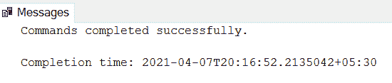
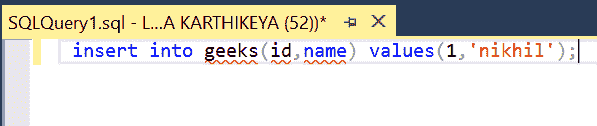
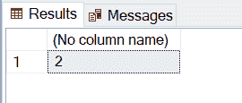
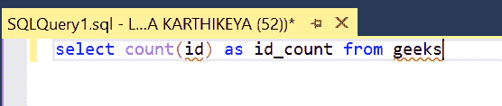

# 统计表格行数的 SQL 查询

> 原文:[https://www . geesforgeks . org/SQL-查询-计算表中的行数/](https://www.geeksforgeeks.org/sql-query-to-count-the-number-of-rows-in-a-table/)

在本文中，我们将编写一个 SQL 查询来计算表中的行数。因为我们将使用 SQL 的 **count()** 函数。在本文中，我们将使用**微软 SQL Server** 作为我们的数据库。

让我们通过在数据库中构建一个表并计算其行数来完成同样的工作。我们将首先创建一个名为“ *【极客】* 的数据库，然后在该数据库中创建一个“ *【员工】* ”表，并对该表执行我们的查询。

### **创建数据库:**

使用下面的 SQL 语句创建一个名为 geeks 的数据库:

```sql
CREATE DATABASE geeks;
```

### **使用数据库:**

```sql
USE geeks;
```

### 表格定义:

我们的 *极客* 数据库中有以下员工表:

```sql
CREATE TABLE geeks(
    id int(20) , 
    name varchar(200));
```

**输出:**



可以用下面的语句查询创建的表的描述:

```sql
EXEC sp_columns employees;
```

### 向表中添加数据:

使用以下语句向*员工*表添加数据:

```sql
INSERT INTO geeks(id,name) values(1,'nikhil');
INSERT INTO geeks(id,name) values(2,'kartik');
```



### 计算行数的 SQL 查询:

函数的作用是:返回表中的行数。它与 Select()语句一起使用。

```sql
Syntax: SELECT COUNT(colmn_name) from table_name;
```

**示例:**

使用' * '我们得到如下所示的所有行:

```sql
SELECT * FROM geeks;
```

这将产生下图:


我们将要操作的表有两行。因此，让我们输入查询来获取特定列(比如 id)的行数，如下所示:

```sql
SELECT COUNT(id) from geeks;
```

**输出:**



我们甚至可以更改显示计数的显示名称:

```sql
SELECT COUNT(id) as id_count FROM geeks
```

**输出:**

