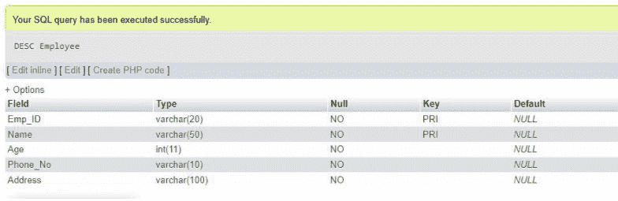

# 用主键创建表的 SQL 查询

> 原文:[https://www . geesforgeks . org/SQL-查询-用主键创建表/](https://www.geeksforgeeks.org/sql-query-to-create-table-with-a-primary-key/)

主键唯一标识每个行表。它必须包含唯一的非空值。一个表只能有一个主键，主键可以由一个或多个字段组成。当多个字段用作主键时，它们被称为复合键。

要在表中创建主键，我们必须使用关键字；"主键( )"

**查询:**

```sql
CREATE TABLE `Employee` ( `Emp_ID` VARCHAR(20) NOT NULL ,`Name` VARCHAR(50) NOT NULL ,  
`Age` INT NOT NULL ,`Phone_No` VARCHAR(10) NOT NULL ,`Address` VARCHAR(100) NOT NULL ,
 PRIMARY KEY (`Emp_ID`));
```


为了查看“Emp_ID”是否是主键，我们使用 description 命令来查看表的结构。

**description**用来形容某物。因为在数据库中我们有表，所以我们使用 DESCHERE 或 DESC(两者都是相同的)命令来描述表的结构。

**查询:**

```sql
DESCRIBE Employee;
Or 
DESC Employee;
```

**输出:**


现在，当表已经存在(没有定义更早的主键)时，要在任何列上创建主键约束，请使用以下 SQL **语法:**

> 更改表[表名]添加主键(标识)；

**查询:**

```sql
ALTER TABLE Employee ADD PRIMARY KEY (Phone_No);
```

**输出:**


如果定义了任何更早的主键，那么将会出现如下错误；

**输出:**


这个错误是因为；只能存在一个主键。因此，我们必须首先删除初始主键来创建新的主键。

**1。要在多列上创建主键:**

**查询:**

```sql
CREATE TABLE `Employee` ( `Emp_ID` VARCHAR(20) NOT NULL ,
                      `Name` VARCHAR(50) NOT NULL ,  
                      `Age` INT NOT NULL ,  
                      `Phone_No` VARCHAR(10) NOT NULL ,
                      `Address` VARCHAR(100) NOT NULL ,
                      PRIMARY KEY (`Emp_ID`,`Name`));
```


**输出:**


**2。当表已经存在时添加多个主键**

**查询:**

```sql
ALTER TABLE Employee
 ADD CONSTRAINT PK_CUSTID PRIMARY KEY (Emp_ID, NAME);
 DESC Employee;
```


**输出:**

