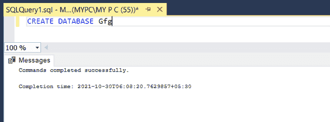
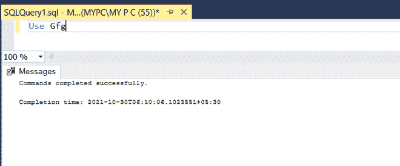
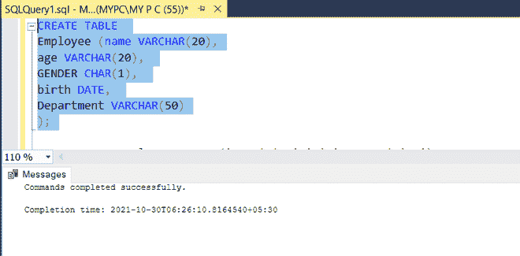
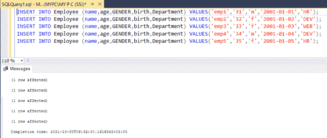
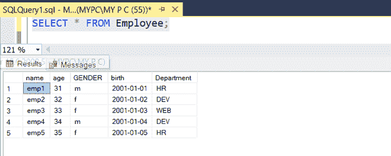
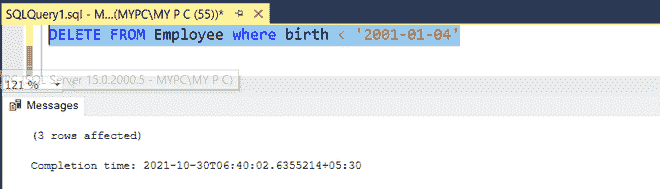
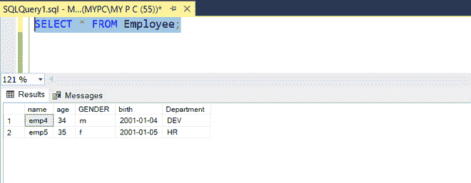

# 基于日期从表中删除数据的 SQL 查询

> 原文:[https://www . geesforgeks . org/SQL-query-to-delete-a-data-from-table-based-on-date/](https://www.geeksforgeeks.org/sql-query-to-delete-a-data-from-a-table-based-on-date/)

很多时候我们不得不根据日期删除数据。这些日期可以是一些更早的日期。为此，我们可以使用 delete 查询和 where 子句。这种方法帮助我们删除数据库中的一些旧数据。在本文中，我们将根据员工的出生日期删除他们的数据。

**步骤 1:** 创建数据库

**查询**:

```
CREATE DATABASE Gfg;
```



**步骤 2:** 使用数据库

**查询**:

```
USE DATABASE Gfg;
```



执行这个查询后，我们可以在数据库中创建表。

**步骤 3:** 表格定义

**查询:**

```
CREATE TABLE EMPLOYEE (name VARCHAR(20), age VARCHAR(20),
 GENDER(20), birth DATE, Department VARCHAR(50) );
```

**输出:**



执行此查询后，将使用指定的列创建一个名为 Employee 的表。

**步骤 4:** 向表中添加数据



**输出:**



执行该查询后，将插入如上所示的记录。

**步骤 5:** 基于日期从表中删除

**查询:**

```
DELETE FROM Employee where birth < '2001-01-04'
```

在此查询中，我们将删除出生日期早于 2001-01-04(年-月-日)的记录。



**输出:**

由于我们已经删除了出生日期早于“2001-01-04”的员工，我们可以看到日期大于等于 2001-01-04 的员工。

