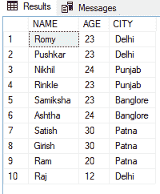
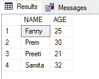
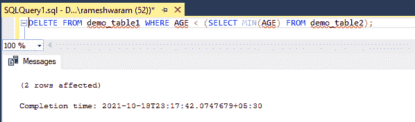
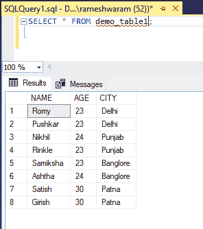

# 基于与其他表的比较删除某些行的 SQL 查询

> 原文:[https://www . geeksforgeeks . org/SQL-查询-删除-某些行-基于与其他表的比较/](https://www.geeksforgeeks.org/sql-query-to-delete-certain-rows-based-on-comparisons-with-other-tables/)

在本文中，我们将看到，如何根据与其他表的比较来删除某些行。我们可以通过使用[子查询](https://www.geeksforgeeks.org/sql-subquery/)代替 WHERE 子句中的条件来执行该函数。子查询是出现在另一个查询中的查询。也可以称之为[嵌套查询。](https://www.geeksforgeeks.org/nested-queries-in-sql/)

**语法:**

```sql
SELECT * FROM table_name WHERE column_name=
( SELECT column_name FROM table_name);
```

选择查询写在 WHERE 子句是子查询之后。

### **从**表**中删除该行**

**语法:**

```sql
DELETE FROM table_name WHERE condition;
```

现在，按照以下步骤进行演示:

**步骤 1:** 创建数据库

我们可以使用以下命令创建一个名为 geeks 的数据库。

**查询:**

```sql
CREATE DATABASE geeks;
```

**步骤 2:** 使用数据库

使用下面的 SQL 语句将数据库上下文切换到极客:

**查询:**

```sql
USE geeks;
```

**步骤 3:** 表格定义

在极客的数据库中，我们有两个名为“ **demo_table1** ”和“ **demo_table2** ”的表。

**查询(demo_table1):**

```sql
CREATE TABLE demo_table1(
NAME VARCHAR(20),
AGE int,
CITY VARCHAR(10));
```

**查询(demo_table2):**

```sql
CREATE TABLE demo_table2(
NAME VARCHAR(20),
AGE int);
```

**步骤 4:** 将数据插入表格

**查询(demo_table1):**

```sql
INSERT INTO demo_table1 VALUES
('Romy',23,'Delhi'),
('Pushkar',23,'Delhi'),
('Nikhil',24,'Punjab'),
('Rinkle',23,'Punjab'),
('Samiksha',23,'Banglore'),
('Ashtha',24,'Banglore'),
('Satish',30,'Patna'),
('Girish',30,'Patna'),
('Ram', 20 , 'Patna'),
 ('Raj', 12, 'Delhi');
```

**查询(demo_table2):**

```sql
INSERT INTO demo_table2 VALUES ('Fanny',25 ),
('Prem', 30), ('Preeti',21 ),('Samita',32);
```

**第五步:**查看内容

执行以下查询查看表格的内容

**查询:**

```sql
SELECT * FROM demo_table1;
```

**输出:**



**查询:**

```sql
SELECT * FROM demo_table2;
```

**输出:**



**步骤 6:** 使用子查询基于比较删除行

为了演示，让我们删除 demo_table1 中年龄小于 demo_table2 的最小年龄值的行

**获取 demo_table2 的最小年龄值:**

**查询:**

```sql
SELECT MIN(AGE) FROM demo_table2;
```

现在，我们将使用上面的查询作为子查询来删除值小于从查询中获得的值的行。

**查询:**

```sql
DELETE FROM demo_table1 WHERE AGE < 
(SELECT MIN(AGE) FROM demo_table2);
```



现在检查 demo_table1 的内容

**输出:**



我们可以在图像中看到，现在删除了 2 个条目，即(' Ram '，20，' Patna '，(' Raj '，12，'德里')，因为这两个条目的 age 值都小于 demo _ table2 中的最小 AGE 值)。