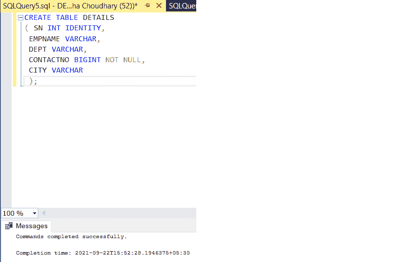
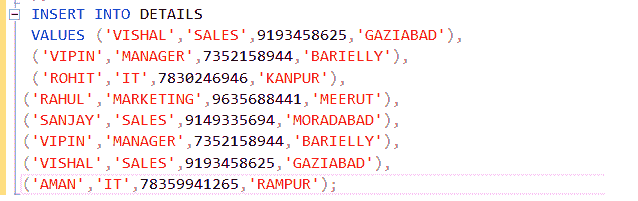
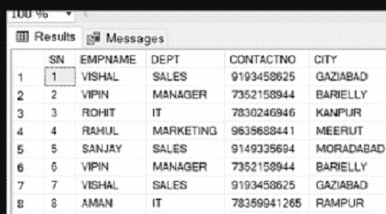
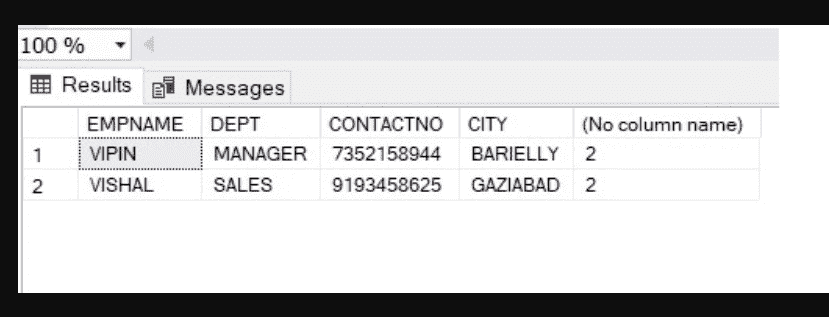
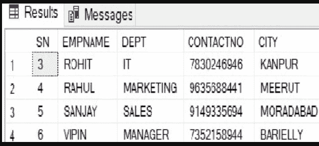

# 删除重复行的 SQL 查询

> 原文:[https://www . geesforgeks . org/SQL-查询-删除-重复-行/](https://www.geeksforgeeks.org/sql-query-to-delete-duplicate-rows/)

通过本文，我们将学习如何从数据库表中删除重复的行。正如我们所知，数据库中的表里不一往往会浪费内存空间。它记录了不准确的数据，也无法从数据库中取出正确的数据。

> 具有相同或相同数据值的一行或多行被视为重复行。

现在，我们必须按照以下步骤完成任务-

**步骤 1:** 首先我们必须创建一个名为“DETAILS”的表

**查询:**

```sql
CREATE TABLE DETAILS
( SN INT IDENTITY(1,1)
 EMPNAME VARCHAR(25),
 DEPT VARCHAR(20),
 CONTACTNO BIGINT NOT NULL,
 CITY VARCHAR(15)
 );

```



**步骤 2:** 现在，我们必须在表中插入值或数据。

```sql
INSERT INTO EMPDETAIL
 VALUES ('VISHAL','SALES',9193458625,'GAZIABAD'),
 ('VIPIN','MANAGER',7352158944,'BARIELLY'),
 ('ROHIT','IT',7830246946,'KANPUR'),
('RAHUL','MARKETING',9635688441,'MEERUT'),
('SANJAY','SALES',9149335694,'MORADABAD'),
('VIPIN','MANAGER',7352158944,'BARIELLY'),
('VISHAL','SALES',9193458625,'GAZIABAD'),
('AMAN','IT',78359941265,'RAMPUR');
```



**输出:**插入值后，我们看到了表格的视图:



**第三步:**在这一步中，我们要找出有多少行是重复的。

**查询:**

```sql
SELECT EMPNAME,DEPT,CONTACTNO,CITY, COUNT(*) FROM EMPDETAIL
GROUP BY EMPNAME,DEPT,CONTACTNO,CITY
HAVING COUNT(*)>1
```

**输出:**



**第四步:**也可以用这个行找出唯一的行。

```sql
SELECT EMPNAME,DEPT,CONTACTNO,CITY, COUNT(*) FROM DETAILS
GROUP BY EMPNAME,DEPT,CONTACTNO,CITY
```

**步骤 5:** 最后我们必须从数据库中删除重复的行。

```sql
DELETE FROM DETAILS WHERE SN NOT IN (
SELECT MAX(SN) FROM DETAILS GROUP BY EMPNAME,DEPT,CONTACTNO,CITY)
```

**第 6 步:**删除重复行后，我们就有了表的视图:

**输出:**

