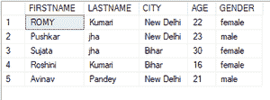
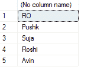
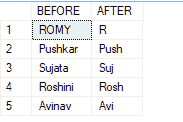

# 删除字段最后 N 个字符的 SQL 查询

> 原文:[https://www . geesforgeks . org/SQL-查询到删除-最后 n 个字符-from-field/](https://www.geeksforgeeks.org/sql-query-to-delete-last-n-characters-from-field/)

**SQL** 代表结构化查询语言**。**用于与数据库通信。有一些标准的 SQL 命令，如“选择”、“删除”、“更改”等。要从字段中删除最后 N 个字符，我们将使用字符串函数。

## 字符串函数:

它用于对输入字符串执行操作并返回输出字符串。有各种各样的字符串函数，如 LEN(用于 SQL 服务器)、SUBSTR、LTRIM、TRIM 等。

为了执行所需的功能，我们需要以下功能:

**1。SUBSTRING():** 此函数用于从给定位置的字符串中查找子字符串。它需要三个参数:

*   字符串:这是必需的参数。它提供了关于应用函数的字符串的信息。
*   开始:它给出了字符串的开始位置。它也是必需的参数。
*   长度:这是一个可选参数。默认情况下，它采用整个字符串的长度。

**查询:**

```sql
SUBSTRING('geeksforgeeks', 1, 5);
```

**输出:**

```sql
geeks
```

**2。LEN():** 这个语法不是标准的。对于不同的服务器语法，返回字符串的长度可能会有所不同。例如，LEN()用在 SQL server 中，LENGTH()用在 oracle 数据库中，等等。

它只接受一个参数，即您需要查找其长度的字符串。

**查询:**

```sql
LEN('geeksforgeeks')
```

**输出:**

```sql
13
```

要删除字段中的最后 N 个字符，我们将使用以下查询:

**查询:**

```sql
SUBSTRING(string, 1, length(string)-N)
```

这里，字符串表示字段，1 表示字符串的起始位置，长度(字符串)-N 表示字符串的长度。为了演示，我们将在一个名为“极客”的数据库中创建一个极客表。

**创建数据库:**

使用下面的 SQL 语句创建一个名为 geeks 的数据库:

> 创建数据库极客；

**使用数据库:**

使用下面的 SQL 语句将数据库上下文切换到极客:

> 使用极客；

**表定义:**我们的极客数据库中有以下极客 forgeeks 表。

**查询:**

```sql
  CREATE TABLE geeksforgeeks(FIRSTNAME VARCHAR(20),LASTNAME VARCHAR(20),CITY VARCHAR(20),
  AGE INT,GENDER VARCHAR(20));
```

**向表中添加数据:**使用下面的语句向 geeksforgeeks 表中添加数据:

**查询:**

```sql
INSERT INTO geeksforgeeks VALUES ('ROMY', 'Kumari', 'New Delhi', 22, 'female');
INSERT INTO geeksforgeeks VALUES ('Pushkar', 'jha', 'New Delhi', 23, 'male');
INSERT INTO geeksforgeeks VALUES ('Sujata', 'jha', 'Bihar', 30, 'female');
INSERT INTO geeksforgeeks VALUES ('Roshini', 'Kumari', 'Bihar', 16, 'female');
INSERT INTO geeksforgeeks VALUES ('Avinav', 'Pandey', 'New Delhi', 21, 'male');
```

**查看表格的内容:**使用下面的命令查看 geeksforgeeks 表格的内容:

**查询:**

```sql
SELECT * FROM geeksforgeeks;
```



现在要删除字段中的最后 N 个字符，我们将使用 geeksforgeeks 表。下面是 SUBSTRING()函数从字段中删除最后 N 个字符的语法。

**语法:**

> SELECT SUBSTRING(列名，1，长度(列名)-N) FROM 表名；

**示例:**从 geeksforgeeks 表中删除 FIRSTNAME 列的最后 2 个字符。

**查询**:

```sql
SELECT SUBSTRING(FIRSTNAME,1,len(FIRSTNAME)-2) FROM geeks for geeks;
```

**输出:**



从国家栏中删除最后 3 个字符，然后查看。

**查询:**

```sql
SELECT FIRSTNAME AS BEFORE, SUBSTRING(FIRSTNAME,1,len(FIRSTNAME)-3)AS AFTER FROM geeksforgeeks;
```

**输出:**

