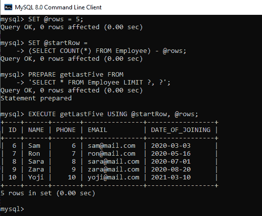

# 显示员工表最后 5 条记录的 SQL 查询

> 原文:[https://www . geesforgeks . org/SQL-查询到显示-最后 5 条记录-来自员工-表/](https://www.geeksforgeeks.org/sql-query-to-display-last-5-records-from-employee-table/)

**总结:**

在这里，我们将学习如何在 SQL 查询的帮助下从数据库表中检索最后 5 行。

我们将探索的不同方法有:

*   借助 LIMIT 子句按降序排列。
*   借助关系运算符和计数函数。
*   借助准备好的报表和限制条款。

**创建数据库:**

```
CREATE DATABASE geeks; /* SQL is case insensitive thus 'create database geeks;' means the same
```

**显示可用数据库:**

```
SHOW DATABASES;
```

**使用数据库:**

```
USE geeks;
```


显示 sql 查询的图像

既然我们已经改变到极客数据库，现在我们将创建我们的雇员表。

**创建员工表:**

```
CREATE TABLE (
ID INT PRIMARY KEY AUTO_INCREMENT,
NAME VARCHAR(30) NOT NULL,
PHONE INT(10) NOT NULL UNIQUE,
EMAIL VARCHAR(30) NOT NULL UNIQUE,
DATE_OF_JOINING DATE);
```


显示 sql 查询的图像

注意:我们应该使用 **VARCHAR** 或者 **BIGINT** 作为 PHONE 列的数据类型，避免整数溢出。

**查看/描述员工表:**

```
DESC Employee;
```


显示 sql 查询的图像

**在员工表中添加值:**

```
INSERT INTO Employee (NAME, PHONE, EMAIL, DATE_OF_JOINING)
VALUES
('Yogesh Vaishnav', 0000000001, 'yogesh@mail.com', '2019-10-03'),
('Vishal Vishwakarma', 0000000002, 'chicha@mail.com', '2019-11-07'),
('Ajit Yadav', 0000000003, 'ppa@mail.com', '2019-12-12'),
('Ashish Yadav', 0000000004, 'baba@mail.com', '2019-12-25'),
('Tanvi Thakur', 0000000005, 'tanvi@mail.com', '2020-01-20'),
('Sam', 0000000006, 'sam@mail.com', '2020-03-03'),
('Ron', 0000000007, 'ron@mail.com', '2020-05-16'),
('Sara', 0000000008, 'sara@mail.com', '2020-07-01'),
('Zara', 0000000009, 'zara@mail.com', '2020-08-20'),
('Yoji', 0000000010, 'yoji@mail.com', '2020-03-10');
```


显示 sql 查询的图像

**从员工表中检索所有数据:**

```
SELECT * FROM Employee;
```


显示 sql 查询的图像

现在让我们从 Employee 表中检索最后 5 行。

**方法 1:按降序使用 LIMIT 子句**

我们知道 LIMIT 子句给出了指定行的指定行数。我们将使用 LIMIT 和 ORDER BY 子句按降序检索最后 5 行，最后将结果行设为升序。

由于员工表有标识，我们将在查询中执行按标识排序。

> **语法:**
> 
> (从<table_name>订单中选择*通过 <id_column>DESC 限制</id_column></table_name>
> 
> 订单依据<id_column>ASC；</id_column>

**示例:**

```
(SELECT * FROM Employee ORDER BY ID DESC LIMIT 5)
ORDER BY ID ASC;
```

**输出:**


显示 sql 查询的图像

**方法二:使用关系运算符和计数函数。**

我们知道，在 Employee 表中，行是根据 id 排列的，我们可以在条件 As 的帮助下得到最后 5 行

id >(总行数–要检索的行数(此处为 5))

> **语法:**
> 
> 从<table_name>选择*</table_name>
> 
> 在哪里
> 
> <id_column>>(从<table_name>中选择计数(*))–(要检索的行数)；</table_name></id_column>

**示例:**

```
SELECT * FROM Employee
WHERE 
ID > (SELECT COUNT(*) FROM Employee) - 5;
```

**输出:**


显示 sql 查询的图像

**方法三:使用 SQL 准备语句和 LIMIT 子句**

我们知道，我们可以在 LIMIT 子句的帮助下从指定的行开始检索任意数量的行，如下所示:

```
SELECT * FROM <table_name> 
LIMIT (row after which the data is to be retrieved), (no. of rows to retrieve)
```

但是我们不能使用子查询，也不能直接使用带有 LIMIT 子句的变量。

因此，我们将在运行时执行准备好的语句并替换模板值。

准备和执行语句的语法如下:

> **语法:**
> 
> 从“<any valid="" sql="" query="">”准备<statement_name>；/*使用？(问号)表示在执行时必须用一个值替换它*/</statement_name></any>
> 
> 使用(可选)<template_values or="" parameters="" values="">执行<statement_name></statement_name></template_values>

**示例:**

```
/*declare and initialize a variable named 'rows' (here we want to retrieve last 5 rows thus the value 5*/
SET @rows = 5;
SET @startRow = (SELECT COUNT(*) FROM Employee) - @rows; /*Row after which we want to retrieve*/
PREPARE getLastFive FROM 'SELECT * FROM Employee LIMIT ?, ?';
EXECUTE getLastFive USING @starRow, @rows;
```

**输出:**



显示 sql 查询的图像