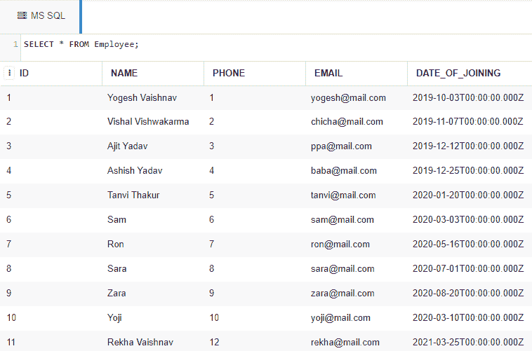

# 显示员工表中最后 50%记录的 SQL 查询

> 原文:[https://www . geesforgeks . org/SQL-查询-显示-最后-50%记录-来自员工-表/](https://www.geeksforgeeks.org/sql-query-to-display-last-50-percent-records-from-employee-table/)

在这里，我们将看到如何在 MySQL 和 MS SQL 服务器的数据库中显示雇员表中最后 50%的记录。

为了演示，我们将在名为“*极客*的数据库中创建一个*员工*表。

### **创建数据库:**

使用下面的 SQL 语句创建一个名为 geeks 的数据库:

```
CREATE DATABASE geeks;
```

### **使用数据库:**

```
USE geeks;
```

### 表格定义:

我们的*极客*数据库中有以下员工表:

```
CREATE TABLE Employee(
ID INT IDENTITY(1,1) KEY,     --IDENTITY(1,1) tells start ID from 1 and increment
                            -- it by 1 with each row inserted.
NAME VARCHAR(30) NOT NULL,
PHONE INT NOT NULL UNIQUE,
EMAIL VARCHAR(30) NOT NULL UNIQUE,
DATE_OF_JOINING DATE);
```

**注意:**我们应该使用 **VARCHAR** 或者 **BIGINT** 作为 PHONE 列的数据类型，避免整数溢出。

您可以使用下面的语句来查询创建的表的描述:

```
EXEC SP_COLUMNS Employee;
```


### 向表中添加数据:

使用以下语句向*员工*表添加数据:

```
INSERT INTO Employee (NAME, PHONE, EMAIL, DATE_OF_JOINING)
VALUES
('Yogesh Vaishnav', 0000000001, 'yogesh@mail.com', '2019-10-03'),
('Vishal Vishwakarma', 0000000002, 'chicha@mail.com', '2019-11-07'),
('Ajit Yadav', 0000000003, 'ppa@mail.com', '2019-12-12'),
('Ashish Yadav', 0000000004, 'baba@mail.com', '2019-12-25'),
('Tanvi Thakur', 0000000005, 'tanvi@mail.com', '2020-01-20'),
('Sam', 0000000006, 'sam@mail.com', '2020-03-03'),
('Ron', 0000000007, 'ron@mail.com', '2020-05-16'),
('Sara', 0000000008, 'sara@mail.com', '2020-07-01'),
('Zara', 0000000009, 'zara@mail.com', '2020-08-20'),
('Yoji', 0000000010, 'yoji@mail.com', '2020-03-10'),
('Rekha Vaishnav', 12, 'rekha@mail.com', '2021-03-25');
```

要验证表格的内容，请使用以下语句:

```
SELECT * FROM Employee;
```



现在让我们从雇员表中检索最后 50%的记录。

### **对于 MS SQL 数据库:**

在 MS SQL 中，借助 top 和 percent 以及 order by 子句，我们可以直接检索最后 50%的记录。下面给出了一个简单的语法:

> **语法:**
> 
> 选择*从
> 
> /*给出数据库表底部前 N %的记录*/
> 
> (按 <column_name>desc 从<table_name>订单中选择前 N % *)</table_name></column_name>
> 
> 按<column_name>排序；</column_name>

**示例:**

```
SELECT * FROM
(SELECT top 50 percent * FROM Employee ORDER BY ID DESC)
ORDER BY ID;
```

**输出:**

